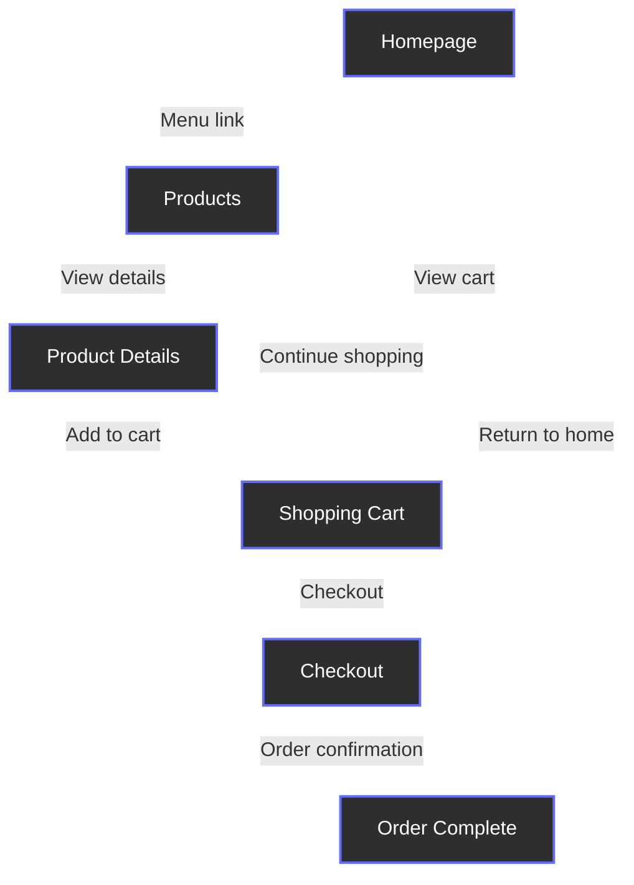
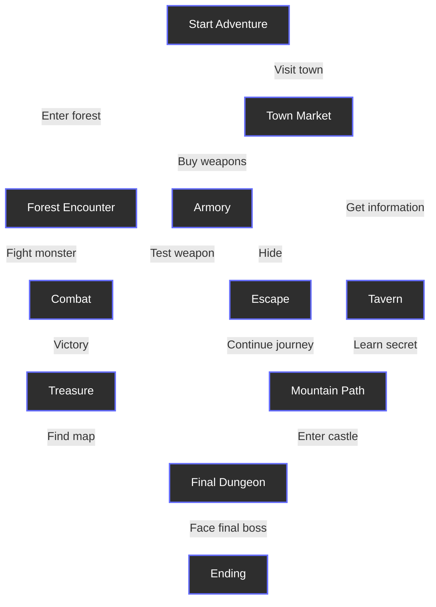

## Choose Your Node Adventure

Adventure gamebooks, like the *Fighting Fantasy* series or *Choose Your Own Adventure* books, are written as a set of scenes that make little sense if you read them in print order. Each scene describes what is happening to you, the reader, then offers a list of choices for the next section to read. Read as intended, starting with the first section and choosing your path, the book becomes an interactive story where you are the hero. You succeed or fail through your choices.

The books usually move forward from choice to choice towards one of several endings, though in rare cases adventurers must return to earlier scenes and make different choices to progress. More advanced gamebooks add RPG mechanics. These range from simple, single-book systems, such as the main *Fighting Fantasy* series, to complex systems that span several books, such as the *Lone Wolf* or *Sorcery!* adventures. These mechanics are usually implemented using a simple stat system (like **SKILL**, **STAMINA**, and **LUCK** in the worlds of *Fighting Fantasy*): scores against which dice can be rolled to determine outcomes. The stats fluctuate during and between adventures, and can be supplemented by finding items like enchanted weapons, potions of healing and other trinkets.

Gamebooks reached their peak of popularity in the 80s. After that, computers caught up and could render these adventures with graphics and mechanics players did not have to track by hand. Recently there has been a comeback of sorts, with new titles added to the *Fighting Fantasy* series in the last few years; but despite this, their moment has gone. The idea behind them, however, has not. Hidetaka Miyazaki, creator of the popular *Dark Souls* games, has cited *Fighting Fantasy* as a major influence on his work, and his work is often compared to gamebooks for its interconnectedness and difficulty. The genre has become a staple of modern gaming, with many developers taking inspiration from its mechanics and design philosophy.

The format used by gamebooks is not limited to gaming or books; there are interactive short stories like *The Garden of Forking Paths* by Jorge Luis Borges; programmed learning materials like the *TutorText* series and *Bandersnatch*, the *Choose Your Own Adventure* episode of Netflix's *Black Mirror* series written by Charlie Brooker. A basic website also works, in some ways, like a gamebook. The user navigates the website like an adventurer delving the depths of *Deathtrap Dungeon*. Instead of fighting monsters and overcoming traps, they must battle with adverts and answer cookie policy preferences. Each page contains text and links to other pages, just as each scene in a gamebook is a description and list of choices. This shared structure is known as a graph, and fortunately for us, there is a theory that describes them.

## Graph Theory 101

Graph Theory is a branch of mathematics and computer science that studies the properties and applications of graphs.

- A **graph** models the relationships between a collection of nodes.
- **Nodes** (also called vertices) are the fundamental units in graph theory, representing entities or points that can be connected to other nodes.
- **Edges** are the relationships between nodes, which connect the nodes and define how they interact with each other.
- In a **directed** graph (also known as a **digraph**), the edges have a specific direction, indicating a one-way relationship between nodes.
- In an **undirected** graph, the edges do not have a direction, indicating a two-way relationship between nodes.
- A graph can be **cyclic** or **acyclic**; it can contain loops that lead back to previous nodes or not.

To illustrate these concepts, let's look at some examples. First, consider a simple e-commerce website:



This forms a **directed cyclic graph** comprising the `Products`, `Product Details`, `Shopping Cart` and `Checkout` nodes. The `Homepage` and `Order Complete` nodes are part of this cycle as well, allowing users to navigate back to the starting point after completing their purchase.

For our second example, consider this outline of a simple adventure gamebook plot:



This is a **directed acyclic graph (DAG)**. The player can start their adventure by entering the forest or visiting the town. Each choice leads to different encounters and outcomes, but once a path is chosen, it cannot be revisited. The player must navigate through the nodes, making decisions that affect the flow of the story. The edges represent the choices made by the player, leading them to different nodes based on their decisions.

Gamebooks and adventure modules tend to mostly use DAGs to prevent infinite loops, though some may include cycles for specific gameplay mechanics. Published adventure modules and homebrewed adventures for tabletop RPGs like *Dungeons & Dragons* are often written in a similar way. They typically consist of a series of interconnected nodes that guide players through the narrative. Some of these nodes are cyclic graphs, for example, if the players are exploring a bazaar they can go into shops multiple times, engaging in haggling loops with the shopkeeper (much to the DM's dismay). Most, however, are acyclic graphs: adventures have branching paths that lead to different outcomes depending on their decisions.

This highlights how geographical, narrative and encounter-based nodes differ in adventure gamebooks and tabletop adventures. When an adventure is run by a person for a group of players, non-linearity is suddenly on the table. Say, for example, the adventurers head off to the Dungeon of Elemental Fire, but realise their wizard doesn't know any fire protection spells. They turn around and head back to the apothecary in the last town to buy some potions of fire resistance instead. In an adventure gamebook, you can't just go back to a previous scene with a potion shop, or suddenly decide you are invincible to fire (unless you cheat, of course). In some ways, an adventure session is an undirected cyclic graph, where the players can go back and forth between nodes, but the DM is the one who decides which nodes are connected - and that's not even considering if any of the players, NPCs or monsters know any time travel magic.

Whatever the graph, the variety of formats such adventures can take is limitless, but a few common structures have emerged over the years. Much like how there are common plots that have emerged in drama (only 7 by some counts), archetypal adventure setups have emerged in the world of gamebooks and tabletop RPGs. One such, short & sweet and endlessly adaptable, is the Five Room Dungeon.

## Five Room Dungeons

The structure of a Five Room Dungeon consists of five nodes, often rooms in a dungeon but not exclusively:

- **Room 1: Entrance and Guardian** - This encounter introduces the players to the adventure and sets the stage for the challenges ahead. It often includes a guardian or obstacle that must be overcome to proceed.

You find yourself at the entrance to a cave carved out into the south side of Mt. Graphnor. A solitary goblin sleeps at the mouth of the cave.

You could sneak past it, charge and attack or try to talk to it and see if it can tell you anything about the wonders below the mountain.

- **Room 2: Puzzle or Roleplaying Challenge** - This encounter presents a puzzle or roleplaying challenge that requires players to think creatively and work together to solve it.

The room is circular and covered wall to wall in arcane symbols. In the centre you see a scroll floating in mid air. Initially the scroll is made up of the same symbols on the wall and is undecipherable, but slowly the lines and shapes on the vellum coalesce into a language you can understand. It reads:

This room will only reveal its treasures to those with the wit to answer: What has keys but can't open locks? What has space but no room? What can enter but never leave?

Do you answer, or try to open the chest by some other means?

- **Room 3: Red Herring, Trick or Setback** - This encounter introduces a twist or setback that complicates the players' progress.

You walk into this small empty room and the door slams behind you. The walls begin to close in and you hear a voice echoing around the room. "You have entered my lair, and now you must pay the price for your intrusion!"

The walls are closing in and you have no way out. You must find a way to escape before it's too late!

- **Room 4: Climax and Final Challenge** - This encounter presents the ultimate challenge that players must face to complete the adventure.

You enter this vast cavern and are nearly blinded by the dazzling lights coming from the centre of the room. As your eyes adjust, you see a massive dragon perched on a pile of gold and jewels, the light of the sun blazing down from the opening in the roof and reflecting off the dragon's scales and hoard. It looks at you with disdain, and you can feel the heat radiating from its body. The dragon roars and you can see the flames licking at the edges of its mouth.

Do you fight the dragon or turn heel and flee?

- **Room 5: Reward and Conclusion** - This encounter provides the players with a reward for their efforts, wrapping up the adventure and offering closure to the story. Alternatively, it can set the stage for future stories with a shocking twist or cliffhanger.

You pick your sword from the dragon's lifeless corpse and look at the hoard. The gold and jewels are piled high, and you can see the glint of magic items hidden among the treasure. As you reach for a shimmering dagger, you hear a ripping sound behind you. You turn and look to the far end of the cavern, and see a bunch of roundish, leathery spheres only just visible in the glittery light. One has a large crack on the side, and it begins to pulsate ominously.

The number of nodes can be anywhere from five to thousands. While the structure is designed around five nodes, additional ones can be added depending on the needs of the story. The encounters can take place in one location or span multiple, and they can be approached in a number of different ways. The geographical nodes, the rooms or locations, represent an interesting challenge for the Dungeon Master. They must create a map that allows players to navigate the encounters in a way that makes sense and is engaging. The rooms can be connected with passageways, secret tunnels, teleportation circles or by any number of other means. They can be locked behind doors or easily accessible, and the design of these connections can greatly influence the flow of the adventure.

Interestingly, if the adventure is a literal five room dungeon, then we know thanks to the research of [Steve Lawford](https://enac.hal.science/hal-03097484/document) that the rooms can be joined in one of 21 different ways:


With 21 ways to connect locations and an almost endless number of encounter variations, the Five Room Dungeon is a flexible structure for adventure design. It also offers a fascinating glimpse of the complexity that can arise from linking nodes together.

## Implementing a Five Room Dungeon Gamebook

To wrap up this chapter, let's implement a simple gamebook using the concepts we have discussed. We will create a simple adventure gamebook using htmx and Alpine.js. Gamebook scenes and webpages map neatly to each other, for example:

```html
<div id="scene" class="card">
  <blockquote>
    <p>
      You awake to find yourself in a dark room. Your eyes adjust to the gloom and you lift your head off the bed,
      the only thing in this barren room aside from two doors.
    </p>
  </blockquote>
  <menu>
    <li>
      <a href="/left-door">Try the door on the left</a>
    </li>
    <li>
      <a href="/right-door">Try the door on the right</a>
    </li>
    <li>
    <a href="/cry-in-horror">Cry in Horror</a>
  </li>
  </menu>
</div>
```

The HTML above represents a simple gamebook scene, where the player is presented with a description of their surroundings and three choices. The `<blockquote>` element contains the text description of the scene, while the `<menu>` element contains a list of `<a>` elements that link to the next scenes in the adventure. While this approach is fine, it suffers from using raw anchor tags to make the requests for the next node, which forces a full page refresh. To improve this, we can replace them with buttons powered by htmx to only update the scene element with the new content:

```html
<button hx-get="/left-door" hx-target="#scene">Try the door on the left</button>
```

If we add some styling and render it on the page, we have something that looks like this:

You awake to find yourself in a dark room. Your eyes adjust to the gloom and you lift your head off the bed, the only thing in this barren room aside from two doors.

- Try the door on the left
- Try the door on the right
- Cry in Terror

This scene card provides the basis for our graph of adventure nodes. With this concept and a couple of hundred nodes, you have a *Choose Your Own Adventure*. To make the game more interesting, we can use Alpine to keep track of game state, run combat encounters, and manage the player's stats. Future chapters will cover how to implement these components, but for now you can enjoy the simple adventure below as an interactive example of graphs and node traversal, with added goblins.
