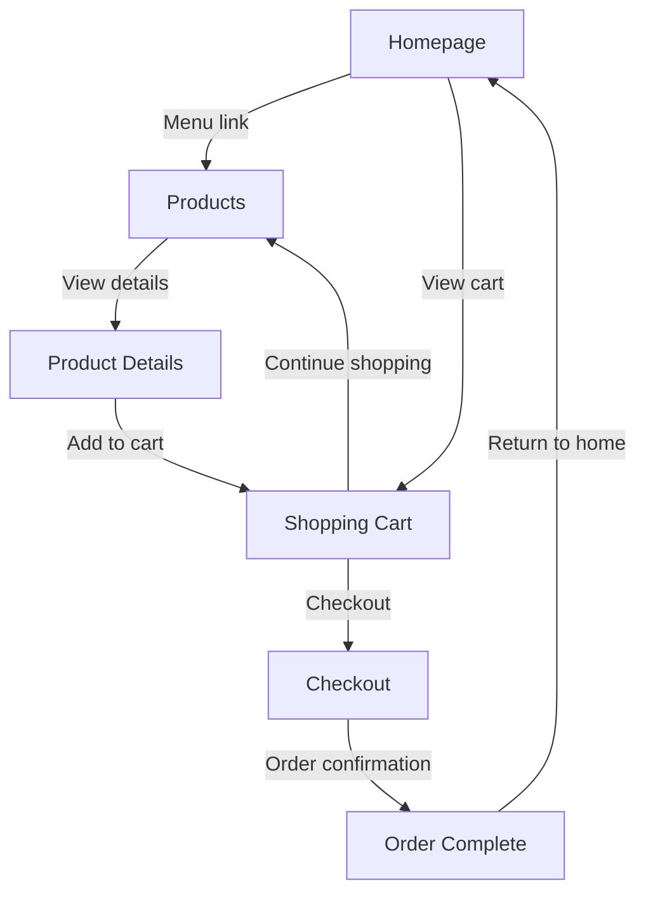
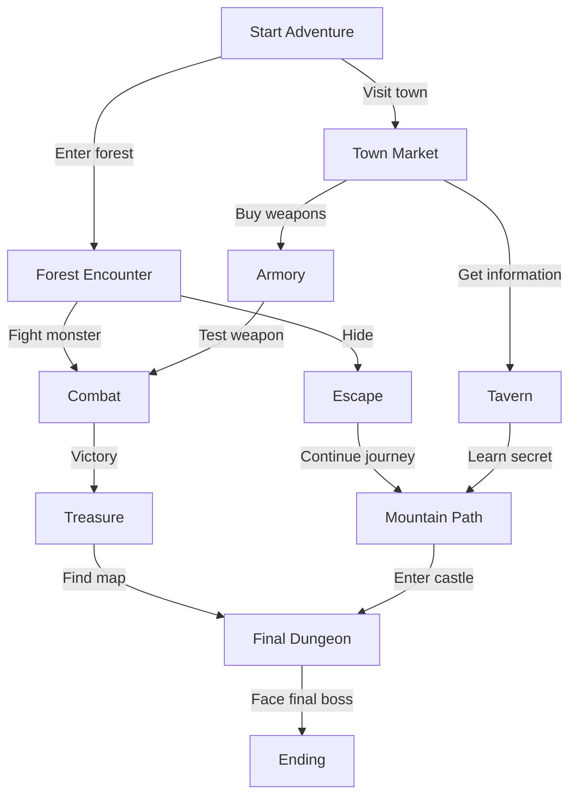

# Chapter 2: Choose Your Node Adventure

---

> **The Cartographer and the Adventurer**
>
> The Cartographer unrolled the map and pressed its edges flat with both palms before speaking.
> It was a good map: crisp notation, every passage marked, every chamber named in a small careful
> hand.
>
> "There," said the Adventurer, pressing a finger to a room near the centre of the parchment.
> "The Chamber of Answered Questions. That's where we need to go."
>
> The Cartographer said nothing.
>
> "Well?" said the Adventurer.
>
> "Look at the passages," said the Cartographer.
>
> The chamber sat at the meeting of four beautifully drawn corridors. Each one, on closer inspection,
> led *to* the chamber from somewhere else. Not one led *away* from anywhere that could be reached from
> the entrance.
>
> "It's on the map," said the Adventurer.
>
> "Aye," said the Cartographer. "It exists. It has walls, a floor, a ceiling, presumably some answers.
> But how do you get in? There's no path to it from the door we came in by. We'd have to begin inside
> it."
>
> "Then why is it on the map?"
>
> The Cartographer rolled the parchment back up and slid it into its case.
>
> "Because someone put it there without asking whether anyone could arrive."

---

Adventure gamebooks, like the *Fighting Fantasy* series[^1] or *Choose Your Own Adventure*[^2]
books, are written as a set of scenes that make little sense read in print order. Each scene
describes what's happening to you, the reader, then offers a list of choices for the next section
to turn to. Read as intended, starting at the first passage and following your choices, the book
becomes an interactive story in which you are the protagonist. You succeed or fail through your
decisions.

Not all gamebooks organise their graphs the same way. The core *Fighting Fantasy* titles are
mostly discrete: each numbered passage is a distinct node, and the adventure visits them in
whatever order your choices dictate. Some of the more ambitious entries in the genre experiment
with continuity. Steve Jackson's *Sorcery!* tetralogy tracks state across four separate books,
carrying gold, items, injuries, and spell knowledge from one volume to the next; each book is a
subgraph that connects to the next at specific transition points. Joe Dever's *Lone Wolf* series
goes further: a campaign spanning over thirty books, where a persistent character sheet grows
from book to book and the graph of the whole series is too large to map on any sensible piece
of paper. The underlying idea, nodes and edges, stays constant; the scope of what it can describe
turns out to have no obvious ceiling.[^3]

Meanwhile, before any of this was happening in print, a different medium was exploring the same
structure on a computer screen. The first text adventure games, *Colossal Cave Adventure* from
1976 and *Zork* from 1977, placed the player inside a directed graph of locations connected by
exits, described in second-person prose.[^4] You typed your commands rather than selecting from
a numbered list, but the underlying structure was the same: nodes, edges, reachability, and the
possibility of writing beautiful locations that could never actually be reached. The dungeon and
the data structure were the same thing.

In 2010, comedian John Robertson took the concept somewhere unexpected. *The Dark Room* began as
a series of interconnected YouTube videos: each clip ended with a set of options, with links to the
next node overlaying the video.[^5] The player navigated by clicking, using YouTube's infrastructure
as a hypertext engine it was never designed to be. Robertson later adapted the piece into a live show,
with himself as the omniscient narrator and the audience member brought up on stage as the player (or
Darren, as they are known). In the original YouTube form the game is no longer playable as Robertson
intended. The platform evolved in ways that broke the edge structure, which makes it an accidental
illustration of a real software concern: a graph whose edges depend on a service you don't control can
become disconnected without warning.

Gamebooks reached their peak of popularity in the 1980s, then faded as home computers caught up
and could render these adventures with graphics and mechanics that didn't require a pencil and a
rubber. There has been something of a revival in recent years, with new titles added to the
*Fighting Fantasy* catalogue; but even so, the cultural moment has passed. The idea behind them,
though, hasn't. Hidetaka Miyazaki, creator of the *Dark Souls* series, has cited *Fighting
Fantasy* as a significant influence, and his games are often compared to gamebooks precisely for
their interconnected geography and punishing consequences. The format became a template for a
generation of designers who may never have held a paperback with a dice-rolling section at the
back.[^6]

The structure is not limited to games. Jorge Luis Borges wrote *The Garden of Forking Paths* in
1941, an intricate short story built around branching choices and nested narratives. The
*TutorText* series applied similar principles to learning in the 1950s. *Bandersnatch*, Charlie
Brooker's 1984-set episode of *Black Mirror*, used the form for television.[^7] And a basic
website works, in some ways, like a gamebook. The user navigates each page like an adventurer
working through a dungeon: instead of fighting monsters and avoiding traps, they battle cookie
consent banners and hunt for the fabled contact form. Each page contains text and links to other
pages, just as each scene in a gamebook is a description and a set of choices. This shared
structure is called a graph, and there is a branch of mathematics built entirely around understanding
them.

---

## Books That Are Maps

A gamebook is a directed graph, printed out of order.

The reader holds it as a book, but the structure underneath is not a sequence. It is a web of
*nodes* connected by *edges*. Each passage is a node: a named location in the story. Each choice
is an edge: a directed connection from one node to another. The direction matters. The choice "go
north" takes you from the entrance hall to the guard room, not the other way round. If you want
to go back, there must be a separate choice pointing south.

This is the basic vocabulary. A **node** (also called a **vertex**) is a point in the structure:
a page, a location, a state. An **edge** is the relationship between two nodes. When an edge has
a direction, it is a **directed edge**: it goes from A to B, but not necessarily from B to A. A
structure made of nodes and directed edges is a **directed graph**, sometimes called a **digraph**.

Most gamebooks are also **acyclic**: once you've committed to a path, you generally can't loop back
to the same passage via the same route. A directed acyclic graph is commonly abbreviated to a
**DAG**, which is accurate but sounds like something you'd find lurking in an underground lake.
When a graph *can* loop back on itself, it is called **cyclic**. Shopping districts in adventure
games are often cyclic: you can visit the alchemist three times before deciding on the potion you
want, much to the game designer's difficulty-balancing distress.

---

## Websites Are Gamebooks Without Dice

Consider a simple e-commerce website:



This is a **directed cyclic graph**: the user can move from the homepage to products to a product
detail page to the cart, but also loop back from the cart to products, and eventually return home
from the order confirmation. The nodes are pages; the edges are links and button actions. A user
navigating this site is, without any drama, performing graph traversal.

Now consider a gamebook:



This is a **directed acyclic graph**: the story moves forward. You might reach the final dungeon
via the treasure room or via the mountain path, but either way you're moving towards the ending,
not looping back to the town market. The reader makes meaningful choices, but the adventure has an
inexorable forward motion.

The structural similarity between these two diagrams is not a coincidence. Both are systems for
navigating information through choices. The difference is mostly aesthetic: one sells you a bag of a
hundred tiny plastic babies, the other asks you to fight a goblin. The underlying shape is the same.

---

## Graph Vocabulary Without Panic

Before going further, it's worth pausing to name a few more terms precisely, because graph theory
has a tendency to introduce eight words where two would do.

A **tree** is a special kind of graph where every node except the root has exactly one parent.
Family trees are trees in this sense. So are file systems. A pure tree has no converging paths:
every branch stays separate. Many gamebooks are close to trees, but not quite, because paths often
reconverge. Two different routes through the dungeon might both arrive at the same antechamber
before the final boss. When paths reconverge, you have a DAG rather than a tree.[^8]

**Reachability** is the question of whether you can get from one node to another by following
edges. In a gamebook, the critical reachability question is: can the player get from the start
passage to this passage? If the answer is no, the passage is unreachable. It exists in the data,
it might even have beautiful prose, but the player will never see it. This is exactly the problem
the Cartographer identified at the start of this chapter, and exactly the kind of problem a
validator can catch before a reader does.

Two common ways of storing graphs in code are worth knowing about. An **adjacency list** maps each
node to the nodes it connects to: for each passage, you record which other passages its choices
can reach. An **adjacency matrix** stores the same information as a grid, with a row and column
for every node and a mark at each intersection representing a connection. Adjacency lists are
usually more practical for gamebooks because most passages connect to only a small number of
others; a full matrix would be mostly empty.[^9]

The gamebook engine in this book uses a variation of the adjacency list approach: each `Passage`
directly embeds its `Choice` objects, and each `Choice` carries a `targetId`. The graph is encoded
in the passage data itself, and a separate validation step builds the full map to check for
structural problems.

---

## Five Rooms, Many Shapes

One useful frame for thinking about small adventure graphs is the **Five Room Dungeon**,[^10] a
compact design template that gives each room a distinct mechanical role. The five rooms are not
necessarily literal rooms; they are structural beats in a short adventure:

**Room 1: Entrance and Guardian.** The first obstacle. This might be a physical encounter, a
locked door, a guard who can be fought or bribed or reasoned with. It introduces the adventure's
stakes and sets up the choices to come.

> *You find yourself at the entrance to a cave carved into the south face of a mountain. A solitary*
> *goblin dozes at the mouth of the passage, its chin on its chest, a spear leaning against the wall*
> *beside it.*
>
> Do you
> - sneak past?
> - wake it and try to talk?
> - charge?

**Room 2: Puzzle or Roleplaying Challenge.** A non-combat obstacle. A riddle, a social encounter,
a mechanism that rewards lateral thinking. This is the room that favours players who engage with
the world rather than hitting everything.

> *The room is circular and covered wall to wall in inscribed symbols. A scroll hovers in the centre,
> its text shifting and settling into words you can read:* What has keys but cannot open locks? What
> has space but no room? What can enter but never leave? *Beside it, a chest.*
>
> Do you
> - answer?
> - force the chest?
> - look more carefully at the symbols on the walls.

**Room 3: Trick or Setback.** A twist that complicates progress. A trap, a false promise, a
consequence for overconfidence. This is the room that makes players pay attention.

> *The door seals behind you. The walls begin to move inward, slowly but with evident purpose. A*
> *voice reverberates around the stone. You have perhaps two minutes.*
> - Check your inventory.

**Room 4: Climax.** The principal challenge of the adventure. This is why the dungeon exists:
the confrontation that all the preceding rooms have been preparing you for.

**Room 5: Reward and Conclusion.** Victory, partial success, failure with consequences, or a hook
into something larger. The adventure resolves, one way or another.

The reason this template is useful for our purposes is not adventure design, though it's valuable
for that too. It's that a Five Room Dungeon makes graph structure *visible*. You have five nodes,
each with a defined role and a defined mechanical purpose. The edges between them can be arranged
in many configurations. Steve Lawford has shown[^11] that five nodes can be connected in twenty-one
distinct ways. Twenty-one different dungeons from the same five rooms, depending only on how you
draw the edges.

Mt. Graphnor, the companion gamebook for this book, uses the Five Room Dungeon as its structural
template. Not because five rooms is the right number for a great adventure, but because it is the
right size to make every concept in this chapter concrete without the dungeon becoming unwieldy.
You can hold the whole graph in your head at once, which turns out to be useful when you're trying
to explain what a graph is.

---

## How Computers Store The Map

Let's look at how the gamebook represents this structure in code.

The most important types are simple:

```typescript
interface Passage {
  id: string;
  title: string;
  body: string;
  choices: Choice[];
  ending?: EndingKind;
}

interface Choice {
  id: string;
  text: string;
  targetId: string;
}
```

A `Passage` is a node. Its `id` is its identity in the graph. Its `choices` are its outgoing
edges, each pointing to another passage via `targetId`. An optional `ending` marks a passage as
terminal: no choices necessary because the story concludes here.

The `id` field deserves a moment's attention. It is a string rather than a number, and the
strings in Mt. Graphnor are descriptive: `"entrance"`, `"keyboard-room"`, `"trap-hall"`,
`"ending-victory"`. Numbers are fine for a printed gamebook where the author navigates by
turning to the right page. In code, a number carries no meaning. When a validator reports a
broken target, "missing passage: 47" tells you nothing; "missing passage: silver-gallery" tells
you exactly what went wrong. The id should name the passage's role in the adventure, because
the id is what every other part of the system uses to refer to it. It is a contract, and
contracts should be legible.

The full `Passage` and `Choice` types in `src/gamebook/model.ts` are more detailed than this
sketch, because they need to handle checks, combat outcomes, item requirements, and conditional
effects. But the structural core is exactly what's above: an id, some content, and a list of
directed edges.

Building the graph from this data is straightforward. A map from passage id to passage gives you
the adjacency-list structure:

```typescript
function createPassageMap(passages: Passage[]): Map<string, Passage> {
  return new Map(passages.map(p => [p.id, p]));
}
```

From there, reachability is a traversal: start at the start passage, follow choices, mark
everything you visit, and report everything you didn't.[^12]

---

## Validating The Dungeon

This is where the Cartographer earns their keep.

A gamebook can have structural problems that aren't obvious when you're writing passages one at a
time. A `targetId` can reference a passage that doesn't exist. A passage can be written but never
referenced by any choice: beautiful prose, no road in. A non-ending passage can have no choices at
all, leaving the player stranded. Endings can be authored but made unreachable by the structure of
the graph itself.

The validation functions in `src/gamebook/graph.ts` check for all of these. Running
`validateAdventure(adventure)` returns a list of issues, each with a code, a description, and
enough context to find the problem:

```typescript
type ValidationIssue =
  | { code: "missing-start"; message: string }
  | { code: "missing-target"; passageId: string; choiceId: string; targetId: string }
  | { code: "targetless-choice"; passageId: string; choiceId: string }
  | { code: "unreachable-passage"; passageId: string }
  | { code: "unreachable-ending"; passageId: string }
  | { code: "empty-passage"; passageId: string };
```

An empty validation result means the adventure is structurally sound: every passage can be
reached, every choice leads somewhere real, and every ending has a path to it. It doesn't mean the
prose is good. It doesn't mean the difficulty is balanced or the adventure is fun. Structural
validity is a necessary condition, not a sufficient one.[^13]

The author tools in the development build surface this validation on a dedicated page. You can also
export a Mermaid diagram of the full passage graph directly from the tooling, which makes it easy
to see at a glance whether the structure looks the way it should. The Chamber of Answered
Questions, if it appeared in Mt. Graphnor, would float clearly in the diagram: unconnected,
pointed at by nothing. The Cartographer would not let it through.

---

## The Build Move

By the end of this chapter, the gamebook has:

- A `Passage` type with an `id`, a `body`, a list of `Choice` objects pointing to other passages
  by id, and an optional `ending` kind.
- An `Adventure` type that collects passages, names a start passage, and records an adventure id
  and title.
- A `createPassageMap` function for building the adjacency-list structure from passage data.
- A `validateAdventure` function that checks for missing targets, unreachable passages,
  unreachable endings, and empty non-ending passages.
- An `exportMermaid` function that renders the passage graph as a Mermaid flowchart.
- The first version of the Mt. Graphnor adventure: five rooms, three endings, every passage
  reachable, the validation passing clean.

These live in `src/gamebook/model.ts` for the types and `src/gamebook/graph.ts` for the
structural logic. The adventure content itself is in `src/gamebook/content/mt-graphnor.ts`. They
are separate files not for tidiness, but because they change for different reasons: the model
changes when the game's data needs evolve, the validator changes when structural rules tighten,
and the content changes when the adventure does. We'll return to this idea in Chapter 10, when
we talk about what modules actually are.

---

The graph is a simple idea with a long reach. Gamebooks, websites, tube maps, version control
history, social networks, dependency trees: the same structure, the same vocabulary, the same
questions about reachability and cycles and connectivity. Once you start seeing graphs, you find
them everywhere. They were there before you had a name for them.

The Chamber of Answered Questions is still on the map. The corridors leading in are still
beautiful, and the room still has walls and a floor and presumably some answers. The validator
just won't let you start there. Whether to cut it, connect it, or leave it as a monument to an
authoring decision that didn't survive contact with the graph is a question for the Cartographer.

In the next chapter, we'll look at how a passage in Mt. Graphnor becomes a web page: how choices
become links and forms, how the server responds, and what it means for a gamebook to live on the
web rather than in a paperback.

---

[^1]: *Fighting Fantasy* is a gamebook series created by Steve Jackson and Ian Livingstone,
originally published by Puffin Books from 1982. The official series site is at
[fightingfantasy.com](https://www.fightingfantasy.com/). The first book, *The Warlock of Firetop
Mountain*, established the format: second-person narration, numbered passages, a two-stat system
of Skill and Stamina, and a dice-driven combat mechanic. If you haven't read one, they're worth an
hour of your time even now.

[^2]: *Choose Your Own Adventure* is a series published by Bantam Books from 1979. The books
largely omitted RPG mechanics in favour of pure narrative branching, which made them faster to read
and considerably less likely to end with the dice betraying you at a crucial moment. The series
official site is at [cyoa.com](https://www.cyoa.com/).

[^3]: The *Sorcery!* books are Steve Jackson's (the British one; there are two). They are
significantly more complex than standard *Fighting Fantasy*, tracking items, spells, and choices
across all four volumes. *Lone Wolf* by Joe Dever ran to twenty-eight original books plus twelve
further volumes in the New Order series; the full adventure graph of the series represents
something like thirty years of a character's life. The digital versions are available at
[projectaon.org](https://www.projectaon.org/).

[^4]: *Colossal Cave Adventure* (1976) by Will Crowther and Don Woods is generally considered the
first text adventure. *Zork* (1977), developed at MIT and later published by Infocom, brought the
form to a wider audience. Nick Montfort's *Twisty Little Passages* (MIT Press, 2003) is the
definitive scholarly treatment of both games and the tradition they founded.

[^5]: *The Dark Room* was created by John Robertson and launched as a YouTube project around 2010.
The live show version toured internationally and became considerably more successful than the
original platform experiment. The YouTube version's edges have since broken as the platform
changed its search and recommendation behaviour; what was once a playable hypertext adventure is
now a collection of disconnected clips. Robertson has discussed the project and its
platform-dependency problem in various interviews.

[^6]: Miyazaki has discussed the *Fighting Fantasy* influence in several interviews over the years.
The connection is most visible in the environmental storytelling of *Dark Souls*: a world that
exists completely regardless of whether the player understands it, full of readable history for
those who look carefully and entirely opaque to those who don't.

[^7]: *Bandersnatch* (2018), dir. David Slade, written by Charlie Brooker. Netflix's interactive
episode was genuinely interesting as a structural achievement, whatever you think of the
meta-commentary. The production required building custom branching-video infrastructure and
reportedly involved a staggering number of possible paths through the story. Borges' story, for
the record, predates it by 77 years and is considerably shorter.

[^8]: The distinction matters for certain algorithms. Depth-first search on a tree is simpler
than on a general DAG because you can't accidentally revisit a node via a different route. For
gamebooks this is mostly a theoretical note; the practical validation concern is reachability,
not tree-ness.

[^9]: If your adventure has 200 passages and most passages have three choices, an adjacency list
stores roughly 600 connections. An adjacency matrix stores 200 x 200 = 40,000 cells, most of them
empty. For sparse graphs, which most gamebooks are, the list wins on both memory and lookup time.

[^10]: The Five Room Dungeon template has been around probably since the beginning of RPGs. The
exact author is lost to the sands of time. Johnn Four at
[roleplayingtips.com](https://www.roleplayingtips.com/5-room-dungeons/) offers an excellent
introduction to the idea. It's less a formula than a useful pressure: five distinct beats force you
to think about pacing in a way that a vague "write some rooms" instruction simply doesn't.

[^11]: Steve Lawford, *Five-Room Dungeons*, available via HAL open science at
[enac.hal.science/hal-03097484/document](https://enac.hal.science/hal-03097484/document). The
paper is a proper graph-theoretic treatment: Lawford enumerates all non-isomorphic connected
digraphs on five vertices, which is where the twenty-one figure comes from. It's a short paper and
worth a read if you find yourself caring about this more than is strictly necessary.

[^12]: The traversal in `src/gamebook/graph.ts` uses a simple iterative breadth-first approach:
a queue of passage ids to visit, a set of visited ids, and a loop that adds unvisited choice
targets to the queue. Anything not in the visited set at the end is unreachable. One of those
algorithms that looks intimidating in a textbook and obvious in thirty lines of code.

[^13]: This is a useful general principle worth carrying forward. A type-correct program can still
be wrong. A structurally valid gamebook can still be unfun. A passing test suite can still ship a
broken feature. Validation is a floor, not a ceiling.