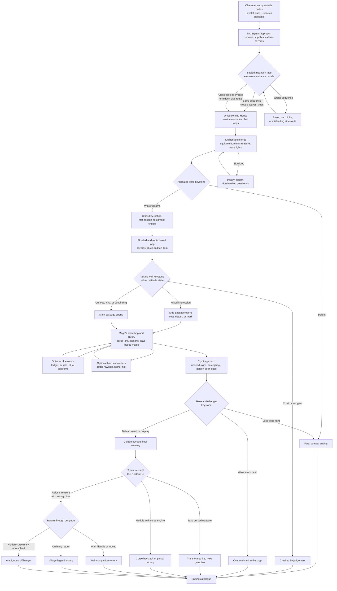

Source seed: `/Users/dank/Downloads/five_room_dungeon.py`

## Short Answer

Yes: the original adventure can plausibly expand to a 400-node gamebook. The five rooms should become **keystone encounters** rather than the whole map:

- The handleless entrance and elemental button puzzle.
- The animated knife and first equipment cache.
- The talking wall and hidden morality test.
- The skeletal challenger and golden key.
- The cursed treasure chamber and final reveal.

The expansion should add surrounding rooms, loops, optional treasures, lore clues, false trails, traps, minor combats, hidden shortcuts, class/species-specific approaches, and fatal routes. Character creation should sit outside the numbered nodes, and routine fleeing/giving-up nodes should be dropped unless a retreat is narratively distinctive.

## Design Goals

- Preserve the Python's comic voice, especially the dry narrator, the living wall, and the bait-and-switch treasure ending.
- Make the dungeon feel larger than five rooms while keeping the five original scenes as major structural locks.
- Use the treasure curse as the spine of the adventure: earlier rooms should hint that successful looters become later guardians.
- Hide internal state from the reader. The wall's attitude score should never be named in prose or shown as a number.
- Support fighter, rogue, wizard, and cleric routes.
- Expand character flavour to include race/species-specific text and options.
- Give each class and species distinctive ways to interact with the dungeon, not just unique dialogue.
- Start characters at level 3, with preset SRD-safe class packages rather than player-selected spells or features.
- Make combat dangerous but less brutally swingy than the level-1 Python prototype.
- Use saving throws for spells, traps, curses, poison, fear, illusions, collapsing rooms, and undead magic.
- Use classic gamebook texture: loops, dead ends, traps, luckless choices, strange treasures, suspicious hints, code words, one-way doors, and risky shortcuts.

## Revised Scope

The original 55-node extraction includes character creation, flee/give-up options, and visible notes about state. A production gamebook should trim or hide those:

- Character creation moves outside the node count.
- Generic "go home" and "flee combat" branches are removed.
- Combat defeat goes to compact fatal endings.
- The wall's attitude is an internal variable or hidden set of flags.
- Player-facing text says what the wall does, not why the state machine chose it.

The source material then becomes a **40-45 node critical path**. A 400-node book can wrap that path with about **355-360 additional nodes**.

## Character Level And Combat Stance

The original Python script effectively assumes very low-level characters, which makes every fight extremely lethal. The full gamebook should start the player at **level 3**.

Level 3 is a better fit because:

- The character has enough hit points to survive more than one unlucky exchange.
- Each class can have a stronger identity in combat and exploration.
- The adventure can include several easy or moderate fights before the final boss.
- Spellcasters have interesting options without requiring the player to choose from a large spell list.
- The final boss can be a real challenge without every earlier combat feeling like a coin toss.

Character creation should still stay quick. The player chooses name, class, and species, then receives a preset SRD-safe package:

| Class | Preset role | Combat feel |
| --- | --- | --- |
| Fighter | Durable weapon specialist | Reliable attacks, stronger defence, occasional shove or guard options |
| Rogue | Mobile opportunist | Lower durability, higher burst damage when conditions are right, trap and lock advantages |
| Wizard | Fragile arcane problem-solver | Limited preset spells, illusion and animation counters, risky high-impact options |
| Cleric | Tough support and warding caster | Healing, protection, undead pressure, curse and symbol interpretation |

Combat difficulty should vary deliberately:

- **Easy fights** teach the combat loop and spend small resources: animated cutlery, brittle bone hands, wax servants.
- **Moderate fights** threaten careless players but reward preparation: animated armour, mirror-duellist, chapel guardian.
- **Hard fights** should be optional, avoidable, or strongly telegraphed: waking extra sarcophagi, cursed treasure guardians.
- **Final boss** should be the sharpest mandatory challenge, especially if the player missed clues or useful items.

The design goal is not to remove danger. It is to stop the first unlucky d20 from ending an otherwise interesting run.

## Proposed Node Budget

| Area | Approx. nodes | Purpose |
| --- | ---: | --- |
| Prologue and mountain approach | 20 | Rumours, supplies, exterior clues, first hazards |
| Entrance puzzle complex | 45 | Elemental puzzle, alternate clues, wrong sequences, traps |
| Outer service rooms | 55 | Stores, barracks, kitchens, first loot, minor monsters |
| Knife room keystone | 25 | Animated knife, key, potion, equipment choices |
| Flooded and root-choked side loop | 45 | Hazards, lore, hidden item, species/class routes |
| Talking wall keystone | 45 | Social puzzle, hidden attitude, lore, conditional passage |
| Mage's workshop and library | 55 | Curse explanation, spell clues, cleric/wizard options |
| Crypt approach | 45 | Undead hints, traps, optional fights, golden door clues |
| Skeleton keystone | 25 | Boss fight, parley fragments, time-loop reveal |
| Treasure vault and endings | 35 | Cursed treasure, safe victory, wall ending, fatal greed |
| Deaths, dead ends, and redirects | 50 | Sudden failures, wrong turns, soft loops, one-way doors |
| Total | 400 | Full book-scale adventure |

These buckets do not need to be contiguous in numbering. In a finished gamebook, node numbers should be shuffled to make the graph feel less linear.

## Map Shape

The dungeon can be structured as five linked zones:

1. **The Sealed Face Of Mt. Bryntor**
   The mountain exterior, old camp remains, weathered warnings, and the elemental entrance puzzle.

2. **The Unwelcoming House**
   Rooms that look like domestic or service spaces: table, kitchen knife, pantry, sleeping alcoves, boot room, cracked cistern, dumbwaiter. This keeps the animated knife absurd and memorable.

3. **The Hall Of Judgement**
   The talking wall, morality test, confession rooms, murals of former challengers, and side rooms that let the player gather context before speaking to it.

4. **The Mage's Failed Immortality Engine**
   Workshop, library, observatory, ritual chamber, specimen cases, failed apprentices, timekeeping devices, and curse machinery.

5. **The Golden Lie**
   Crypt, sarcophagus chamber, golden door, treasure vault, and endings.

## Rough Flow

This is a high-level structure rather than final passage numbering. The finished book should shuffle node numbers and include many loops, false routes, and clue branches inside each zone.

## Critical Path

The shortest successful route should be possible in roughly 55-70 nodes:

1. Reach Mt. Bryntor.
2. Solve or bypass the elemental entrance.
3. Survive the animated knife and gain the first key.
4. Reach the talking wall.
5. Avoid angering the wall enough to be crushed.
6. Learn at least one warning about the treasure curse.
7. Defeat or otherwise resolve the skeletal challenger.
8. Enter the treasure vault.
9. Refuse the treasure.
10. Leave with either ordinary victory or the wall-companion ending.

The longer routes should improve survival odds through equipment, lore, clues, and alternative solutions, but should also expose the player to more danger.

## Keystone Encounter Expansions

### Entrance Puzzle

Keep the original answer: clouds, waves, trees. Add:

- A weathered pilgrim carving that hints "sky before sea before seed".
- A false clue left by a doomed treasure hunter.
- Wrong-order consequences that escalate from reset, to minor damage, to opening a trap niche.
- Class/species options:
  - Cleric can read the sequence as a creation liturgy.
  - Wizard can identify the puzzle as elemental ordering.
  - Rogue can inspect worn button edges.
  - Dwarf can read stonework stress around the true mechanism.
  - Elf can recognise the tree symbol is newer than the others.
  - Halfling can squeeze behind the slab if a side route has been found.

### Animated Knife

Keep the table, key, bottle, and flying knife. Add:

- Optional kitchen rooms that reveal the knife was once part of a larger animated cutlery set.
- A shield, padded gloves, or iron pan that can reduce damage.
- A rogue disarm route.
- A wizard can suppress the animation briefly.
- A cleric can bless the table or sense the object is not undead.
- Species details:
  - Dwarf notices the key is cheap brass, not the important treasure key.
  - Halfling can duck beneath the knife's first pass.
  - Elf hears the bottle chime oddly before touching it.
  - Human gets a practical improvisation prompt.

### Talking Wall

The wall should become the personality centre of the book. Its internal attitude should be hidden. The reader sees facial expression, tone, and available options, but never a score.

Add:

- Earlier gossip about a "lonely judge" in the mountain.
- Optional side rooms that let the player learn the wall likes being asked about itself.
- More dialogue options keyed to class and species.
- A cleric route based on confession, mercy, or sincere moral intent.
- A rogue route based on charm, bluffing, or noticing when jokes are not landing.
- A fighter route based on directness, humility, or accidentally making things worse.
- A wizard route based on curiosity about the enchantment.
- A route where the wall opens a side passage instead of the main route.
- A route where the wall marks the player with a hidden judgement flag that affects the treasure ending.

Possible hidden state:

- `wall-kindness`
- `wall-irritation`
- `asked-wall-story`
- `flirted-with-wall`
- `mocked-wall`
- `passed-judgement`

The engine can store these as numeric counters or flags. The page should only describe the wall's behaviour.

### Skeleton Challenger

The skeleton should be more than a boss. It is evidence of the curse.

Add:

- A chance to notice old adventuring gear matching earlier rumours.
- A wizard or cleric clue that the skeleton is bound by time magic as much as necromancy.
- A fighter route to read its stance and gain a combat advantage.
- A rogue route to snatch or loosen the golden key before combat.
- A parley fragment where the skeleton almost remembers its name.
- Fatal routes for disturbing the sarcophagus carelessly.
- Treasure-room foreshadowing: the key is warm, not because it is gold, but because it is part of the curse engine.

### Treasure Vault

The treasure must tempt the player. The safe ending should feel like a hard-earned moral choice, not an obvious button marked "win".

Add:

- Several treasures that look useful: crown, ring, jeweled sword, coin pouch, spellbook, reliquary.
- A few safe non-treasure rewards: map, memory, blessing, wall's secret name, a mundane token.
- Cursed treasure routes with different transformations or fatal images.
- Cleric option to consecrate or refuse the hoard.
- Rogue option to detect the trap but still risk palming one coin.
- Wizard option to identify the curse but possibly overreach.
- Fighter option to smash a display and trigger a guardian.
- Species-specific perceptions of the treasure's emotional or craft value.

## Additional Room Families

### Combat Rooms

Use combat to tax resources, not just pad node count.

- Rusted training armour animated by old commands.
- Candle-wax servants that reform unless their wicks are cut.
- Bone hands reaching through floor grates.
- A pantry swarm of animated utensils.
- A mirror-duellist that copies the player's class.
- A chapel guardian that tests whether violence is necessary.
- A false skeleton that is only a puppet, designed to waste spells and hit points.

### Trap Rooms

Traps should teach the dungeon's themes: greed, impatience, vanity, and careless certainty.

- Coin floor that gets heavier with every step.
- Door handle that bites and will not let go until politely addressed.
- Corridor that shortens when the player lies.
- Portrait gallery where looking too long swaps memories.
- Hourglass room that loops unless the player waits.
- False healing fountain that restores hit points but adds a hidden curse mark.
- "Obvious" treasure chest that is safest when ignored.

### Treasure And Equipment Rooms

Useful rewards should come with trade-offs.

- Lantern that reveals invisible writing but attracts guardians.
- Chalk for marking loops.
- Rope and pitons.
- Silvered kitchen knife.
- Mirror shard that shows the last person who touched treasure.
- Blessed bandage.
- Old shield with a dent matching the skeleton's sword.
- Keyring with many false keys.
- Wax earplugs for rooms with enchanted commands.
- A humble wooden token that matters more than gold.

### Lore Rooms

Lore should not be exposition dumps. It should answer practical player questions:

- Why does no one return?
- Why does the wall judge people?
- Who made the dungeon?
- Why is the skeleton still guarding the door?
- What does the treasure actually do?
- How can the curse be avoided?
- Is the wall a prisoner, servant, or collaborator?

Possible delivery methods:

- Graffiti from former adventurers.
- Ledger of names with the last line unfinished.
- Failed spell diagrams.
- Domestic notes from the mage.
- Wall murals that change after the player makes moral choices.
- Skeleton memories triggered by items.
- Cleric-readable funerary marks.
- Wizard-readable spell diagrams.
- Rogue-readable scratch marks and hidden caches.
- Fighter-readable weapon damage and old battle signs.

### Dead Ends And Fatal Routes

Use these sparingly but confidently. They are part of the genre texture.

- Fatal greed route: take the obvious treasure too early.
- Fatal arrogance route: insult the wall repeatedly.
- Fatal impatience route: force the wrong door without support.
- Fatal curiosity route: open a sealed jar in the workshop.
- Fatal combat route: wake all the sarcophagi.
- Dead-end loop: circular corridor with chalk as the solution.
- Soft failure: waste a key or potion and make a later route much harder.

## Saving Throws

Saving throws should be part of the game. Their absence from the Python was an experience constraint, not a design principle.

Use saving throws when the player or another creature resists an effect rather than when the player actively attempts a task:

- **Strength saves**: resist crushing walls, dragging chains, magnetic armour racks, or a sarcophagus lid slamming shut.
- **Dexterity saves**: dodge blades, falling stones, alchemical fire, dart traps, or collapsing bridges.
- **Constitution saves**: endure poison, choking dust, cursed treasure sickness, freezing water, or necrotic fumes.
- **Intelligence saves**: resist maze logic, memory loops, false maps, and hostile puzzle magic.
- **Wisdom saves**: see through fear, compulsion, cursed greed, ghostly pleading, and moral illusions.
- **Charisma saves**: resist possession, forced oaths, name-stealing magic, and the dungeon trying to make the player part of its story.

Enemy saving throws should also exist. Cleric and wizard options can force monsters, spirits, or constructs to save against effects:

- A cleric wards undead; the skeleton makes a Wisdom save or loses its first attack.
- A cleric consecrates a threshold; lesser undead make Charisma saves or cannot cross it.
- A wizard disrupts an animated object; the object makes a Constitution or Intelligence save depending on whether its magic is brute force or clever enchantment.
- A wizard reveals an illusion; the illusion's maker, ward, or static DC contests the spell.

In prose, this should feel like classic gamebook jeopardy: "Test your Dexterity" or "the skeleton resists your prayer". In the engine, it should be structured data with explicit save type, DC, roller, outcome, and log entry.

## Class Routes

Each class should receive occasional unique options, but not a separate full adventure. These options should change how the player handles the world: new routes, safer solutions, different risks, altered combat openings, or better information.

| Class | World interactions | Example branches | Risks |
| --- | --- | --- | --- |
| Fighter | Smash weak doors, brace mechanisms, read weapon marks, hold collapsing passages, intimidate minor guardians, exploit combat stances | Break the pantry lock instead of finding its key; hold a pressure plate down while crossing; identify that the skeleton favours its left side | Brute force can trigger louder traps, break useful items, or start harsher fights |
| Rogue | Pick locks, disarm traps, spot hidden compartments, palm small items, read footprints and scratch marks, set ambushes | Pick the kitchen door; remove the dart spring from the coin floor; lift the golden key chain before combat starts | Greedy or sneaky options can worsen the treasure curse or offend the wall if discovered |
| Wizard | Decode runes, see through illusions, identify enchantments, disrupt animated objects, understand time magic, manipulate puzzle symbols | Reveal a fake corridor; suppress the animated knife for one round; read the chronomancy on the sarcophagus | Over-analysis and magical meddling can wake stronger defences or trigger spell backlash saves |
| Cleric | Interpret holy symbols, sense curses, consecrate remains, ward undead, bless thresholds, hear confessions, resist temptation | Read funerary marks in the crypt; force a lesser undead creature to make a saving throw; consecrate the sarcophagus before opening it | Moral certainty can anger the wall if it becomes judgemental; failed wards can draw undead attention |

## Race/Species Routes

Use species-specific detail as flavour and occasional mechanical leverage. Avoid making any one species mandatory for victory. Species options should behave like small affordances: alternate readings of the same space, different routes through a hazard, or extra context.

| Species | World interactions | Example branches |
| --- | --- | --- |
| Human | Adaptable social reads, practical improvisation, village rumour memory, quick trust-building | Recall a rumour about previous expeditions; improvise a lever from broken furniture; read when the wall wants sincerity rather than cleverness |
| Elf | Old symbols, subtle sounds, living roots, long-view moral reflections, illusion tells | Hear the false corridor humming; recognise that the tree button was carved later; notice root growth around a hidden cistern |
| Dwarf | Stonework, masonry locks, goldcraft, underground navigation, structural danger | Sense a wall is load-bearing; identify fool's gold in the treasure vault; find the safest path through a collapsing tunnel |
| Halfling | Small gaps, domestic details, luck-inflected choices, under-table routes, overlooked hiding places | Crawl through a dumbwaiter; duck under the animated knife's first pass; spot a useful household object in the kitchen clutter |

If the project later adds more SRD-compatible options, this table can expand. For now it matches the existing engine's race model.

## Cleric Support

The original Python omitted cleric because saving throws against cleric spells were awkward at the time. The full gamebook should include them. Cleric options should mix narrative interpretation, state changes, and proper save-based effects:

- Turn or ward minor undead by forcing Wisdom or Charisma saves.
- Consecrate remains to prevent a later skeleton from reviving.
- Detect curse as information, not automatic victory.
- Offer mercy or burial to gain hidden blessing flags.
- Interpret holy symbols, funerary marks, and failed rites.
- Resist cursed treasure through Wisdom or Charisma saves.
- Use prayer or blessing to alter an encounter opening, not to bypass every threat.

This gives clerics a real identity in the dungeon without requiring a complete spell-list simulator.

## Engine Implications

To support the expanded design cleanly, the engine should add:

- Hidden numeric or ranked variables for wall attitude, curse pressure, and dungeon alertness.
- Conditional prose fragments keyed by class and species.
- Choice requirements based on class, species, item, flag, save proficiency, and hidden variable thresholds.
- Ordered puzzle support or a reusable sequence-puzzle helper.
- Saving throw definitions for player saves and enemy saves, including DC, ability, source, success and failure targets, and optional partial-success effects.
- Creature actions that can call for saving throws as well as attack rolls.
- Code-word style discoveries for lore clues.
- Optional combat modifiers from items, class routes, and prior choices.
- Fatal ending categories beyond plain failure: cursed, trapped, transformed, slain, abandoned.
- Author tooling for 400-node graph validation, including unreachable endings, overly linear chains, and orphaned clues.

## Authoring Strategy

Build the 400-node version in layers:

1. **Canonical path, 60 nodes**
   Strip the source adventure down to the playable path without character creation or generic retreat choices.

2. **Dungeon map, 120 nodes**
   Add side rooms, loops, locked doors, shortcuts, and clue routes around the keystone encounters.

3. **Hazards and rewards, 220 nodes**
   Add combat, traps, consumables, equipment, lore fragments, and early fatal routes.

4. **Class/species pass, 300 nodes**
   Add optional class and species branches that rejoin the main graph after giving information, items, advantage, or consequences.

5. **Endgame and replay texture, 400 nodes**
   Add cursed treasure variants, wall epilogues, skeleton memory routes, final false choices, dead ends, and alternate victories.

This order keeps the adventure testable while it grows. The graph should remain beatable after every layer.

## Working Premise

Mt. Bryntor is not simply a treasure vault. It is a moral and magical recycling machine built by a mage who wanted a guardian that could renew itself. The wall judges whether entrants are likely to feed the curse. The skeleton is a previous victor who failed the final test. The treasure is real, but taking it makes the taker part of the dungeon.

That premise lets the old Python's jokes, traps, and twist scale up into a full gamebook without losing the charm of the original.
