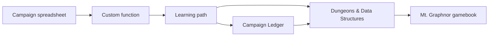

# Chapter 01: From Spreadsheets To Spellcraft

## Research Question

How should the introduction welcome a curious beginner into a book about computer science, software
engineering, RPGs, gamebooks, Campaign Ledger, Hyper-Dank, and the Mt. Graphnor gamebook without
pretending the reader already belongs in all of those worlds?

The answer should be: start with the human route in. The book began with a non-computer-science
developer trying to solve campaign problems in spreadsheets, discovering custom functions and
JavaScript, then following that thread into Python, Bash, Linux, HTML, CSS, software consultancy,
Campaign Ledger, Hyper-Dank, and finally this book/gamebook pair.

The introduction should make the promise plain:

- games are systems made visible;
- programming can be learned through familiar structures;
- the book is a dissertation-shaped reflection on roughly five years of learning;
- the companion gamebook is an original worked example, not a decorative side quest;
- Campaign Ledger is the mature case study showing how the same ideas grow in a real app;
- the reader does not need to arrive with a computer science background.

## Core Concept

The introduction is a contract with the reader.

For this book, that contract has five parts:

- **Permission**: you can learn computer science and software engineering from a non-traditional
  route.
- **Lens**: RPGs, gamebooks, and fantasy systems make abstract ideas visible.
- **Method**: each chapter teaches one concept, then ties it to the gamebook or Campaign Ledger.
- **Boundary**: D&D 5e SRD mechanics, gamebook form, and fantasy tropes are inspiration and
  structure; the book must respect licences and original expression.
- **Promise**: by the end, the reader should see software as choices, constraints, state, rules,
  evidence, and meaning.

The introduction should not front-load the whole table of contents. It should orient the reader,
name the book's unusual route, and give them confidence that the strange mixture is deliberate.

## RPG Or Gamebook Analogy

A spreadsheet becomes a spellbook.

At first, the sheet is just a ledger: campaign notes, session plans, names, numbers, formulae. Then
one formula is not enough. The author discovers that a sheet can run a custom function. A cell stops
being a box and becomes an invocation. From there, the map widens: JavaScript, Python, Bash, Linux,
HTML, CSS, web apps, databases, packages, tests, and deployment.

That image should carry the introduction without becoming too grand. The joke works because it is
half silly and half true: programming really does feel like writing precise words that change the
world.

## Opening Passage Or Table Transcript

Open with a table transcript: **The Wizard and the Apprentice** discuss whether a spreadsheet can be
a spellbook.

The Apprentice thinks a spreadsheet is mundane. The Wizard points at a formula, then a custom
function, then a web app, and asks where the spell begins. The transcript should dramatise the first
conceptual shift of the book: a tool becomes programmable when the user can describe rules and
state changes precisely enough for a machine to repeat them.

The excerpt should be warm, short, and introductory. It should not explain the full book. It should
open the door and then hand off to the personal spreadsheet story.

## Sources

- Personal source: `/Users/dank/Code/personal/scratch.md`
  - Defines the book as an exploration of computer science and software engineering through RPGs,
    Fighting Fantasy-style gamebooks, fantasy literature, and related interests.
  - Names the book as a dissertation-like reflection on five years of learning.
  - Records the non-traditional route: call-centre work, Google Sheets, D&D campaign management,
    custom functions, JavaScript tutorials, Python, Bash, Linux, HTML, CSS, and software consultancy.
  - Frames programming as the closest practical equivalent to spellcasting for someone raised on
    Fighting Fantasy and D&D wizards.
- Seed manuscript source: `book/chapters/seed/introduction.md`
  - Supplies the existing thesis that RPGs and computer science both organise structured information
    and rules for changing it.
  - Names data structures, algorithms, character sheets, stat blocks, adventure modules, branching
    narrative, TypeScript examples, and diagrams as core territory.
- Book structure source: `book/book-structure-plan.md`
  - Defines the book as concept-led and beginner-friendly.
  - Establishes the gamebook as the running worked example, but not the table-of-contents spine.
  - Sets the personal thread and the mechanics-first Mt. Graphnor boundary.
  - Requires SRD and gamebook originality guardrails.
- Gamebook plan source: `book/gamebook-plan.md`
  - Defines the static TypeScript/HTML gamebook, local-storage state, SRD-safe mechanics, and
    framework-light domain layer.
  - Clarifies that final gamebook prose comes later and the gamebook should not become a direct
    computer-science allegory.
- Architecture checkpoint source: `book/architecture-checkpoint-before-further-dossiers.md`
  - Confirms the introduction still fits the current architecture and Campaign Ledger origin story.
- Current implementation evidence:
  `/Users/dank/Code/personal/web/dungeons-and-data-structures/book/build-log.md`,
  `/Users/dank/Code/personal/web/dungeons-and-data-structures/src/gamebook/`,
  `/Users/dank/Code/personal/web/dungeons-and-data-structures/src/app.tsx`.
- Campaign Ledger evidence:
  `/Users/dank/Code/personal/web/campaign-ledger/ARCHITECTURE.md`,
  `/Users/dank/Code/personal/web/campaign-ledger/src/app.tsx`,
  `/Users/dank/Code/personal/web/campaign-ledger/docs/operations/`.

## Campaign Ledger Evidence

The introduction should mention Campaign Ledger as the origin pressure and mature case study, not as
a second product the reader must understand immediately.

Use it to establish:

- The author's first programming needs came from managing D&D campaign information.
- Campaign Ledger is what the spreadsheet impulse became after several years: a local-first,
  server-rendered app with users, roles, sheets, rules, campaign material, imports, previews,
  screenshots, accessibility checks, smoke tests, and delivery notes.
- The book will often use Campaign Ledger when the small gamebook example needs a bigger,
  production-shaped counterpart.
- The reader does not need to know Campaign Ledger in advance; the relevant pieces will be introduced
  where they matter.

Avoid opening with deep Campaign Ledger architecture. The introduction should name it as lived
evidence and defer the details to later chapters.

## Gamebook Build Payoff

The introduction should introduce the companion gamebook as a promise:

- It is a static TypeScript/HTML gamebook.
- It stores local progress in the browser.
- It uses SRD 5.1-compatible mechanics where useful.
- It is inspired by gamebook form without copying protected maps, passages, trade dress, names,
  encounters, or puzzle answers.
- It uses Mt. Graphnor as a mechanics-first prototype and worked example.
- It will supply concrete code examples for graph structure, hypermedia, character data, class
  composition, dice, combat, inventory, permissions, modules, rules, saving, authoring, and testing.

The introduction should not overpromise a finished literary adventure. Say clearly that the book uses
the gamebook's mechanics and code as teaching material while final narrative polish comes later.

## Notes For The Draft

### Opening Move

Start with the personal moment:

> I was not trying to become a software developer. I was trying to make my D&D campaign spreadsheet
> do one more thing.

Then move quickly from a specific spreadsheet limitation into the broader discovery:

- a formula could not express the needed operation;
- custom functions made the sheet programmable;
- a JavaScript tutorial opened the door;
- the door led to a much larger dungeon.

Keep the tone lightly funny and sincere. The reader should feel invited, not lectured.

### Sections

1. **The Spreadsheet That Opened**
   - Begin with call-centre work, Google Sheets, D&D campaign management, and the custom-function
     problem.
   - Explain that the author expected a small fix and found a whole discipline.

2. **Programming As Spellcraft**
   - Use the spellcasting metaphor carefully: precise words, strict rules, mysterious tools, real
     effects.
   - Keep it grounded in learning, not mysticism.

3. **Games Are Systems You Can Touch**
   - Explain why RPGs and gamebooks are useful teaching lenses: rules, state, probability, branching
     choices, resources, roles, modules, and evidence.
   - Reuse the seed introduction's point about data structures and algorithms.

4. **What This Book Is**
   - A beginner-friendly technical book.
   - A reflection on five years of self-directed learning and consultancy.
   - A practical gamebook build.
   - A bridge between playful metaphors and real software.

5. **The Running Examples**
   - Introduce Mt. Graphnor as the small companion gamebook.
   - Introduce Campaign Ledger as the larger mature app.
   - Explain that the chapters move between the two when scale matters.

6. **What This Book Is Not**
   - Not a D&D rules clone.
   - Not a Fighting Fantasy pastiche.
   - Not a full computer science textbook.
   - Not a promise that every metaphor is perfect.

7. **How To Read It**
   - Each chapter teaches one idea.
   - Code examples are there to make the idea concrete.
   - Opening passages and table transcripts are doorways into the idea.
   - The gamebook grows by pressure from the concepts.

### Diagram Idea

### Reusable Sentences

- "This book is not about making programming cute. It is about noticing that games are already made
  of data, rules, choices, constraints, and state."
- "The dungeon is a metaphor, but the code is real."
- "I did not enter programming through a university course. I entered through a spreadsheet that
  refused to be enough."
- "If you have ever tracked hit points, checked a spell description, followed a gamebook paragraph,
  or argued about what a player can see, you have already touched the shape of the ideas in this
  book."

## Risks

- **Overlong autobiography**: the personal story should open the door, not delay the book.
- **Cute metaphor overload**: spellcraft and dungeons should clarify the concepts, not obscure them.
- **Overclaiming**: the introduction should not promise a complete CS curriculum or a finished
  commercial gamebook.
- **Licence blur**: establish SRD and gamebook originality guardrails early.
- **Campaign Ledger overload**: mention it as the mature case study, then defer details.
- **False beginner tone**: the reader should feel welcomed, not talked down to.
- **Narrative confusion**: Mt. Graphnor is the running mechanics example, not the book's in-world
  narrator and not a direct allegory for computer science.
