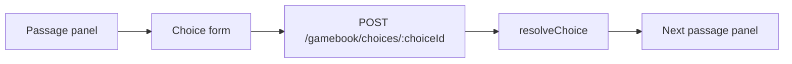
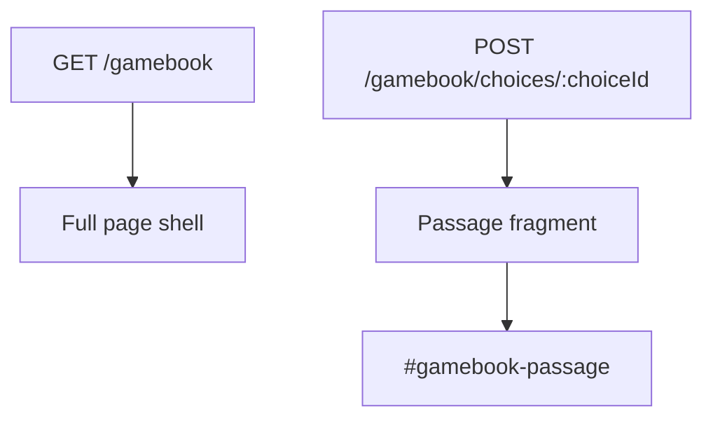
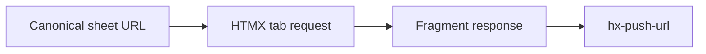

# Chapter 03: Hypertext, HATEOAS, And The Gamebook Page

## Research Question

How can a beginner understand hypertext, forms, fragments, redirects, HATEOAS, and progressive
enhancement through a playable gamebook page before seeing the same ideas in a larger application?

## Core Concept

Hypertext turns application state into visible choices. A page does not need to explain the whole
system; it needs to show the reader what they can do next.

For this chapter, the key idea is:

- A link says, "go to this resource".
- A form says, "submit this intention to this resource".
- A response returns a new representation of state.
- A fragment response can update part of the page without abandoning the web's link-and-form model.
- A redirect says, "the next application state lives over there".
- HATEOAS is the larger architectural idea that the representation itself should carry the controls
  for the next valid state transitions.

The chapter should not turn HATEOAS into a jargon trophy. Use it as a name for something the reader
has already felt while playing: the door, button, or choice is the current state's invitation to
move.

## RPG Or Gamebook Analogy

A gamebook passage is a hypermedia response. It gives the reader:

- The current state: where they are, what just happened, and what resources they have.
- Available controls: choices, checks, combat actions, exits, and restart or save options.
- Hidden constraints: unavailable choices are not printed, just as unavailable actions should not be
  offered by an honest interface.
- A target for each action: another passage, an ending, or a changed state.

At the table, a Dungeon Master does this conversationally. In a solo gamebook or web app, the page
does it through links, forms, buttons, labels, and responses.

## Opening Passage Or Table Transcript

Open with a gamebook passage where a door refuses to reveal every possible room in the dungeon.

The door offers only the actions available from the current passage: listen, knock, force, retreat.
The Adventurer wants a complete map, but the passage only gives valid next moves. The technical
handoff is HATEOAS: a good hypermedia representation offers the next valid actions without requiring
the reader to know the whole server, graph, or rules engine in advance.

## Sources

- Authoritative CS/software source: Roy Fielding's dissertation chapter on REST, especially the
  uniform interface and "hypermedia as the engine of application state" constraint:
  <https://roy.gbiv.com/pubs/dissertation/rest_arch_style.htm>.
- Web platform source: MDN on anchors and forms:
  <https://developer.mozilla.org/en-US/docs/Web/HTML/Reference/Elements/a> and
  <https://developer.mozilla.org/en-US/docs/Web/HTML/Reference/Elements/form>.
- HTTP source: MDN on HTTP redirections:
  <https://developer.mozilla.org/en-US/docs/Web/HTTP/Guides/Redirections>.
- HTMX source: official htmx documentation for hypertext-oriented requests, targets, swaps,
  history, and redirects:
  <https://htmx.org/docs/>,
  <https://htmx.org/attributes/hx-post/>,
  <https://htmx.org/attributes/hx-swap/>,
  <https://htmx.org/attributes/hx-push-url/>, and
  <https://htmx.org/headers/hx-redirect/>.
- D&D 5e SRD source, if relevant: not central for this chapter. Use adventure choices and checks as
  examples, but save rules detail for later chapters.
- Gamebook/hypertext source, if relevant: use the Chapter 02 gamebook and graph sources as the
  bridge. The chapter's new research focus is the web/hypermedia layer, not gamebook history.

## Campaign Ledger Evidence

Campaign Ledger is the mature case study for this chapter.

- `/Users/dank/Code/personal/web/campaign-ledger/src/app.tsx`
  - `HttpResponder.redirectAfterAction()` is used for action redirects that work for normal and
    HTMX requests.
  - `FormValues.from(context)` keeps form parsing close to route actions.
  - Routes serve full pages for refreshable navigation and fragments for focused updates.
  - Campaign routes expose wiki, NPC, image, import, and preview surfaces as named resources.
- `/Users/dank/Code/personal/web/campaign-ledger/src/app.test.tsx`
  - Tests cover `HX-Redirect`, authenticated redirects, fragment-only sheet tab panels, canonical
    tab pages with `hx-push-url`, and many focused edit fragments.
- `/Users/dank/Code/personal/web/campaign-ledger/src/components/organisms/SheetTabs/SheetTabs.tsx`
  - Tabs use `hx-push-url` so fragment navigation also remains addressable and refreshable.
- `/Users/dank/Code/personal/web/campaign-ledger/src/components/molecules/Breadcrumbs/index.ts`
  - Campaign Ledger now adopts Hyper-Dank `Breadcrumbs`, making orientation a shared hypermedia UI
    primitive rather than one-off local markup.
- `/Users/dank/Code/personal/web/campaign-ledger/src/components/pages/Campaign/Campaign.tsx`
  - `CampaignBreadcrumbs` and campaign wiki/player discovery routes show how a larger app gives the
    user context, return paths, and relevant next actions.
- `/Users/dank/Code/personal/web/campaign-ledger/scripts/hyper-dank-compat.test.tsx`
  - Covers shared `Breadcrumbs`, `HxForm`, `FormValues`, and HTMX prop contracts from Hyper-Dank
    packages.

Inference from project context: Campaign Ledger shows the same hypermedia idea at product scale.
The gamebook page is the beginner-sized version; Campaign Ledger is the evidence that the pattern
survives when routes, permissions, fragments, and roles multiply.

## Gamebook Build Payoff

This chapter explains the gamebook's page and interaction layer:

- `src/app.tsx`
  - `GET /gamebook` renders the full playable page.
  - `POST /gamebook/choices/:choiceId` resolves a choice and returns the next passage fragment.
  - `POST /gamebook/passages` is the development-only author navigation route.
  - `PassagePanel` renders choices as forms with `action`, `method`, `hx-post`, `hx-target`, and
    `hx-swap`.
- `src/gamebook/render.ts`
  - Shared author-capable HTML renderer for passages, choices, debug controls, and details panels.
- `src/gamebook/player-render.ts`
  - Player-only static renderer that keeps published play free of author/debug tooling.
- `src/gamebook/client.ts` and `src/gamebook/player-client.ts`
  - Browser behaviour that progressively enhances the static gamebook while preserving the same
    passage, choice, and state model.
- `src/app.test.tsx`
  - Route tests assert full-page rendering, choice fragments, author mode preservation, and forced
    passage behaviour.
- `scripts/test-static-gamebook.ts`
  - Browser smoke evidence that the published static game still behaves like a playable hypertext
    adventure.

The build move should make one passage response feel like an honest hypermedia representation:
story, state summary, available choices, hidden submitted state, and a target where the response
will appear.

## Notes For The Draft

### Opening Move

Start with the reader at a closed door.

The page does not need to reveal the whole dungeon. It needs to show what the player can do from
this moment: open the door, listen, force the lock, go back, or rest. That is enough to introduce
hypermedia controls before naming HATEOAS.

Avoid opening with REST theory. Bring in Fielding after the reader understands the smaller pattern:
state is carried forward by representations and controls.

### Sections

1. **A Page Is A Room With Exits**
   - Connect Chapter 02's graph vocabulary to actual web pages.
   - Links and forms are labelled exits.
   - URLs identify resources; visible text explains why a reader should use them.

2. **Links, Forms, And Intent**
   - Use MDN anchor and form docs as the web-platform base.
   - Links suit navigation.
   - Forms suit actions that submit intent or state.
   - Explain why gamebook choices are forms in the current implementation: the state document travels
     with the choice.

3. **Fragments Without Forgetting The Page**
   - Explain `hx-post`, `hx-target`, and `hx-swap`.
   - Show how `POST /gamebook/choices/:choiceId` returns just the next `PassagePanel`.
   - Contrast full-page route refresh with focused fragment replacement.
   - Keep progressive enhancement visible: a form still has `action` and `method`.

4. **Redirects And Refreshable Paths**
   - Use Campaign Ledger's `HX-Redirect` tests as the mature example.
   - Explain canonical URLs and `hx-push-url` through sheet tabs and breadcrumbs.
   - Keep the lesson practical: fragment interactions should not trap the user in an unshareable,
     unrefreshable state unless there is a deliberate reason.

5. **HATEOAS Without The Fog Machine**
   - Introduce Fielding's uniform interface and hypermedia control constraint.
   - A response should carry the next valid actions.
   - The gamebook can hide unavailable choices; Campaign Ledger can hide unavailable role actions.
   - Avoid claiming every htmx app is automatically RESTful. The useful lesson is narrower:
     hypermedia controls can reduce client-side guessing.

6. **The Same Pattern At Two Scales**
   - Gamebook: passage, choices, target fragment, local state.
   - Campaign Ledger: full pages, fragments, redirects, breadcrumbs, player/GM route availability.
   - The beginner lesson survives the grown-up app.

### Diagram Idea

Use Mermaid for at least two diagrams.

Choice request loop:



Full page versus fragment:



Optional Campaign Ledger tab flow:



### Code Examples

Start with plain HTML:

```html
<a href="/gamebook">Enter the dungeon</a>

<form action="/gamebook/choices/open-door" method="post">
  <button type="submit">Open the door</button>
</form>
```

Then show the enhanced version from the gamebook:

```html
<form
  action="/gamebook/choices/open-door"
  method="post"
  hx-post="/gamebook/choices/open-door"
  hx-target="#gamebook-passage"
  hx-swap="innerHTML"
>
  <button type="submit">Open the door</button>
</form>
```

Useful project snippets:

- `PassagePanel` in `src/app.tsx`.
- `renderPassagePanel` in `src/gamebook/render.ts`.
- `renderPassagePanel` in `src/gamebook/player-render.ts`.
- Campaign Ledger `redirectAfterAction()` in `src/app.tsx`.
- Campaign Ledger `SheetTabs` `hx-push-url` attributes.

### Sidebars

- **Do Not Turn Every Button Into A Link**: links navigate; buttons submit actions.
- **Fragments Are Not A Licence To Lose URLs**: keep refreshable paths where the user will expect
  to return, bookmark, or share.
- **HATEOAS Is A Constraint, Not A Magic Word**: a response with buttons is not automatically good
  architecture. The controls must be valid, meaningful, and current.
- **The Server Can Be The Game Master**: the client asks what happens; the server returns the next
  visible state.

## Risks

- **Jargon overload**: HATEOAS, REST, hypermedia, representation, resource, and fragment can stack
  up quickly. Introduce one term at a time after showing the gamebook version.
- **Overclaiming REST**: do not claim the gamebook or Campaign Ledger is a pure REST exemplar. Use
  REST/HATEOAS as a conceptual lens for hypermedia controls.
- **Progressive-enhancement hand-waving**: if a form depends on hidden JSON state, explain what
  still works and what belongs to later persistence chapters.
- **Confusing graph edges with HTTP actions**: Chapter 02 choices are graph edges; Chapter 03 forms
  are how the web client asks the application to traverse or resolve those edges.
- **Accessibility drift**: link text, button text, headings, breadcrumbs, and focus behaviour are
  part of the user-facing state machine.
- **Campaign Ledger dominance**: keep the gamebook as the beginner example. Use Campaign Ledger to
  prove the pattern scales, not to bury the chapter in app-specific detail.

## Bibliography-Ready Entries

- Fielding, Roy Thomas. *Architectural Styles and the Design of Network-based Software
  Architectures*. Doctoral dissertation, University of California, Irvine, 2000.
  https://roy.gbiv.com/pubs/dissertation/rest_arch_style.htm
- MDN Web Docs. "`<a>`: The Anchor element." Mozilla.
  https://developer.mozilla.org/en-US/docs/Web/HTML/Reference/Elements/a
- MDN Web Docs. "`<form>`: The Form element." Mozilla.
  https://developer.mozilla.org/en-US/docs/Web/HTML/Reference/Elements/form
- MDN Web Docs. "Redirections in HTTP." Mozilla.
  https://developer.mozilla.org/en-US/docs/Web/HTTP/Guides/Redirections
- htmx. "Documentation." https://htmx.org/docs/
- htmx. "`hx-post` Attribute." https://htmx.org/attributes/hx-post/
- htmx. "`hx-swap` Attribute." https://htmx.org/attributes/hx-swap/
- htmx. "`hx-push-url` Attribute." https://htmx.org/attributes/hx-push-url/
- htmx. "`HX-Redirect` Response Header." https://htmx.org/headers/hx-redirect/
