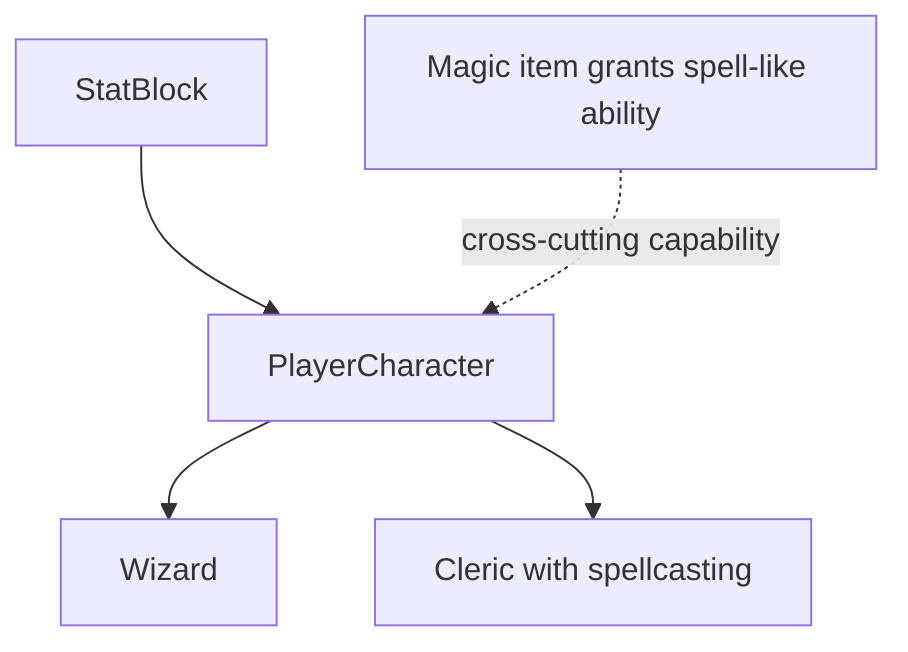
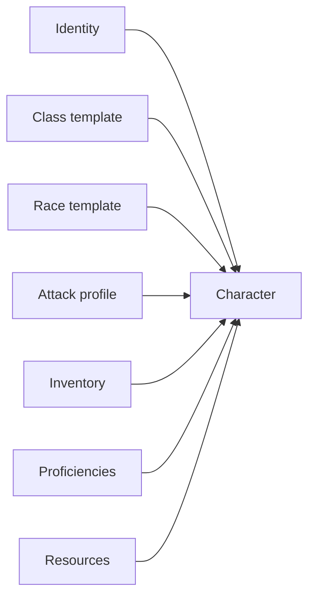
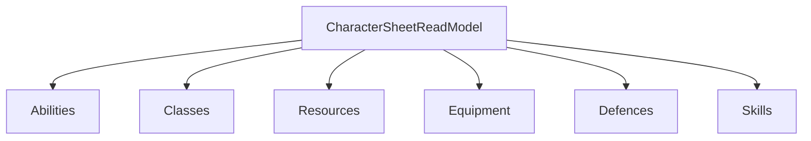

# Chapter 05: Classes, Composition, And The Limits Of Inheritance

## Research Question

How can the chapter teach classes, inheritance, composition, polymorphism, and substitutability
without encouraging a brittle RPG inheritance tree?

## Core Concept

Object-oriented design is not the art of finding the tallest family tree. It is the art of deciding
which concepts need identity, which behaviours need a shared contract, and which variations are
better assembled from smaller parts.

For this chapter, the useful beginner distinction is:

- **Class**: a reusable shape for state and behaviour.
- **Inheritance**: an `is-a` relationship where a subtype should still work wherever the supertype
  is expected.
- **Polymorphism**: different values can satisfy the same contract.
- **Composition**: a value is built from smaller capabilities, records, helpers, or strategies.
- **Liskov substitution**: a subtype should not surprise code that relies on the supertype's
  promised behaviour.

The chapter should not tell readers inheritance is evil. It should show that inheritance is a
specific tool. Character classes in RPGs are an especially good trap: "Fighter", "Rogue", "Wizard",
and "Cleric" are game labels, but they do not automatically need to become software subclasses.

## RPG Or Gamebook Analogy

An RPG character class is a bundle of capabilities. A fighter is not a different species of
software object from a wizard because they both need a name, ability scores, hit points, inventory,
and a way to take actions. The differences are often data and capability choices: starting stats,
equipment, proficiencies, attacks, spellcasting, resources, and feature rules.

The beginner-friendly question is not "which parent class does Wizard inherit from?" It is "what
does this character need to be able to do, and which small parts describe that?"

## Opening Passage Or Table Transcript

Open with a table transcript where **the Wizard and the Apprentice** argue about whether every
spellcaster must inherit from Wizard.

The Wizard claims that all magic should pass through the grand ancestral tower of `Wizard`. The
Apprentice points at the Cleric, who can cast spells without being a wizard at all. The excerpt
should introduce the difference between a game label, a shared capability, and a class hierarchy.

## Sources

- Authoritative language source: TypeScript's class documentation for `implements`, `extends`,
  inheritance, and abstract classes:
  <https://www.typescriptlang.org/docs/handbook/2/classes.html>.
- Authoritative language source: TypeScript's object-types documentation for structural typing and
  interface-shaped contracts:
  <https://www.typescriptlang.org/docs/handbook/2/objects.html>.
- Object-oriented design source: Barbara Liskov, "Data Abstraction and Hierarchy", OOPSLA 1987,
  for the substitutability idea behind Liskov substitution:
  <https://www.cs.tufts.edu/~nr/cs257/archive/barbara-liskov/data-abstraction-and-hierarchy.pdf>.
- Object-oriented design source: Gamma, Helm, Johnson, and Vlissides, *Design Patterns: Elements of
  Reusable Object-Oriented Software*, especially the principle to favour object composition where it
  gives more flexible reuse than class inheritance.
- D&D 5e SRD source: System Reference Document 5.1 under Creative Commons Attribution 4.0
  International:
  <https://media.wizards.com/2023/downloads/dnd/SRD_CC_v5.1.pdf>.

## Shelf References

- Dungeons & Dragons 2014 *Player's Handbook*: use Fighter, Rogue, Wizard, and Cleric as familiar
  labels for class identity and capability bundles; cite SRD 5.1 for reusable mechanics.
- Martin Fowler, *Refactoring*: use for replacing inheritance tangles with clearer object
  composition and behaviour-preserving design changes.
- Robert C. Martin, *Clean Code*: use cautiously for class size, names, and single-responsibility
  pressure.
- Erich Gamma, Richard Helm, Ralph Johnson, and John Vlissides, *Design Patterns*: use for the
  composition-over-inheritance principle and strategy-like capability modelling.

## Campaign Ledger Evidence

Campaign Ledger is the mature case study because it avoids turning the whole character sheet into a
deep inheritance hierarchy.

- `/Users/dank/Code/personal/web/campaign-ledger/src/db/model.ts`
  - `CharacterClassSummary` is a small record for class name, subclass name, level, hit dice, and
    spellcasting ability. It is not a `Wizard extends Character` hierarchy.
  - `CharacterSheetReadModel` composes abilities, class summaries, resources, equipment, defences,
    proficiencies, senses, skills, hit points, and summary fields into the sheet view.
  - `CharacterRepository` exposes focused update methods for abilities, skills, armour class
    sources, equipment, resources, proficiencies, senses, and summary fields.
- `/Users/dank/Code/personal/web/campaign-ledger/src/db/schema.ts`
  - Character details are stored in related tables such as `character_classes`,
    `character_abilities`, `character_skills`, `character_resources`, `character_equipment`,
    `character_defences`, and `character_proficiencies`.
  - This is composition at the persistence level: each part has its own constraints and relationship
    to the character.
- `/Users/dank/Code/personal/web/campaign-ledger/src/app.tsx`
  - Sheet routes update individual slices: summary, abilities, skills, senses, armour class
    sources, resources, and other sheet parts.
  - `parseSheetSummaryForm` treats class name and subclass name as editable data, while the rest of
    the sheet continues to be composed from separate model parts.
- `/Users/dank/Code/personal/web/campaign-ledger/src/local-play/document.ts`
  - The local-play document stores only the small character summary it needs: id, name, species,
    class name, level, notes, and update time.
  - This supports the chapter's "fit the model to the job" point. A local rehearsal document does
    not need the full sheet hierarchy.
- `/Users/dank/Code/personal/web/campaign-ledger/src/characters/calculations.ts`
  - Shared calculations are plain helpers, not superclass methods. That makes ability modifiers,
    saving throws, skill modifiers, armour class totals, and display formatting reusable without
    forcing every sheet concept into one parent class.

Inference from project context: Campaign Ledger shows that real product complexity pushed the model
toward composed records, repositories, helpers, and tables rather than one perfect `Character`
superclass. That is exactly the architectural lesson Chapter 05 should teach after Chapter 04's
record-oriented model.

## Gamebook Build Payoff

This chapter explains why the gamebook uses templates and composition rather than subclassing each
character option:

- `src/gamebook/model.ts`
  - `CharacterClass` is a union of playable labels: `fighter`, `rogue`, `wizard`, and `cleric`.
  - `Character` is one playable shape with class, race, ability scores, hit points, armour class,
    proficiencies, inventory, and attack profile.
- `src/gamebook/rules/character.ts`
  - `CharacterTemplate` composes ability scores, hit points, armour class, skill proficiencies,
    inventory, and attack data.
  - `CHARACTER_TEMPLATES` supplies Fighter, Rogue, Wizard, and Cleric options as data.
  - `RaceTemplate` and `RACE_TEMPLATES` add a second axis of variation through ability bonuses,
    optional inventory, and optional skill proficiencies.
  - `createCharacter` composes class template, race template, name, id, and level into one
    playable `Character`.
  - `abilityModifier`, `proficiencyBonus`, and `skillModifier` remain reusable helpers.
- `src/gamebook/rules/srd.ts`
  - `CLASS_RULES` and `RACE_RULES` keep SRD-informed class/race metadata separate from the runtime
    character creation helper.

The build move should be to create or explain beginner-friendly Fighter, Rogue, Wizard, and Cleric
options as composed templates. Avoid introducing `FighterCharacter extends Character` unless the
chapter uses it as a short cautionary sketch.

## Notes For The Draft

### Opening Move

Start with the seductive inheritance tree:

```text
StatBlock
  PlayerCharacter
    Fighter
    Rogue
    Wizard
    Cleric
  Monster
  NonPlayerCharacter
```

Then ask what breaks when Clerics cast spells, Rogues use magic items, monsters have inventories,
NPCs need combat stats, or a future rule lets a Fighter gain a spell-like feature. The point is not
that the tree is useless. The point is that the tree makes some changes expensive before the reader
has earned that complexity.

### Sections

1. **A Class Is Not Always A Character Class**
   - Explain the overloaded word "class".
   - In programming, a class can define state and behaviour.
   - In D&D, a class is a rules package or role.
   - Keep the distinction explicit so beginners do not assume every RPG class should be a software
     subclass.

2. **Inheritance And The Promise Of `is-a`**
   - Use TypeScript `extends` for the basic idea.
   - Explain that inherited code can be useful when a subtype really can stand in for its parent.
   - Introduce Liskov substitution in plain English: code expecting a parent should not be tricked
     by a child.

3. **Where The Old StatBlock Example Helps**
   - The seed `stats.md` correctly notices shared concepts: abilities, HP, armour class, damage,
     conditions, and actions.
   - Use the old abstract `StatBlock` as a teaching sketch, not as the final architecture.
   - The shared vocabulary is valuable; the deep superclass is the questionable part.

4. **Composition: Build The Hero From Parts**
   - Show class templates as records.
   - Show race templates as a second independent axis.
   - Show attack profile, inventory, proficiencies, and derived helpers as pieces.
   - Explain why this makes a Cleric with spellcasting less awkward than `Cleric extends Wizard`.

5. **Polymorphism Through Contracts**
   - Use TypeScript interfaces or structural object types to show shared capabilities:
     `CanAttack`, `HasInventory`, `CanCastSpell`, or `HasResources`.
   - Keep examples tiny. The goal is to show that different objects can satisfy the same contract
     without sharing a parent class.
   - Connect this to Campaign Ledger's read model and helper functions.

6. **A Mature Sheet Is A Bundle, Not A Tower**
   - Compare gamebook templates with Campaign Ledger's composed sheet tables and read model.
   - Explain that Campaign Ledger can update a skill, resource, armour class source, or summary
     without reconstructing an inheritance tree.
   - Keep the beginner principle: model the axis of change, not the label that feels most dramatic.

### Diagram Idea

Use Mermaid for two diagrams.

Tempting hierarchy:



Composed character:



Optional Campaign Ledger sheet composition:



### Code Examples

Start with the intentionally tempting sketch:

```ts
abstract class StatBlock {
  constructor(public name: string, public hitPoints: number) {}

  isAlive() {
    return this.hitPoints > 0;
  }
}

class Wizard extends StatBlock {
  castSpell() {
    return "spark";
  }
}
```

Then show the composition-shaped alternative:

```ts
type CharacterClass = "fighter" | "rogue" | "wizard" | "cleric";

interface AttackProfile {
  name: string;
  attackBonus: number;
}

interface CharacterTemplate {
  class: CharacterClass;
  maxHitPoints: number;
  inventory: string[];
  attack: AttackProfile;
}
```

Then show a capability contract:

```ts
interface CanAttack {
  attack: AttackProfile;
}

function describeAttack(actor: CanAttack) {
  return `${actor.attack.name} +${actor.attack.attackBonus}`;
}
```

Useful project snippets:

- `docs/published/stats.md` for the original abstract `StatBlock` direction.
- `docs/published/character.md` for the original player-character composition/inheritance sketch.
- `src/gamebook/rules/character.ts` for the current template-based approach.
- `src/gamebook/model.ts` for the `Character` and `AttackProfile` types.
- `/Users/dank/Code/personal/web/campaign-ledger/src/db/model.ts` for the composed sheet read
  model.
- `/Users/dank/Code/personal/web/campaign-ledger/src/db/schema.ts` for sheet parts as related
  persistence tables.

### SRD-Safe Handling

Use SRD class names and broad mechanics as structural examples: Fighter, Rogue, Wizard, Cleric,
ability scores, hit points, hit dice, proficiency, equipment, and spellcasting ability. Do not copy
class feature prose, subclass text, spell descriptions, or equipment descriptions into the chapter.

When naming the gamebook options, keep them as simplified level-one templates. The chapter can point
out that the gamebook's Fighter, Rogue, Wizard, and Cleric are teaching models, not complete SRD
character builders.

### Chapter Boundary

This chapter should stay about modelling variation. It should not become the full character-creation
chapter, the full rules-data chapter, or the spellcasting chapter. Save detailed SRD rule
provenance for Chapter 11 and save combat loop design for Chapter 07.

## Risks

- **False anti-OOP lesson**: avoid teaching "inheritance bad". Teach "inheritance has a contract;
  composition is often a better first move for changing game capabilities".
- **RPG word collision**: make the difference between programming classes and D&D classes explicit.
- **Over-large examples**: the seed `StatBlock` examples are useful but too big for a beginner
  chapter. Reduce them to small sketches.
- **Substitutability fog**: Liskov substitution can become abstract quickly. Keep it practical:
  code expecting a generic combatant should not fail because the specific combatant is a Wizard.
- **Licence blur**: use SRD-compatible labels and mechanics only. Keep prose, examples, and
  adventure material original.
