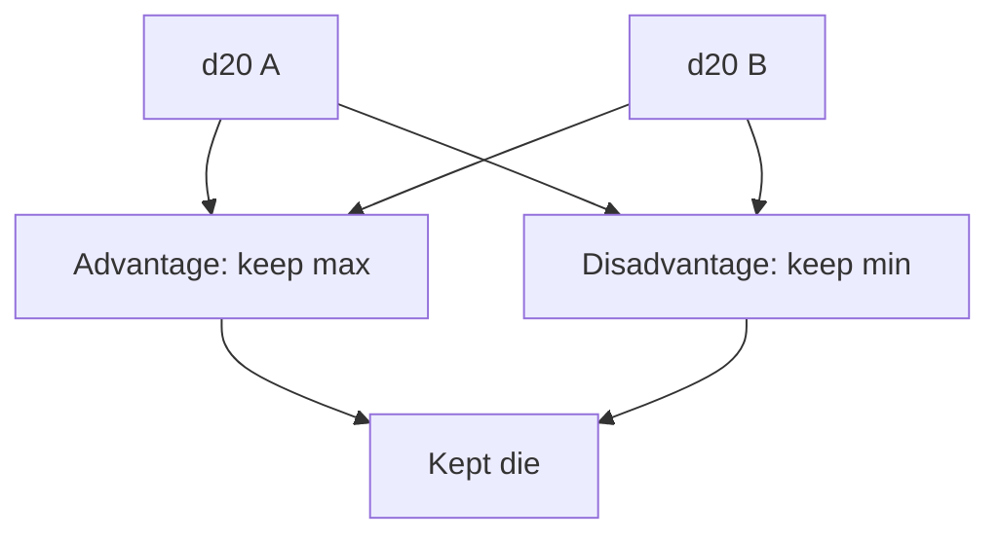

# Chapter 06: Dice, Probability, And Risk

## Research Question

How can the chapter teach random variables, distributions, expected value, advantage/disadvantage,
and risk through dice rolls that the reader can see and inspect?

## Core Concept

A die roll is a tiny random experiment. The result is uncertain before the roll, but the possible
outcomes and their probabilities can still be described.

For this chapter, the key ideas are:

- **Random variable**: a numerical result from an uncertain process, such as a d20 roll.
- **Distribution**: the probabilities attached to possible outcomes.
- **Expected value**: the long-run average outcome if the same experiment is repeated many times.
- **Variance and swinginess**: how widely results can spread around the average.
- **Threshold chance**: the probability that a roll meets or beats a difficulty class.
- **Advantage/disadvantage**: roll two d20s and keep the higher or lower, changing the distribution
  without changing the die.
- **Transparent randomness**: software should show enough roll detail for the player to trust the
  outcome.

The chapter should make probability feel practical rather than mystical. A player does not need to
calculate every distribution at the table, but a developer should understand how the dice shape the
experience.

## RPG Or Gamebook Analogy

A fair die still feels unfair when the story matters. The player remembers the natural 1 at the
cliff edge more than the quiet average of many ordinary checks.

The gamebook can make that tension visible. A locked door with DC 15 is not just a sentence in the
story; it is a threshold. A character's modifier moves the threshold closer. Advantage bends the
shape of the chance. A roll log lets the reader see the raw dice, the kept die, the modifier, the
total, and the result.

## Opening Passage Or Table Transcript

Open with a table transcript where **the Oracle and the Dice** expose the difference between fairness
and risk.

The Dice says every face has the same chance. The Oracle replies that a single fair roll can still
hurt, because probability only promises patterns over time. The table should then watch a player
miss a likely roll, making expectation, variance, risk, and narrative consequence concrete.

## Sources

- Probability source: OpenStax, *Introductory Statistics 2e*, section 4.2 on expected value and
  standard deviation:
  <https://openstax.org/books/introductory-statistics-2e/pages/4-2-mean-or-expected-value-and-standard-deviation>.
- Probability source: NIST/SEMATECH e-Handbook of Statistical Methods on probability
  distributions:
  <https://www.itl.nist.gov/div898/handbook/eda/section3/eda36.htm>.
- JavaScript source: MDN on `Math.random()` and its pseudo-random, approximately uniform
  `0 <= x < 1` range, plus the security caveat:
  <https://developer.mozilla.org/en-US/docs/Web/JavaScript/Reference/Global_Objects/Math/random>.
- D&D 5e SRD source: System Reference Document 5.1 under Creative Commons Attribution 4.0
  International, especially d20 checks, advantage/disadvantage, attack rolls, and damage rolls:
  <https://media.wizards.com/2023/downloads/dnd/SRD_CC_v5.1.pdf>.
- Licence source: Creative Commons Attribution 4.0 International legal code:
  <https://creativecommons.org/licenses/by/4.0/legalcode.en>.

## Shelf References

- Dungeons & Dragons 2014 *Player's Handbook*: use d20 checks, advantage/disadvantage, attacks, and
  damage as table-familiar probability examples; cite SRD 5.1 for reusable rules.
- Fighting Fantasy books with Skill, Stamina, Luck, and combat rolls: use as a contrast between
  different dice systems and risk curves; do not reproduce tables or passage outcomes.
- Ian Livingstone, *Deathtrap Dungeon*: use as a shelf example of visible risk, luck pressure, and
  trap consequences in solo play.
- Andrew Hunt and David Thomas, *The Pragmatic Programmer*: use for making hidden behaviour visible
  through feedback, logs, and clear outputs.

## Campaign Ledger Evidence

Campaign Ledger is the mature case study for visible dice as a sheet interaction.

- `/Users/dank/Code/personal/web/campaign-ledger/src/components/molecules/DiceRoller/DiceRoller.tsx`
  - Renders a native popover-backed d20 form.
  - Sends `label`, `modifier`, `proficiencyBonus`, `mode`, and `additionalModifier` to
    `/sheet/:characterRef/rolls`.
  - Lets the user select normal, advantage, or disadvantage before rolling.
  - Shows a ready-state output such as `Ready: d20 +5`.
- `/Users/dank/Code/personal/web/campaign-ledger/src/app.tsx`
  - `POST /sheet/:characterRef/rolls` checks read access, parses the roll form, computes base,
    proficiency, and extra modifiers, rolls one or two d20s, keeps the correct die for the mode, and
    returns a focused `<output>` fragment.
  - The result format exposes the label, raw d20 roll or rolls, modifier, and total.
- `/Users/dank/Code/personal/web/campaign-ledger/src/components/organisms/SkillsTrainingTab/SkillsTrainingTab.tsx`
  - Embeds dice controls beside skills and tool proficiencies.
  - Shows the product-level lesson: probability is not isolated in a maths page; it belongs next to
    the action the user is deciding to take.
- `/Users/dank/Code/personal/web/campaign-ledger/src/app.test.tsx`
  - Covers custom conditions and dice roll fragments, including advantage mode and visible roll
    output.
- `/Users/dank/Code/personal/web/campaign-ledger/src/characters/rests.ts`
  - Tracks hit dice as resources during rests. This is not the main probability lesson, but it is a
    useful reminder that dice can also be represented as spendable resources, not only as random
    events.

Inference from project context: Campaign Ledger does not yet attempt deep probability analysis. Its
valuable evidence is UX and trust: a roll is attached to a sheet action, returned as a small
hypermedia fragment, and displayed with enough arithmetic for the player to understand the result.

## Gamebook Build Payoff

This chapter explains the gamebook's transparent d20 roller and structured roll logs:

- `src/gamebook/rules/dice.ts`
  - `rollDie` maps a random source in `0 <= x < 1` to an integer die face.
  - `rollD20Check` records notation, raw rolls, kept die, modifier, total, DC, success, mode, and
    reason.
  - `rollDamage` supports damage notation and rolled damage details for combat.
  - The injectable `RandomSource` makes tests deterministic.
- `src/gamebook/model.ts`
  - `RollMode` names normal, advantage, and disadvantage.
  - `RollResult` and `DamageRollResult` make dice outcomes explicit data rather than hidden side
    effects.
- `src/gamebook/play.ts`
  - Choice resolution turns ability or skill checks into `RollResult` objects.
  - Successful and failed checks choose different passage targets and append readable log entries.
- `src/gamebook/rules/combat.ts`
  - Combat uses the same d20 check machinery for attack rolls and `rollDamage` for damage rolls.
- `src/app.tsx`, `src/gamebook/render.ts`, and `src/gamebook/player-render.ts`
  - Roll summaries show rolls, kept die, total, DC, reason, and success/failure in the action
    details panel.
- `src/gamebook/rules/dice.test.ts`
  - Tests deterministic die mapping, modifier/DC success, advantage, and disadvantage.

The build move should add or explain a transparent d20 roll result model. The reader should be able
to trace a check from choice text to random roll, modifier, total, DC comparison, passage outcome,
and visible action log.

## Notes For The Draft

### Opening Move

Open with a simple choice:

> Sneak past the guardian. DC 15 Dexterity (Stealth).

Ask what the player actually wants to know:

- What do I roll?
- What do I add?
- What number do I need?
- How likely is that?
- What happens if I fail?

That sequence moves naturally from game text to probability and then to implementation.

### Sections

1. **A Die Is A Random Variable**
   - A d20 roll can produce one of twenty values.
   - For a fair d20, each face has equal probability.
   - Use `rollDie(20)` as the code bridge.

2. **Uniform Does Not Mean Kind**
   - A d20 has a flat distribution: every face is equally likely.
   - A single dramatic failure can still happen.
   - Distinguish fairness from comfort.

3. **Thresholds, Modifiers, And Risk**
   - A DC turns a roll into a success/failure question.
   - A modifier shifts the total.
   - Show the beginner formula: successful faces divided by 20.
   - Example: needing 12 or higher means 9 successful faces out of 20, or 45%.

4. **Expected Value And Swinginess**
   - A d20 has expected value 10.5, but no roll can actually show 10.5.
   - Multiple dice can keep the same average while changing the shape of outcomes.
   - Use the `docs/dice-systems.md` material selectively: 1d20 is flat, 2d6 clusters around 7,
     3d6 clusters more tightly around the middle.
   - Keep central limit theorem material as an optional sidebar, not the main lesson.

5. **Advantage And Disadvantage**
   - Roll two d20s; keep the higher or lower.
   - The die has not changed, but the probability of meeting thresholds has.
   - Use the gamebook `RollMode` and `keepD20` logic.
   - Avoid full combinatorics unless in a sidebar. The visible explanation is enough for the main
     draft.

6. **Randomness In Software**
   - `Math.random()` is appropriate for a local teaching gamebook, but it is pseudo-random and not
     security-grade.
   - Injecting `RandomSource` makes tests deterministic.
   - Do not turn the chapter into cryptography. Mention secure randomness only as a boundary.

7. **Trust Through Roll Logs**
   - Show the player raw rolls, kept die, modifier, total, DC, and outcome.
   - Campaign Ledger's dice popover and the gamebook's action details both prove the same UX point:
     reveal the arithmetic when the result changes the story.

### Diagram Idea

Use Mermaid for three diagrams.

Check pipeline:


Distribution comparison can use Mermaid as a conceptual bar chart, avoiding over-detailed
probability tables in the main chapter:

```mermaid
xychart-beta
  title "Roll shape comparison"
  x-axis ["Low", "Middle", "High"]
  y-axis "Relative chance" 0 --> 10
  bar "1d20" [5, 5, 5]
  bar "2d6" [2, 9, 2]
```



Advantage/disadvantage:



### Code Examples

Start with die mapping:

```ts
type RandomSource = () => number;

function rollDie(sides: number, rng: RandomSource = Math.random): number {
  return Math.floor(rng() * sides) + 1;
}
```

Then show the structured roll result:

```ts
interface RollResult {
  notation: string;
  rolls: number[];
  kept: number;
  modifier: number;
  total: number;
  dc?: number;
  success?: boolean;
  mode: "normal" | "advantage" | "disadvantage";
  reason?: string;
}
```

Then show the threshold comparison:

```ts
const total = kept + modifier;
const success = dc === undefined ? undefined : total >= dc;
```

Useful project snippets:

- `docs/dice-systems.md` for raw material on distributions, expected value, and simulation.
- `src/gamebook/rules/dice.ts` for the current dice API.
- `src/gamebook/play.ts` for choice checks and roll log entries.
- `src/gamebook/rules/combat.ts` for attack and damage rolls.
- `src/app.tsx` and `src/gamebook/render.ts` for visible roll summaries.
- `/Users/dank/Code/personal/web/campaign-ledger/src/components/molecules/DiceRoller/DiceRoller.tsx`
  for product-scale sheet dice controls.
- `/Users/dank/Code/personal/web/campaign-ledger/src/app.tsx` for focused dice result fragments.

### SRD-Safe Handling

Use SRD-compatible mechanics as structure: d20 checks, difficulty classes, ability checks, skill
checks, attack rolls, damage rolls, advantage, and disadvantage. Paraphrase the SRD rules and avoid
copying descriptive examples or long rules text.

The chapter should not import non-SRD dice systems except as brief comparison. If mentioning other
published systems, keep it generic and do not copy rules expression.

### Chapter Boundary

Keep this chapter about probability and single-roll transparency. Save the full combat loop for
Chapter 07. Save resource accounting for Chapter 08. Save deep verification strategy for Chapter
14. Monte Carlo simulation can be a sidebar or future exercise, but it should not take over the
chapter.

## Risks

- **Too much maths too soon**: keep formulas short and attached to concrete dice examples.
- **Expected value confusion**: say plainly that expected value is a long-run average, not a
  promised next result.
- **RNG overreach**: mention secure randomness as a boundary, but keep the gamebook on injectable
  `Math.random()` for local teaching and deterministic tests.
- **Opaque outcomes**: the chapter must emphasise visible roll details; otherwise probability feels
  like the app hiding behind maths.
- **Licence blur**: use SRD mechanics and labels safely, with attribution, and keep examples
  original.
