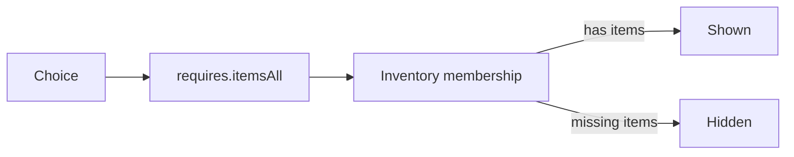
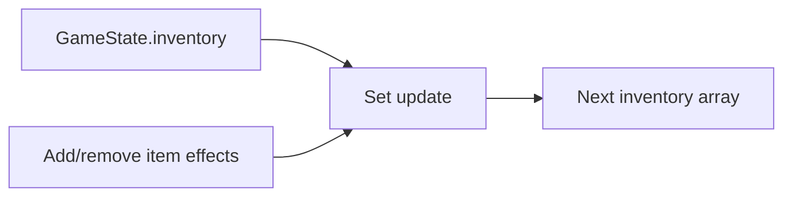

# Chapter 08: Inventory, Resources, And Encumbrance

## Research Question

How can the chapter teach collections, membership, counted resources, constraints, and simple search
through the familiar problem of carrying, spending, equipping, and finding items?

## Core Concept

Inventory is collection management with rules attached.

For this chapter, the key ideas are:

- **Collection**: a group of values the program can list, add to, remove from, and inspect.
- **Membership**: asking whether the collection contains a thing, such as a key or tool.
- **Quantity**: counting how many of a thing remain, such as rations, coins, spell slots, or uses.
- **Constraint**: a rule that prevents an action when the state does not satisfy a requirement.
- **Index or lookup**: a structure that makes a specific item easier to find by id, category, tag, or
  owner.
- **Accounting**: spending and restoring resources without losing track of bounds such as zero or a
  maximum value.

The gamebook currently models inventory as set-like membership. That is a good beginner step:
`brass-key` is either present or absent, and a choice can be shown or hidden accordingly. Campaign
Ledger provides the larger product example: equipment has records, quantities, categories, notes,
and equipped state; resources have current values, optional maximums, types, and clamped updates.

The chapter should use that contrast openly. A set-like backpack is enough for keys and one-off
treasure. Counted resources need a different shape.

## RPG Or Gamebook Analogy

An adventurer's pack is a collection, but not every possession behaves the same way.

A key is mostly a membership question: do you have it? A ration is a consumable: can you spend one
and remove it afterwards? A purse is a counter. A shield is an equipment record with an equipped or
carried state. A heavy chest introduces a constraint: even if the item exists, carrying it might be
impossible or costly.

The gamebook turns those table questions into choice gates:

- If the state includes the right item, show the choice.
- If the player takes the choice, add or remove items.
- If a resource changes, keep it inside its bounds.
- If a later version adds weight, capacity, or slots, make that constraint visible before the player
  commits.

## Opening Passage Or Table Transcript

Open with a table transcript where **the Quartermaster and the Adventurer** argue over whether "I
have a rope" is enough information.

The Adventurer wants one heroic list of possessions. The Quartermaster keeps asking annoying but
useful questions: how many, where is it, is it equipped, can you carry it, and what happens when you
spend the last one? The excerpt should dramatise the move from a simple array of item ids to richer
records, counters, maps, and constraints.

## Sources

- Open textbook source: Pat Morin, *Open Data Structures*, for lists, stacks, queues, dictionaries,
  hash tables, and the implementation/analysis framing for collection types:
  <https://opendatastructures.org/>.
- JavaScript source: MDN on `Array` as indexed list-like storage:
  <https://developer.mozilla.org/en-US/docs/Web/JavaScript/Reference/Global_Objects/Array>.
- JavaScript source: MDN on `Set` for unique value membership:
  <https://developer.mozilla.org/en-US/docs/Web/JavaScript/Reference/Global_Objects/Set>.
- JavaScript source: MDN on `Map` for key/value lookup:
  <https://developer.mozilla.org/en-US/docs/Web/JavaScript/Reference/Global_Objects/Map>.
- D&D 5e SRD source: System Reference Document 5.1 under Creative Commons Attribution 4.0
  International, especially equipment, adventuring gear, expenses, carrying capacity, and the basic
  resource vocabulary around hit points, hit dice, spell slots, and conditions:
  <https://media.dndbeyond.com/compendium-images/srd/5.1/SRD_CC_v5.1.pdf>.
- Licence source: Creative Commons Attribution 4.0 International legal code:
  <https://creativecommons.org/licenses/by/4.0/legalcode.en>.

## Campaign Ledger Evidence

Campaign Ledger is the mature case study for the chapter because it separates possessions from
resources and gives each category the fields and bounds it needs.

- `/Users/dank/Code/personal/web/campaign-ledger/src/db/model.ts`
  - `CharacterEquipment` stores `id`, `name`, `category`, `quantity`, `equipped`, and `notes`.
  - `CharacterResource` stores `id`, `key`, `label`, `type`, `current`, and optional `max`.
  - `CharacterSheetReadModel` includes both equipment and resources as first-class sheet data.
  - `CharacterRepository` exposes `listEquipment`, `listResources`, `updateEquipmentItem`, and
    `updateResourceCurrent`.
- `/Users/dank/Code/personal/web/campaign-ledger/src/db/schema.ts`
  - `character_resources` enforces non-negative `current_value`, optional non-negative `max_value`,
    a constrained resource type, and unique resource keys per character.
  - `character_equipment` enforces non-negative quantity and a boolean-style equipped flag.
- `/Users/dank/Code/personal/web/campaign-ledger/src/db/sqlite.ts`
  - `updateResourceCurrent` clamps resource updates and mirrors hit point or temporary hit point
    resource changes onto the character row.
  - `updateEquipmentItem` trims editable text, clamps quantity at zero, and preserves existing
    fields when a patch omits them.
- `/Users/dank/Code/personal/web/campaign-ledger/src/app.tsx`
  - `PATCH /sheet/:characterRef/resources/:resourceId` accepts absolute values or deltas, validates
    the targeted resource, updates the repository, reloads the sheet, and returns a refreshed header
    or tab panel.
  - Equipment read, edit, and patch routes update one item row and return the refreshed fragment.
- `/Users/dank/Code/personal/web/campaign-ledger/src/components/organisms/SheetTabPanel/SheetTabPanel.tsx`
  - Resource controls render spend and restore actions with disabled states when a value is empty or
    already at its maximum.
  - Equipment rows display category, carried/equipped state, quantity, notes, increment/decrement
    controls, an equipped toggle, and inline editing.

Inference from project context: Campaign Ledger shows why "inventory" should not be one shape
forever. A tiny gamebook can begin with item ids in an array, but a play aid that people use at the
table needs durable records, validated counters, bounded updates, and fragments that make every
change visible.

## Gamebook Build Payoff

This chapter explains the current item and resource layer in Mt. Graphnor:

- `src/gamebook/model.ts`
  - `ItemDefinition` defines item metadata with `id`, `name`, `kind`, and optional SRD/source id.
  - `Character` and `GameState` both carry `inventory: string[]`.
  - `ChoiceRequirement.itemsAll` gates a choice behind required item ids.
  - `ChoiceEffect.addItems` and `ChoiceEffect.removeItems` mutate the set-like inventory.
- `src/gamebook/state.ts`
  - `createInitialState` copies the selected character's starting inventory into the save state.
  - `isChoiceAvailable` delegates item gates to `requirementsMet`.
  - `applyChoiceEffects` converts the inventory array to a `Set`, applies additions/removals, and
    serialises the result back to an array.
- `src/gamebook/content/mt-graphnor.ts`
  - Rations can be spent to recover hit points.
  - A puzzle can award a brass key.
  - A thieves' tools route is gated by starting equipment.
  - A trap choice requires and then spends the brass key.
  - The reward room can add the Graphnor map as treasure.
- `src/gamebook/rules/srd.ts`
  - SRD-derived equipment such as ration, shield, staff, holy symbol, shortsword, spellbook, and
    thieves' tools are separated from project-owned items such as the brass key and Graphnor map.
- `src/gamebook/graph.ts`
  - Adventure validation catches duplicate item definitions and missing item references in
    requirements or effects.
- `src/gamebook/state.test.ts`
  - Tests cover item-gated choices, adding an item, removing a ration, and combining item effects
    with flags and hit point changes.

The build move for the chapter should be modest: inventory and flag-gated choices are already in
place, so the chapter can teach from the existing code and then point to the next possible step:
turning some string ids into counted resources or richer item records when the story needs them.

## Notes For The Draft

### Opening Move

Start with a locked choice:

```ts
{
  text: "Unlock the brass ward",
  requires: { itemsAll: ["brass-key"] },
  effects: { removeItems: ["brass-key"], setFlags: ["trap-disabled"] },
}
```

Ask the reader what the program needs to know:

- Which items exist in the adventure?
- Which item ids are currently in the player's save?
- Is the required item present?
- What changes after the item is spent?
- How do we stop a typo from creating an impossible choice?

That gives the chapter an immediate reason to introduce arrays, sets, maps, validation, and
constraints.

### Sections

1. **The Backpack As A Collection**
   - Introduce inventory as a list of item ids.
   - Explain why arrays are a natural serialisation shape for save files and rendered summaries.
   - Show that an array can hold duplicates, which may or may not be what the game wants.

2. **Membership: Do You Have The Thing?**
   - Use the brass key and thieves' tools examples.
   - Explain set-like thinking: an item is either present or absent.
   - Show why the current gamebook converts arrays to `Set` while applying effects.

3. **Effects: Add, Remove, Spend**
   - Walk through gaining the key, spending a ration, and spending the key.
   - Tie state changes to visible player feedback and graph validation.
   - Keep "resource accounting" concrete: never let hidden state be the only evidence of spending.

4. **Quantities: When Membership Is Not Enough**
   - Contrast one key with three rations or twenty coins.
   - Use Campaign Ledger's `quantity` field and resource counters as the mature example.
   - Explain why `["ration", "ration", "ration"]` is possible but awkward once editing, display,
     max values, and validation matter.

5. **Maps And Lookups**
   - Use item definitions as catalogue data and inventory ids as references.
   - Show a small `Map<string, ItemDefinition>` for rendering item names from ids.
   - Connect this to Campaign Ledger repository lookups and unique resource keys.

6. **Constraints And Encumbrance**
   - Introduce constraints as rules that reject or hide actions.
   - SRD carrying capacity can inform examples, but the current gamebook should not promise full
     weight accounting yet.
   - Treat encumbrance as an optional extension: weight, slots, bulk, or "hands free" can all be
     constraints depending on the story.

7. **Search And Nested Containers**
   - Borrow lightly from `docs/inventory-systems.md`.
   - Explain recursive search through a backpack, pouch, and chest as an advanced sidebar.
   - Keep nested containers out of the main build unless a later chapter or adventure genuinely
     needs them.

8. **Economy As A Later Resource System**
   - Borrow lightly from `docs/game-economy-systems.md`.
   - Coins, faction tokens, and market prices are resource/accounting examples.
   - Avoid turning this chapter into a market-simulation chapter.

### Diagram Idea

Use Mermaid for three diagrams.

Item gate:



Inventory effect:



Model growth:


### Code Examples

Start with the current gamebook shape:

```ts
interface ItemDefinition {
  id: string;
  name: string;
  kind: "equipment" | "key" | "consumable" | "treasure";
}

interface ChoiceRequirement {
  itemsAll?: string[];
}

interface ChoiceEffect {
  addItems?: string[];
  removeItems?: string[];
}
```

Then show the set-like update:

```ts
const inventory = new Set(state.inventory);

for (const item of effects.addItems ?? []) {
  inventory.add(item);
}

for (const item of effects.removeItems ?? []) {
  inventory.delete(item);
}

return { ...state, inventory: [...inventory] };
```

Then contrast it with a counted resource:

```ts
interface Resource {
  id: string;
  label: string;
  current: number;
  max: number | null;
}

function spendOne(resource: Resource): Resource {
  return {
    ...resource,
    current: Math.max(0, resource.current - 1),
  };
}
```

Useful project snippets:

- `src/gamebook/model.ts` for item definitions, item gates, and item effects.
- `src/gamebook/state.ts` for set-like inventory mutation.
- `src/gamebook/content/mt-graphnor.ts` for rations, keys, tools, and treasure.
- `src/gamebook/graph.ts` for item-reference validation.
- `/Users/dank/Code/personal/web/campaign-ledger/src/db/model.ts` for equipment and resource
  records.
- `/Users/dank/Code/personal/web/campaign-ledger/src/db/schema.ts` for quantity and resource
  constraints.
- `/Users/dank/Code/personal/web/campaign-ledger/src/db/sqlite.ts` for clamped updates.
- `/Users/dank/Code/personal/web/campaign-ledger/src/components/organisms/SheetTabPanel/SheetTabPanel.tsx`
  for spend/restore and equipment controls.

### SRD-Safe Handling

Use SRD 5.1-compatible equipment categories, adventuring gear, carrying capacity, and basic resource
concepts as structure. Paraphrase rules and write original examples. Do not copy item descriptions,
price tables, class feature text, spell text, or non-SRD equipment options into the chapter.

The game's prototype items should remain a mix of SRD-sourced catalogue entries and project-owned
items with clear source ids. Keep attribution near any SRD-derived item catalogue examples.

### Chapter Boundary

Keep the chapter about collection shape and constraints. Save combat timing for Chapter 07, save
documents and migrations for Chapter 09, parsing/importing for later tooling chapters, and full
verification strategy for Chapter 14.

Do not require full encumbrance before drafting this chapter. It is enough to show how an inventory
constraint would fit. If Campaign Ledger has richer equipment, encumbrance, or combat-resource
features by drafting time, revisit those files and prefer the then-current product evidence.

## Risks

- **Set versus count confusion**: the current gamebook's `Set` update means duplicate rations do not
  represent multiple rations. Say this plainly before using rations as a consumable example.
- **Encumbrance overbuild**: weight, volume, containers, hands, and slots can become a full game
  design problem. Keep them as optional constraints unless the story needs them.
- **Economy creep**: coins and markets are useful resource examples, but not the chapter's main
  subject.
- **Hidden spending**: item/resource changes should appear in rendered summaries, logs, disabled
  controls, or refreshed fragments.
- **Licence blur**: paraphrase SRD concepts, keep project-owned item examples original, and maintain
  clear attribution for SRD-derived catalogue data.
