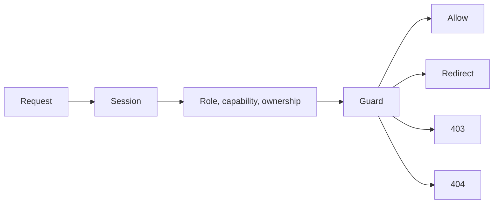
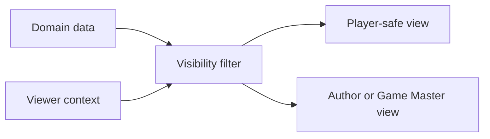
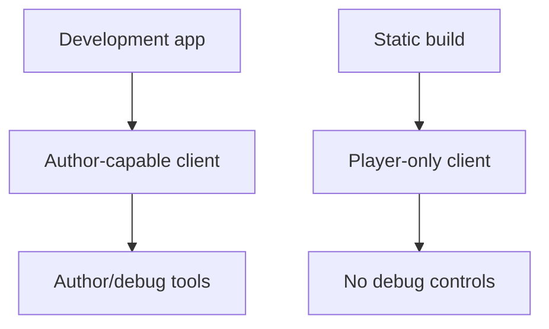

# Chapter 09: The Dungeon Master And The Admin

## Research Question

How can the chapter teach role-based access control, capabilities, ownership, permissions, guard
placement, and player-safe visibility through the difference between normal play and author/admin
tools?

## Core Concept

Access control is a set of decisions about who can do what to which resource.

For this chapter, the key ideas are:

- **Authentication**: knowing which user, author, or player is making the request.
- **Authorisation**: deciding whether that actor may perform the requested action.
- **Role**: a named responsibility such as player, Game Master, admin, or author.
- **Capability**: a specific power, such as access to admin tools or forced navigation.
- **Ownership**: a relationship between a user and a resource, such as a player and their character
  sheet.
- **Permission**: an action/resource pairing, such as read a campaign, manage prep, or write a
  sheet.
- **Guard**: a check placed before a route, mutation, renderer, or export can expose privileged
  behaviour.
- **Player-safe representation**: a rendered page, bundle, or static artifact that omits private
  state, hidden choices, debug controls, and author-only data.

The gamebook is intentionally lightweight. It does not yet have logged-in users or a full permission
system. It does, however, have an important boundary: normal player mode versus author/debug mode.
Campaign Ledger is the mature case study for real roles, campaign membership, content visibility,
selected-player reveals, route guards, and tests that prove protected data stays protected.

## RPG Or Gamebook Analogy

A tabletop campaign has different kinds of knowledge. The player can read their character sheet and
the scene in front of them. The Game Master can see secrets, prep, hidden notes, and future
encounters. An admin may maintain accounts without automatically being allowed to rewrite a
campaign's fiction.

The same distinction exists in software. A debug panel is not just another bit of UI; it changes
what the viewer can know and do. A forced navigation form is not just a shortcut; it can bypass the
normal path through the graph. A player-safe build must omit those tools entirely, not merely hide
them behind polite styling.

## Opening Passage Or Table Transcript

Open with a gamebook passage where **the Doorkeeper and the Admin** argue over whether an impressive
title is enough.

The Admin says they have a master key. The Doorkeeper asks a narrower question: are you allowed to
open this door, in this campaign, for this character, right now? The passage should turn that into a
choice: show title, show membership, show permission, or retreat. The technical handoff is the
difference between global roles, local membership, ownership, permissions, and context-specific
capabilities.

## Sources

- Access-control source: OWASP Proactive Controls C1, "Implement Access Control":
  <https://top10proactive.owasp.org/the-top-10/c1-accesscontrol/>.
- Access-control source: OWASP Developer Guide, "Enforce Access Controls", especially deny by
  default, least privilege, and testing access-control business rules:
  <https://devguide.owasp.org/en/04-design/02-web-app-checklist/07-access-controls/>.
- Access-control source: OWASP Least Privilege Principle:
  <https://owasp.org/www-community/controls/Least_Privilege_Principle>.
- RBAC source: NIST CSRC Role Based Access Control project and glossary:
  <https://csrc.nist.gov/Projects/Role-Based-Access-Control> and
  <https://csrc.nist.gov/glossary/term/rbac>.
- HTTP source: MDN on `403 Forbidden` for understood requests that the server refuses to process:
  <https://developer.mozilla.org/en-US/docs/Web/HTTP/Status/403>.

## Shelf References

- Dungeons & Dragons 2014 *Dungeon Master's Guide*: use the Game Master role, hidden information,
  table authority, and adjudication as the table-side analogy for admin boundaries.
- Robert C. Martin, *Clean Architecture*: use for policy boundaries, dependency direction, and
  keeping privileged decisions out of incidental UI code.
- Andrew Hunt and David Thomas, *The Pragmatic Programmer*: use for tracer bullets and guardrails
  around risky workflows.
- Campaign notebooks or prep documents: use as private context for what should remain hidden from
  players; do not publish private campaign material.

## Campaign Ledger Evidence

Campaign Ledger is the mature case study because it has real sessions, roles, campaign membership,
resource ownership, route guards, and player-safe visibility filters.

- `/Users/dank/Code/personal/web/campaign-ledger/src/db/model.ts`
  - `UserRole` separates `admin`, `game_master`, and `player`.
  - `CampaignMemberRole` separates campaign-local `game_master` and `player` membership.
  - `UserCapability` allows an admin capability to exist separately from a user's base role.
  - `NoteVisibility`, `CampaignContentVisibility`, and `NpcVisibility` encode player-facing,
    Game-Master-only, private, public, and selected-player visibility.
  - `CampaignNpcDossier` stores private fields such as Game Master notes, secrets, scene notes, and
    selected player ids.
- `/Users/dank/Code/personal/web/campaign-ledger/src/auth/guards.ts`
  - `requireRole` checks authenticated sessions against allowed user roles and capabilities.
  - `requireCampaignAccess` requires campaign membership and distinguishes read from manage.
  - `requireSheetAccess` allows character owners and Game Masters while rejecting unrelated players.
  - `requireCampaignContentAccess` treats Game-Master-only content as manage-level access.
  - `userHasAccessRole` models combined global capability and campaign-role membership without
    turning every admin into every campaign role.
- `/Users/dank/Code/personal/web/campaign-ledger/src/app.tsx`
  - `guardResponse` maps guard failures to redirects, `404 Not found`, or `403 Forbidden`.
  - Campaign, prep, sheet, notes, resource, equipment, admin, and import routes call the guard
    helpers before rendering or mutating protected resources.
- `/Users/dank/Code/personal/web/campaign-ledger/src/db/sqlite.ts`
  - `listNotesForCharacter` filters Game-Master-only notes out for player viewers.
  - `deleteNote`, note updates, wiki reads, image reads, session reads, and NPC reads include
    viewer-role checks in repository queries.
  - `listNpcDossiersForCampaign` returns nothing to viewers who cannot see Game Master content.
  - `listNpcSummariesForCampaign` exposes public or selected-player summaries while withholding
    private dossier fields from ordinary player views.
- `/Users/dank/Code/personal/web/campaign-ledger/src/components/pages/Campaign/Campaign.tsx`
  - Campaign pages render manage-only panels, import forms, asset controls, and NPC dossier tools
    only for Game Masters.
  - Player-facing campaign pages omit authoring controls and show visibility-aware summaries.
- `/Users/dank/Code/personal/web/campaign-ledger/src/auth/guards.test.ts`
  - Unit tests cover role checks, admin capability, sheet ownership, Game Master write access,
    campaign membership, admin non-bypass, and player versus Game-Master-only content.
- `/Users/dank/Code/personal/web/campaign-ledger/src/auth/routes.test.tsx`
  - Route tests prove Game Masters cannot open the admin page, players can read campaign pages but
    not manage panels, admins cannot bypass sheet permissions, and players cannot write other
    users' sheets.
- `/Users/dank/Code/personal/web/campaign-ledger/src/app.test.tsx`
  - Tests verify role-filtered notes, blocked Game-Master-only note edits by players, prep access,
    private NPC dossiers, selected-player visibility, and public reveal flows.

Inference from project context: Campaign Ledger's lesson is that access control is both route-level
and representation-level. A route may be guarded correctly, but private content can still leak if a
repository query, component, fragment, export, or test fixture ignores viewer context.

## Gamebook Build Payoff

This chapter explains the current author/player boundary in the static gamebook:

- `src/app.tsx`
  - `createApp` accepts `authorToolsEnabled`, which defaults to development author tooling.
  - `/gamebook?debug=1` enables author mode only when author tools are enabled.
  - `/gamebook/author` returns `404` when author tools are disabled.
  - `/gamebook/passages` rejects forced navigation when author tools are disabled or when the
    submitted form lacks `authorMode=1`.
  - Choice fragments currently preserve submitted author mode, which is useful in development but
    should remain covered by boundary tests so disabled author tooling cannot accidentally expose
    debug UI in a served player-only app.
  - `browserClientBundle` serves the author-capable client when tools are enabled and the
    player-only client when tools are disabled.
  - `PassagePanel` renders `DebugPanel` only in author mode.
  - `DebugPanel` exposes passage ids, flags, item ids, encounter state, recent logs, and a force
    passage form.
- `src/gamebook/client.ts`
  - The author-capable browser client handles forced passage navigation only when boot data says
    author mode is active.
- `src/gamebook/player-client.ts`
  - The player-only browser client omits author tab and forced-navigation behaviour.
- `scripts/build-static.ts`
  - The published static build creates the app with `authorToolsEnabled: false` and builds
    `src/gamebook/player-client.ts`.
- `scripts/check-static.ts`
  - The static artifact check rejects published HTML or client bundles containing `Debug state`,
    `gamebook-force-passage`, `authorMode`, or `mermaid`.
- `src/app.test.tsx`
  - Tests cover author-capable versus player-only client bundles, disabled author tools hiding
    debug mode and author routes, debug page state details, forced navigation rejection outside
    author mode, and disabled author tools omitting force navigation entirely.

The build move is to make the author/player split explicit in the prose and diagrams. The gamebook
does not need user accounts for this chapter. It needs a clear explanation that debug tools are
privileged capabilities and that the static player build should prove those capabilities are absent.

## Notes For The Draft

### Opening Move

Start with a tempting debugging convenience:

```ts
if (authorMode) {
  return <DebugPanel state={state} />;
}
```

Then ask why that condition is not enough on its own:

- Who is allowed to enter author mode?
- Can a submitted form forge `authorMode=1`?
- Does the published bundle include the debug code?
- Does the static build contain hidden debug text?
- Can a test prove that player mode omits the privileged tools?

That moves the reader from "hide a button" to "guard the capability".

### Sections

1. **Roles Are Not Permissions**
   - Introduce player, Game Master, admin, and author as readable roles.
   - Explain why a role is not the same as permission to do every thing everywhere.
   - Use Campaign Ledger's separation between global admin, campaign membership, and sheet
     ownership.

2. **Capabilities: The Things A Role Can Do**
   - Define capabilities as concrete actions: view prep, manage users, write a sheet, force a
     passage, reveal an NPC summary.
   - Use the gamebook's forced navigation as the beginner capability.
   - Use Campaign Ledger's admin capability and campaign manage/read distinction as the mature
     example.

3. **Ownership And Context**
   - Show why "player" is too broad without knowing whose sheet, which campaign, and which NPC.
   - Use `requireSheetAccess` and `requireCampaignAccess` as examples.
   - Introduce horizontal access bugs through the simple question: can one player edit another
     player's sheet?

4. **Guard The Route**
   - Explain route guards before mutation or rendering.
   - Use `403`, `404`, and login redirects as distinct outcomes.
   - Keep the language practical: unauthenticated, not found, forbidden.

5. **Guard The Representation**
   - Explain that access control is not finished when the route returns `200`.
   - Components, repository queries, fragments, and static bundles must receive viewer context.
   - Use Campaign Ledger's player-filtered notes and selected-player NPC summaries.

6. **Player-Safe Publishing**
   - Show why the gamebook's published build uses `authorToolsEnabled: false`.
   - Explain the difference between not linking a page, returning `404`, using a player-only client,
     and checking static artifacts for forbidden debug strings.
   - Treat this as the static-gamebook version of least privilege.

7. **Tests As Permission Tables**
   - Turn expected access rules into tests.
   - Show a small matrix: actor, resource, action, expected result.
   - Compare Campaign Ledger guard tests with gamebook static checks.

### Diagram Idea

Use Mermaid for three diagrams.

Access decision:



Representation filter:



Static publish boundary:



### Code Examples

Start with a tiny guard result:

```ts
type GuardResult =
  | { ok: true }
  | { ok: false; reason: "unauthenticated" | "forbidden" | "not_found" };
```

Then show a capability check:

```ts
function canForcePassage(authorToolsEnabled: boolean, authorMode: boolean) {
  return authorToolsEnabled && authorMode;
}
```

Then show why representation needs a viewer:

```ts
function visibleNotes(notes: Note[], viewerRole: "player" | "game_master") {
  return notes.filter((note) =>
    viewerRole === "game_master" || note.visibility === "player"
  );
}
```

Useful project snippets:

- `src/app.tsx` for author-tool feature flags, author routes, forced navigation, player-only bundle
  selection, and debug panel rendering.
- `src/gamebook/client.ts` and `src/gamebook/player-client.ts` for the author-capable/player-only
  browser split.
- `scripts/build-static.ts` and `scripts/check-static.ts` for player-safe publishing checks.
- `src/app.test.tsx` for author boundary tests.
- `/Users/dank/Code/personal/web/campaign-ledger/src/auth/guards.ts` for role, campaign, content,
  and sheet guard examples.
- `/Users/dank/Code/personal/web/campaign-ledger/src/db/sqlite.ts` for viewer-aware queries.
- `/Users/dank/Code/personal/web/campaign-ledger/src/auth/guards.test.ts`,
  `/Users/dank/Code/personal/web/campaign-ledger/src/auth/routes.test.tsx`, and
  `/Users/dank/Code/personal/web/campaign-ledger/src/app.test.tsx` for permission tests.

### Chapter Boundary

Keep this chapter about authorisation, visibility, and player-safe publishing. Save module
boundaries for Chapter 10, structured SRD/source provenance for Chapter 11, save documents for
Chapter 12, authoring workflows for Chapter 13, and full verification strategy for Chapter 14.

Do not turn the gamebook into a logged-in web application just to satisfy this chapter. The
lightweight author/debug boundary is enough for the beginner build; Campaign Ledger provides the
full application evidence.

## Risks

- **Client-side trust**: hiding a button is not authorisation. The route and build artifact need
  guards too.
- **Forged mode flags**: any hidden `authorMode` field should be treated as a hint, not proof of
  authorisation. The app-level `authorToolsEnabled` boundary must stay part of the decision.
- **Admin overreach**: avoid implying that admin automatically means "can manage every campaign".
  Campaign Ledger deliberately tests against that bypass.
- **Representation leaks**: a protected route can still leak private text through a shared component,
  repository query, fragment, export, or static bundle.
- **Confusing `401` and `403`**: keep the chapter simple by distinguishing "not signed in" from
  "signed in but not allowed"; cite `403` only for the latter.
- **Overbuilding the prototype**: do not add accounts, sessions, or multi-user permissions to the
  static gamebook until the product genuinely needs them.
