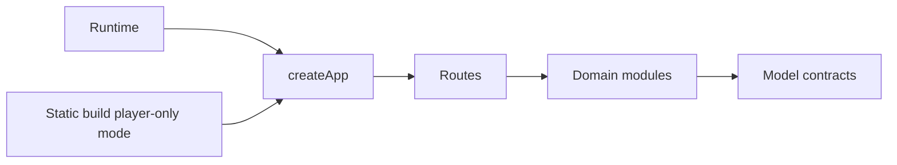
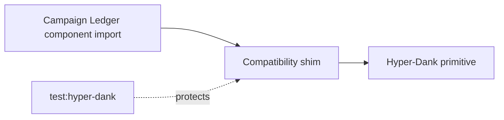

# Chapter 10: Adventure Modules And Programming Modules

## Research Question

How can the chapter teach modularity, boundaries, public contracts, dependency direction, package
adoption, and refactoring through the way a gamebook separates content, rules, state, rendering,
routes, and publishing?

## Core Concept

A module is a boundary around a design decision.

For this chapter, the key ideas are:

- **Module**: a file, folder, package, or subsystem with an explicit public surface.
- **Public contract**: the types, functions, routes, exports, or behaviours other code is allowed to
  depend on.
- **Information hiding**: keeping a module's internal choices private so they can change later.
- **Cohesion**: keeping things together because they change for the same reason.
- **Coupling**: the cost one module pays when another module changes.
- **Dependency direction**: deciding which code knows about which other code.
- **Adapter or shim**: a small boundary that preserves an existing app contract while delegating to a
  shared package or new implementation.
- **Refactoring**: changing structure while preserving behaviour.

The gamebook has a beginner-friendly module map: model types, graph validation, state, choice
resolution, rules, content, renderers, clients, author tooling, and the Hono app shell. Campaign
Ledger is the mature case study for the same ideas under product pressure: app-owned domain logic,
repository contracts, Hyper-Dank package adoption, compatibility shims, runtime wiring, and
verification gates that keep shared dependencies from silently changing the app.

## RPG Or Gamebook Analogy

An adventure module is not only a folder of rooms. It has boundaries:

- The adventure text knows the room names, choices, clues, and endings.
- The rules know how dice, combat, characters, and resources work.
- The map knows whether passages can be reached.
- The game state knows where the player is and what has changed.
- The renderer knows how to show the current moment.
- The app shell knows how browser requests become responses.

When those jobs blur together, changing one room can break combat, changing the renderer can affect
saves, or adding author tools can leak into the player build. The chapter should help the reader
see modules as promises about what is allowed to know what.

## Opening Passage Or Table Transcript

Open with a table transcript where **the Scribe and the Archivist** argue over where a dungeon room
belongs.

The Scribe wants to file everything in one giant tome because it is faster today. The Archivist
insists on separate shelves: maps, rules, character records, room text, and public exports. Their
argument should dramatise cohesion, coupling, and the difference between "I can find it" and "the
system can safely change it later".

## Sources

- Classic modularity source: David L. Parnas, "On the Criteria To Be Used in Decomposing Systems
  into Modules", *Communications of the ACM*, 1972:
  <https://doi.org/10.1145/361598.361623>.
- Software engineering source: IEEE Computer Society, *Guide to the Software Engineering Body of
  Knowledge (SWEBOK Guide), Version 4.0*, especially software architecture and software design:
  <https://www.computer.org/education/bodies-of-knowledge/software-engineering/v4>.
- Refactoring source: Martin Fowler, *Refactoring: Improving the Design of Existing Code*:
  <https://martinfowler.com/books/refactoring.html>.
- Dependency-boundary source: Martin Fowler, "Refactoring Module Dependencies":
  <https://martinfowler.com/articles/refactoring-dependencies.html>.
- JavaScript source: MDN on JavaScript modules:
  <https://developer.mozilla.org/en-US/docs/Web/JavaScript/Guide/Modules>.
- TypeScript source: TypeScript Handbook on modules:
  <https://www.typescriptlang.org/docs/handbook/2/modules.html>.
- Hono source: Hono routing documentation, including route composition:
  <https://hono.dev/api/routing>.

## Campaign Ledger Evidence

Campaign Ledger is the mature case study because it has already had to separate app-owned domain
logic from shared Hyper-Dank framework primitives.

- `/Users/dank/Code/personal/web/campaign-ledger/ARCHITECTURE.md`
  - Documents the intended split between runtime setup, `createApp()`, repositories, services,
    routes, components, HTMX fragments, SQLite persistence, and tests.
  - States that routes own permissions, validation, mutations, and response selection.
  - States that JSX components own semantic markup and visible HTML/HTMX contracts.
  - Records the Hyper-Dank adoption boundary: shared UI, data, transport, and automation packages
    replace generic framework pieces while domain routes, schemas, repositories, sheet controls,
    campaign flows, and product copy remain app-owned.
  - Calls out `sheet-0046` compatibility shims and the `test:hyper-dank` gate for reviewing shared
    package overlap before local components are replaced.
- `/Users/dank/Code/personal/web/campaign-ledger/package.json`
  - Uses public Hyper-Dank package dependencies for UI, data, transport, and automation.
  - Defines `test:hyper-dank` as the compatibility gate.
  - Defines `update:hyper-dank` to update the shared packages and immediately run the compatibility
    test.
- `/Users/dank/Code/personal/web/campaign-ledger/scripts/hyper-dank-compat.test.tsx`
  - Imports shared package primitives through public package paths.
  - Verifies HTMX attributes pass through shared UI primitives.
  - Verifies data-provider, transport, automation, and Markdown helpers remain importable.
  - Checks adopted UI wrappers are thin re-export shims.
  - Flags newly exported Hyper-Dank UI components that overlap local Campaign Ledger component names
    before they become unreviewed accidental replacements.
- `/Users/dank/Code/personal/web/campaign-ledger/src/app.tsx`
  - `AppDependencies` lists repository and service contracts that the route tree depends on.
  - `createApp` receives those dependencies rather than constructing runtime infrastructure itself.
  - Routes coordinate sessions, guards, validation, repository calls, and full-page or fragment
    responses.
- `/Users/dank/Code/personal/web/campaign-ledger/src/index.ts`
  - Resolves runtime configuration, creates the SQLite database runtime, creates auth/session
    services, injects repositories into `createApp`, and exports Bun's `fetch` handler.
  - This keeps process setup separate from the route tree.
- `/Users/dank/Code/personal/web/campaign-ledger/src/db/model.ts`
  - Defines repository contracts such as `AuthRepository`, `CharacterRepository`,
    `CampaignRepository`, `CampaignContentRepository`, `RulesRepository`, and `NotesRepository`.
- `/Users/dank/Code/personal/web/campaign-ledger/src/db/sqlite.ts`
  - Implements SQLite repositories behind those interfaces.
  - Exposes `SqliteDatabaseRuntime` through Hyper-Dank's `DatabaseProviderBase` lifecycle shape.
  - Provides `createSqliteProviderRegistry` as a provider boundary for future database/runtime
    work.
- `/Users/dank/Code/personal/web/campaign-ledger/src/components/`
  - Uses an atoms/molecules/organisms/pages/templates structure for server-rendered JSX.
  - Adopted components such as `Badge`, `Button`, `Breadcrumbs`, and `FormField` keep the existing
    Campaign Ledger import paths while re-exporting Hyper-Dank primitives.
- `/Users/dank/Code/personal/web/campaign-ledger/scripts/lib/local-app.ts`
  - Provides the in-memory app/server test harness while re-exporting shared Hyper-Dank automation
    readiness helpers.

Inference from project context: Campaign Ledger shows that modularity is not just file tidiness. It
is a way to control migration risk. Shared packages can reduce duplication only when the app keeps
clear ownership over its domain contracts and has compatibility tests that fail loudly when a shared
boundary changes.

## Gamebook Build Payoff

This chapter explains the current gamebook module map:

- `src/gamebook/model.ts`
  - Defines the core contracts for adventures, passages, choices, checks, items, characters, game
    state, encounters, rolls, combat rounds, and logs.
- `src/gamebook/content/mt-graphnor.ts`
  - Owns the current adventure data and imports only the model contract plus SRD/equipment rule
    catalogue entries.
- `src/gamebook/content/five-room-template.ts`
  - Owns the template coverage rules for the current adventure shape.
- `src/gamebook/graph.ts`
  - Owns passage maps, choice target extraction, reachability, missing-reference validation,
    duplicate definition checks, and Mermaid graph export.
- `src/gamebook/state.ts`
  - Owns save creation, save parsing/migration, storage adapters, choice requirements, choice
    effects, damage application, log entries, and movement between passages.
- `src/gamebook/play.ts`
  - Owns choice resolution and orchestrates state effects, dice checks, combat rounds, logs, and
    passage routing.
- `src/gamebook/rules/`
  - Owns character templates, dice, combat resolution, and SRD/provenance catalogue data.
- `src/gamebook/render.ts`
  - Owns the author-capable string renderer used by the browser client when author tools are
    available.
- `src/gamebook/player-render.ts`
  - Owns the player-only string renderer that omits debug controls and forced navigation.
- `src/gamebook/client.ts` and `src/gamebook/player-client.ts`
  - Separate author-capable browser behaviour from player-only static behaviour.
- `src/gamebook/testing.ts`
  - Documents verification gates and coverage areas as data.
- `src/gamebook/index.ts`
  - Re-exports the current public gamebook domain surface.
- `src/app.tsx`
  - Owns the Hono app shell, Hyper-Dank UI composition, author pages, routes, forms, fragments, and
    feature flags.
- `src/index.ts`
  - Owns Bun runtime startup and delegates route construction to `createApp()`.
- `scripts/build-static.ts`
  - Builds the published player-safe static artefacts from the same app/gamebook modules.

The build move should be explanatory rather than expansive. The current gamebook does not need a
large plugin system. It needs a clear map of which modules own which design decisions and which
public exports other modules should use.

## Notes For The Draft

### Opening Move

Start with a messy temptation:

```ts
// One file knows the room text, dice rolls, save state, HTML, and browser storage.
```

Then split it by design decision:

```ts
model.ts      // What an adventure is.
content/*.ts  // Which adventure this is.
graph.ts      // Whether the adventure is connected.
state.ts      // What the player has changed.
play.ts       // How one choice resolves.
rules/*.ts    // How dice, characters, and combat work.
render.ts     // How the current state becomes HTML.
app.tsx       // How HTTP requests use those modules.
```

The reader should see that each split answers "what might change independently?"

### Sections

1. **A Module Is A Promise**
   - Introduce `import` and `export` as the visible surface of a module.
   - Explain that the file boundary matters less than the contract.
   - Use `src/gamebook/model.ts` as the contract that other modules share.

2. **Hide The Decision That Might Change**
   - Use Parnas's information-hiding idea in beginner terms.
   - Examples: save storage may change, rendering may change, adventure content may change, combat
     rules may change.
   - Show why those choices should not all live in one file.

3. **Cohesion: Put Like Changes Together**
   - `graph.ts` changes when validation rules change.
   - `state.ts` changes when save or effect rules change.
   - `rules/combat.ts` changes when combat resolution changes.
   - `content/mt-graphnor.ts` changes when the adventure text changes.

4. **Coupling: The Cost Of Knowing Too Much**
   - Show how `play.ts` depends on rules and state, but those lower-level modules do not depend on
     `src/app.tsx`.
   - Explain why domain modules should stay framework-light.
   - Use the app shell as the place where Hono, Hyper-Dank UI, and forms meet the gamebook domain.

5. **Public Contracts And Barrel Exports**
   - Explain `src/gamebook/index.ts` as a public surface, not just a convenience.
   - Discuss what should be exported and what should remain private.
   - Warn that a broad barrel export can accidentally make internals feel stable.

6. **Adapters And Compatibility Shims**
   - Use Campaign Ledger's Hyper-Dank component re-export shims.
   - Explain why a shim can preserve local import paths while changing the implementation behind
     them.
   - Keep the advice pragmatic: shims are useful during migration, but they need tests and eventual
     review.

7. **Dependency Direction**
   - Runtime setup should depend on the app factory, not the other way round.
   - Routes should depend on repository interfaces, not SQLite details.
   - Browser clients should depend on renderers and state helpers, not on the server runtime.
   - Shared packages should supply generic primitives; app modules should own product language and
     domain rules.

8. **Refactoring Without Breaking The Dungeon**
   - Refactoring is behaviour-preserving structural change.
   - Use Campaign Ledger's `test:hyper-dank` gate and gamebook verification gates as safety rails.
   - Show the cycle: identify boundary, add/keep tests, move code, keep public behaviour stable,
     then remove obsolete shims later.

### Diagram Idea

Use Mermaid for three diagrams.

Gamebook module map:

```mermaid
flowchart TD
  model["model.ts"]
  content["content/"]
  graph["graph.ts"]
  rules["rules/"]
  state["state.ts"]
  play["play.ts"]
  render["renderers"]
  app["app shell"]

  content --> model
  graph --> model
  state --> model
  state --> rules
  play --> state
  play --> rules
  render --> state
  render --> model
  app --> content
  app --> graph
  app --> play
  app --> render
```

Layer boundary:



Package adoption:



### Code Examples

Start with a tiny module contract:

```ts
export interface Passage {
  id: string;
  title: string;
  body: string;
  choices: Choice[];
}
```

Then show a module that consumes the contract without knowing the renderer:

```ts
export function createPassageMap(passages: Passage[]): Map<string, Passage> {
  return new Map(passages.map((passage) => [passage.id, passage]));
}
```

Then show runtime injection:

```ts
export interface AppDependencies {
  adventure?: Adventure;
  now?: () => Date;
  random?: () => number;
}

export function createApp(dependencies: AppDependencies = {}) {
  const adventure = dependencies.adventure ?? mtGraphnorAdventure;
}
```

Then show a compatibility shim:

```ts
export { Button, type ButtonProps } from "@macavitymadcap/hyper-dank-ui";
```

Useful project snippets:

- `src/gamebook/model.ts`, `src/gamebook/graph.ts`, `src/gamebook/state.ts`, and
  `src/gamebook/play.ts` for the domain-module split.
- `src/gamebook/rules/` for rules modules.
- `src/gamebook/content/` for content modules.
- `src/gamebook/render.ts`, `src/gamebook/player-render.ts`, `src/gamebook/client.ts`, and
  `src/gamebook/player-client.ts` for author/player rendering and browser boundaries.
- `src/app.tsx` and `src/index.ts` for app-shell and runtime boundaries.
- `scripts/build-static.ts` for reuse of the app factory in player-safe publishing.
- `/Users/dank/Code/personal/web/campaign-ledger/ARCHITECTURE.md` for the mature architecture
  statement.
- `/Users/dank/Code/personal/web/campaign-ledger/scripts/hyper-dank-compat.test.tsx` for shared
  package compatibility checks.
- `/Users/dank/Code/personal/web/campaign-ledger/src/app.tsx`, `src/index.ts`, `src/db/model.ts`,
  and `src/db/sqlite.ts` for app factory, runtime, repository contracts, and SQLite implementation.
- `/Users/dank/Code/personal/web/campaign-ledger/src/components/` for component modules and
  compatibility shims.

### Chapter Boundary

Keep this chapter about source boundaries and dependency direction. Save rules provenance and source
metadata for Chapter 11, save documents and migrations for Chapter 12, authoring workflows for
Chapter 13, and full verification strategy for Chapter 14.

Do not ask the gamebook to become a package ecosystem yet. The useful beginner move is a clear
module map, a small public surface, and honest notes about where duplication remains. In particular,
`render.ts` and `player-render.ts` intentionally duplicate some rendering today to keep the
player-only bundle clean; this can become a later refactoring example if duplication starts to cost
more than the safety boundary is worth.

## Risks

- **File tree theatre**: folders alone do not make a modular design. The chapter must explain
  contracts, change reasons, and dependency direction.
- **Over-abstraction**: avoid inventing plugin systems, service containers, or package boundaries
  before the gamebook needs them.
- **Barrel export sprawl**: `src/gamebook/index.ts` is convenient, but exporting too much can make
  internals look stable.
- **Framework bleed**: keep Hono, Hyper-Dank UI, and browser-only code out of domain modules unless
  the boundary is explicit.
- **Shim permanence**: compatibility shims are useful during migration, but they should be tracked
  and reviewed rather than becoming invisible forever.
- **Shared package drift**: if Hyper-Dank package exports change, compatibility tests should catch
  overlap and contract shifts before product code silently changes behaviour.
