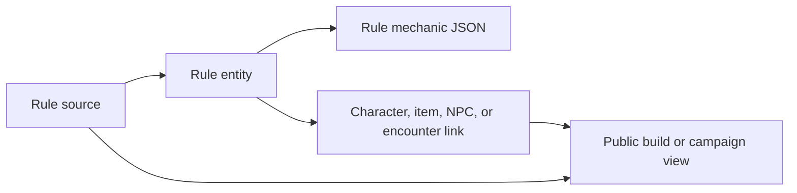

# Chapter 11: Rules As Structured Data

## Research Question

How can the chapter teach parsing, provenance, source precedence, schema design, and
licence-aware data import through the way RPG rules move from prose into structured records?

The answer should be practical rather than encyclopaedic: a rule is not just text in a book. In a
running app it becomes a sourced entity with typed mechanics, search metadata, visibility rules,
export eligibility, links from characters or encounters, and enough provenance to explain where it
came from.

## Core Concept

Structured rule data is the point where prose, schema, and policy meet.

For this chapter, the key ideas are:

- **Schema**: the agreed shape of a record, including required fields, allowed values, and nested
  structures.
- **Rule source**: the book, SRD, campaign note, or project-owned catalogue that a rule came from.
- **Rule entity**: the named thing being represented, such as a spell, condition, item, class,
  background, action, or mechanic.
- **Rule mechanic**: the machine-readable detail that lets the app filter, display, link, or apply
  the rule.
- **Provenance**: metadata that records origin, source, version, and import path.
- **Source precedence**: the decision rule for overlapping sources.
- **Visibility**: whether a source is public or campaign-scoped.
- **Export eligibility**: whether data may be included in a public artefact.
- **Parser**: a translator from text or JSON into the schema, not a magical proof of correctness.

The chapter should show a ladder:

```ts
// Text:
"A shield grants +2 to Armour Class."

// Structured rule:
{
  id: "shield",
  name: "Shield",
  sourceId: "srd-5-1-cc",
  kind: "equipment"
}

// Larger app shape:
{
  source: { slug: "srd-5-1", contentCategory: "srd", publicExportEligible: true },
  entityType: "equipment",
  slug: "shield",
  mechanics: [{ mechanicType: "equipment", data: { category: "armour" } }]
}
```

The reader should come away understanding why "put the rules in JSON" is not enough. The important
design work is choosing what the data means, what may consume it, what can be published, and how to
debug it when two sources disagree.

## RPG Or Gamebook Analogy

The Wizard demands to know which spellbook a rule came from.

One apprentice says, "It says *shield* here." Another says, "My campaign notes also say shield, but
with a different price." The Wizard refuses to cast until the library card is complete:

- Which book is this from?
- Is it SRD material, campaign-local material, or third-party material?
- Is this source allowed in the public gamebook?
- Does the campaign-specific copy override the general copy?
- Is the rule text merely displayed, or does the app need action timing, charges, tags, reset
  cadence, or equipment category?

That gives a friendly metaphor for schemas and provenance. A rule without source metadata is like a
spell copied onto a loose page: useful at the table for a moment, risky inside software that must
search, filter, publish, and explain itself later.

## Opening Passage Or Table Transcript

Open with a table transcript where **the Wizard and the Archivist** argue over a spellbook index.

The Wizard wants to know the one true rule. The Archivist insists there is no rule without a source,
a version, a shelf mark, and a policy label. The transcript can dramatise source precedence:
the newer spellbook may win for a private campaign, but the public book may still be allowed to
quote only the SRD-derived catalogue entry.

The excerpt should stay playful, but the teaching point is sober: structured data can make a rule
more useful only when it also makes the rule more accountable.

## Sources

- D&D 5e SRD source: Wizards of the Coast / D&D Beyond, *Dungeons & Dragons Systems Reference
  Document 5.1*, Creative Commons release:
  <https://media.dndbeyond.com/compendium-images/srd/5.1/SRD_CC_v5.1.pdf>.
- Licence source: Creative Commons, *Attribution 4.0 International Legal Code*:
  <https://creativecommons.org/licenses/by/4.0/legalcode.en>.
- Schema source: JSON Schema documentation, especially the guide to describing JSON document shape:
  <https://json-schema.org/learn/getting-started-step-by-step>.
- TypeScript source: TypeScript Handbook on object types:
  <https://www.typescriptlang.org/docs/handbook/2/objects.html>.
- SQLite source: SQLite foreign key documentation, useful for explaining source/entity/mechanic
  relationships and referential integrity:
  <https://www.sqlite.org/foreignkeys.html>.
- Campaign Ledger evidence:
  `/Users/dank/Code/personal/web/campaign-ledger/src/rules/importer.ts`,
  `/Users/dank/Code/personal/web/campaign-ledger/src/db/schema.ts`,
  `/Users/dank/Code/personal/web/campaign-ledger/src/db/model.ts`,
  `/Users/dank/Code/personal/web/campaign-ledger/src/db/sqlite.ts`.
- Gamebook evidence:
  `/Users/dank/Code/personal/web/dungeons-and-data-structures/src/gamebook/rules/srd.ts`,
  `/Users/dank/Code/personal/web/dungeons-and-data-structures/src/gamebook/rules/srd.test.ts`,
  `/Users/dank/Code/personal/web/dungeons-and-data-structures/src/gamebook/content/mt-graphnor.ts`.

## Campaign Ledger Evidence

Campaign Ledger is the mature case study for this chapter because it already treats rules as
structured data with source policy.

- `/Users/dank/Code/personal/web/campaign-ledger/src/db/schema.ts`
  - Defines `rules_sources` with `slug`, `name`, `abbreviation`, `content_category`, `visibility`,
    `public_export_eligible`, and `precedence`.
  - Defines `campaign_rules_sources` so private or local sources can be attached to a campaign.
  - Defines `rules_entities` as source-owned named records with `entity_type` and `slug`.
  - Defines `rule_mechanics` as typed JSON payloads attached to rule entities.
  - Defines `character_rule_links` so character records can refer to selected, prepared, and sorted
    rule entities.
  - Adds triggers so NPC rule links must point either to a public rules source or to a source
    attached to the same campaign.
- `/Users/dank/Code/personal/web/campaign-ledger/src/db/model.ts`
  - Defines `RuleEntityType` as a union of rule categories including actions, backgrounds, classes,
    conditions, equipment, feats, senses, stat blocks, subclasses, species, and spells.
  - Defines `RulesSourceSeedInput` with source category, visibility, export eligibility, and
    precedence.
  - Defines `RuleEntitySeedInput` and `RuleMechanicSeedInput`, separating the named rule from the
    machine-readable mechanic data.
  - Defines read models that expose `contentCategory`, `publicExportEligible`, `sourceVisibility`,
    tags, mechanics, and provenance.
- `/Users/dank/Code/personal/web/campaign-ledger/src/db/sqlite.ts`
  - Upserts sources and entities by natural keys, then replaces mechanics for the entity.
  - Defaults SRD sources to public-export eligible while defaulting other source categories more
    conservatively.
  - Filters public browsing to public rules unless campaign IDs are provided.
  - Reads provenance back from the first mechanic payload that contains it.
  - Exposes filters for entity type, source, spell level, equipment category, content category, and
    search query.
- `/Users/dank/Code/personal/web/campaign-ledger/src/rules/importer.ts`
  - Imports local Markdown and JSON rule files through `RulesImportService`.
  - Parses Markdown into title, body, inferred entity type, inferred source, slug, and mechanics.
  - Parses structured JSON as a single rule, a list of rules, or an object with `entities`.
  - Adds provenance to imported mechanics: original path, rule type, source abbreviation, and SRD
    version for SRD paths.
  - Resolves overlapping sources by comparing source precedence.
  - Infers mechanic details such as spell metadata, equipment category, action timing, charges,
    reset cadence, tags, and stat-block structure.
  - Normalises selected rule copy into British English for the app's house style.
- `/Users/dank/Code/personal/web/campaign-ledger/src/rules/importer.test.ts`
  - Verifies deterministic source precedence.
  - Verifies representative Markdown parsing across spells, infusions, backgrounds, species traits,
    stat blocks, class features, equipment, and conditions.
  - Verifies idempotent imports into SQLite.
  - Verifies campaign-scoped private sources are not public-export eligible and are hidden unless
    the campaign context is supplied.
  - Verifies SRD 5.1 fixture import contracts without requiring every chapter example to import a
    full rules corpus.
  - Verifies the full local SRD 5.1 corpus can be imported from structured JSON.
  - Verifies SRD parser metadata needed for filtering and sheet links.
- `/Users/dank/Code/personal/web/campaign-ledger/src/db/sqlite.test.ts`
  - Verifies character rule links include source and mechanic summaries.
  - Verifies rule browsing and detail lookup by content category, query, spell level, equipment
    category, and provenance.
  - Verifies campaign-scoped rules sources remain hidden from public queries and visible with the
    right campaign context.
- `/Users/dank/Code/personal/web/campaign-ledger/src/app.tsx`
  - Uses rules repository filters to show the SRD rules reference publicly.
  - Applies stricter browseability checks for sparse SRD records.
  - Uses campaign context when private/local rules should be available to campaign pages.
- `/Users/dank/Code/personal/web/campaign-ledger/src/components/pages/Rules/Rules.tsx`
  - Presents rules as browsable, filterable records rather than raw imported files.
  - Shows source/category labels and equipment filtering, which makes the structured fields visible
    in product UX.
- `/Users/dank/Code/personal/web/campaign-ledger/src/components/pages/Campaign/Campaign.tsx`
  - Shows campaign rules sources with category and public/campaign scope labels.

Inference from project context: Campaign Ledger demonstrates that the chapter topic is not
theoretical garnish. The app already needs source categories, campaign scoping, export flags,
mechanic JSON, provenance, and filters because raw rule prose is not enough for character sheets,
campaign pages, rules browsing, or future public export.

## Gamebook Build Payoff

The gamebook should keep a deliberately small version of the same architecture.

- `/Users/dank/Code/personal/web/dungeons-and-data-structures/src/gamebook/rules/srd.ts`
  - Defines `RuleSourceId`, `RuleSource`, `NamedRule`, `SkillRule`, `ClassRule`, `RaceRule`, and
    `EquipmentRule`.
  - Defines `RULE_SOURCES` for SRD 5.1 Creative Commons material and project-owned original
    material.
  - Defines SRD-sourced ability, skill, class, race, and mechanic catalogues.
  - Defines equipment records that separate SRD-sourced items from original Mt. Graphnor items.
  - Provides attribution helpers so published gamebook output can list source attributions once.
- `/Users/dank/Code/personal/web/dungeons-and-data-structures/src/gamebook/rules/srd.test.ts`
  - Verifies the SRD 5.1 source metadata.
  - Verifies structured rules cover the playable character model.
  - Verifies Mt. Graphnor items are backed by equipment catalogue entries.
  - Verifies character template inventory references catalogued equipment.
- `/Users/dank/Code/personal/web/dungeons-and-data-structures/src/gamebook/content/mt-graphnor.ts`
  - Uses the rules catalogue to give adventure items source IDs and to surface gamebook rule
    attributions.
- `/Users/dank/Code/personal/web/dungeons-and-data-structures/src/gamebook/model.ts`
  - Includes `ItemDefinition.sourceId`, letting item data carry provenance without forcing the
    adventure content to know every source detail.
- `/Users/dank/Code/personal/web/dungeons-and-data-structures/src/gamebook/rules/character.ts`
  - Uses the structured class, race, skill, and equipment catalogues to build playable character
    templates.

The build move for this chapter should remain modest:

- Add or refine one small rule lookup table if the draft needs it, such as conditions, attacks,
  armour, class options, or equipment categories.
- Keep SRD-derived entries short, factual, and attributed.
- Keep original adventure items explicitly marked as project-owned material.
- Avoid importing Campaign Ledger's full SRD corpus into the static gamebook.
- Consider adding a tiny `RuleEntity`/`RuleMechanic` example for teaching, but do not make the
  static gamebook depend on a database-shaped abstraction before it earns its keep.

## Notes For The Draft

### Opening Move

Start with a loose page torn from a spellbook:

```md
# Shield

You use a shield to improve Armour Class.
```

Then show why the app asks for more:

```ts
interface RuleSource {
  id: string;
  title: string;
  licence: string;
  url?: string;
  licenceUrl?: string;
  attribution: string;
}

interface RuleEntity {
  sourceId: string;
  entityType: "equipment" | "spell" | "condition" | "class";
  slug: string;
  name: string;
  mechanics: RuleMechanic[];
}
```

The point is not to bury the reader in types. It is to show that the type names ask ordinary design
questions: what is this, where did it come from, what may the program do with it, and what may the
book publish?

### Sections

1. **The Difference Between Text And Data**
   - Prose is rich for humans.
   - Data is selective for machines.
   - Turning prose into data always loses some nuance and gains some affordances.
   - Use `NamedRule` and `EquipmentRule` from the gamebook as the first small example.

2. **Start With Source**
   - Introduce `RuleSource` before `RuleEntity`.
   - Explain why source, licence, URL, and attribution are not afterthoughts.
   - Tie this to the SRD 5.1 Creative Commons source and the gamebook's project-owned original
     material source.

3. **Entities And Mechanics**
   - A rule entity is the named thing: "Bless", "Chain Mail", "Grappled", "Wizard".
   - A mechanic is the structured payload the app can use: spell level, school, equipment category,
     action timing, reset cadence, tags, or stat-block fields.
   - Use Campaign Ledger's `rules_entities` and `rule_mechanics` split as the mature example.

4. **Parsing Is Translation**
   - A parser maps a source format into an app schema.
   - Use Campaign Ledger's Markdown parser for spells, backgrounds, equipment, stat blocks, and
     conditions.
   - Warn that parser output is only as good as the schema, fixtures, and tests around it.

5. **Provenance Makes Bugs Explainable**
   - Show `originalPath`, `ruleType`, `source`, and `srdVersion`.
   - Explain that provenance helps debug unexpected behaviour and review licensing/publication
     choices.

6. **Source Precedence**
   - Show why two books can define similar or overlapping rules.
   - Explain Campaign Ledger's `precedence` field and `resolveRulesSource`.
   - Keep the beginner lesson simple: decide the rule for choosing before the conflict appears.

7. **Visibility And Public Export**
   - Explain the difference between campaign-local usefulness and public publishability.
   - Use Campaign Ledger's `content_category`, `visibility`, and `public_export_eligible`.
   - Tie this back to the gamebook: SRD-derived references can be used with attribution; private
     notes and third-party material must not leak into a public static build.

8. **Link Rules To Play Objects**
   - Show characters linking to spells, class features, species traits, and equipment.
   - Show gamebook items linking to `sourceId`.
   - Explain why links beat copied strings when rules need to change.

9. **Keep The Static Gamebook Small**
   - Campaign Ledger can import a large corpus because it is an app with a database and browsing UI.
   - The first static gamebook needs a small catalogue that supports play and attribution.
   - The reader should learn the pattern without watching the book build a miniature rules database
     too early.

### Diagram Idea



This diagram can be redrawn in prose as: a source authorises the rule, the entity names it, the
mechanic structures it, and links let the rest of the app use it without copying it.

### Code Example Path

Use the gamebook's small catalogue first:

```ts
export const RULE_SOURCES = {
  "srd-5-1-cc": {
    title: "Dungeons & Dragons System Reference Document 5.1",
    licence: "Creative Commons Attribution 4.0 International"
  },
  "dads-original": {
    title: "Dungeons & Data Structures original gamebook material",
    licence: "Project-owned original material"
  }
};
```

Then contrast it with Campaign Ledger's database-shaped model:

```ts
interface RulesSourceSeedInput {
  slug: string;
  contentCategory?: "local" | "srd" | "third_party";
  visibility?: "campaign" | "public";
  publicExportEligible?: boolean;
  precedence: number;
}
```

The progression should feel like "same design question, larger stakes", not "throw away the simple
version and use the enterprise version".

### Sidebar Ideas

- **SRD-safe Does Not Mean Copy Everything**
  - The SRD 5.1 Creative Commons release is useful, but the gamebook should still use brief,
    attributed, purpose-built data rather than reproduce a full rules corpus inside an early static
    adventure.
- **JSON Is A Format, Not A Design**
  - JSON can represent a good schema or a mess. The important work is naming the records and
    deciding the relationships.
- **When To Use A Parser**
  - Use parsing when the source format is stable enough and the payoff is real.
  - Prefer hand-authored small tables when the domain slice is tiny.

## Risks

- **Licence drift**: imported or copied data could lose its source and attribution metadata.
- **Over-importing**: the static gamebook could become a rules database before the playable chapter
  needs one.
- **False confidence from parsing**: a parser can produce neatly shaped wrong data.
- **Precedence confusion**: overlapping sources can hide meaningful rule differences if precedence
  is treated as a magic answer.
- **Private material leakage**: campaign-local or third-party material must not appear in public
  book/gamebook artefacts unless it is explicitly allowed.
- **Schema churn**: a premature schema can make later combat, conditions, or character rules harder
  to express.
- **Reader overload**: this chapter should teach the pattern with a handful of rule records, then
  point to Campaign Ledger as the richer app case study.
