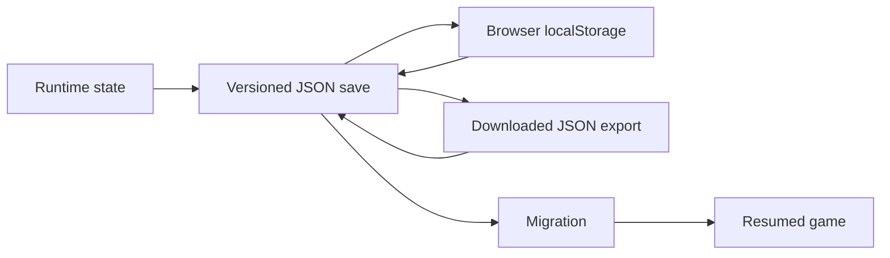
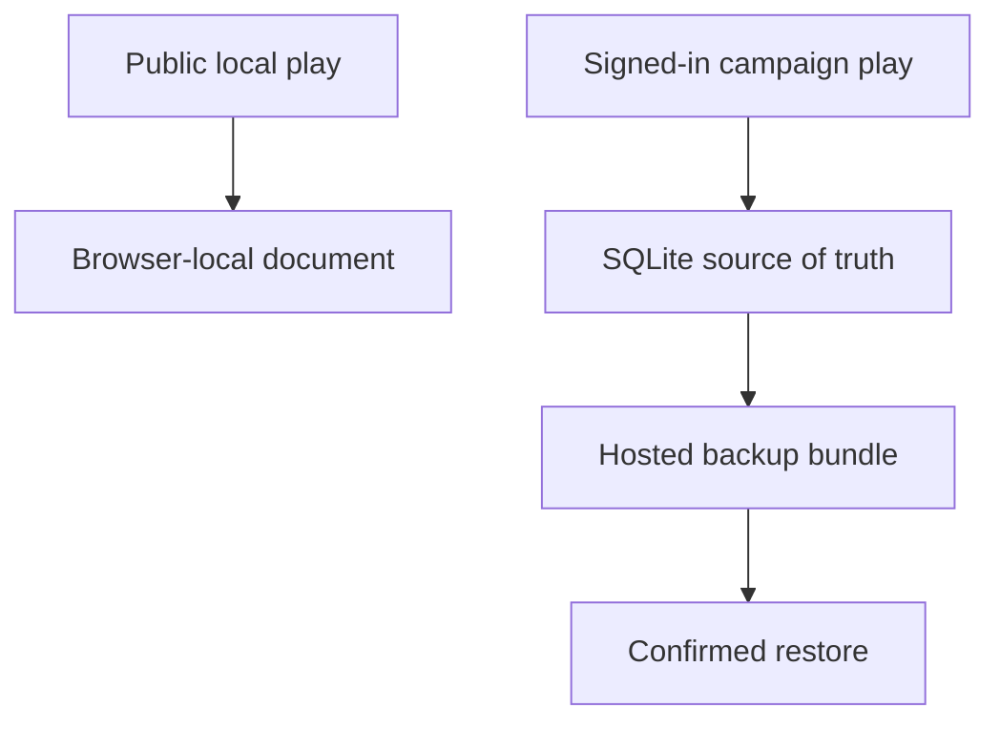

# Chapter 12: Saving The Game

## Research Question

How can the chapter teach persistence trade-offs, local storage, JSON documents, SQLite,
export/import, schema versioning, validation, and migration through the simple promise that a game
can be resumed later?

The chapter should answer a beginner's first assumption: saving is not merely "put this object
somewhere". Saving is a contract between today's program, tomorrow's program, the player's device,
and the shape of data that future code still has to understand.

## Core Concept

Persistence is memory with rules.

For this chapter, the key ideas are:

- **Ephemeral state**: data currently held in memory and lost when the page or process ends.
- **Durable state**: data written somewhere intended to survive reloads, restarts, or deployments.
- **Storage boundary**: the place where state crosses from app memory into local storage, a file, a
  database, or a downloaded export.
- **Serialisation**: turning program state into a format such as JSON.
- **Deserialisation**: reading stored data back into program state.
- **Validation**: checking that an imported or loaded document is the shape the app expects.
- **Schema versioning**: storing an explicit version so future code can recognise old saves.
- **Migration**: upgrading old-but-valid data into the current shape.
- **Source of truth**: the storage layer the app treats as authoritative for a particular workflow.
- **Backup and restore**: deliberate operations for recovering durable data after failure or
  deployment changes.

The chapter's central move should be:

```ts
const state = createInitialState(adventure, character);
localStorage.setItem("dads-gamebook-save", JSON.stringify(state));
```

Then immediately complicate it:

```ts
{
  "schema": "dads-gamebook-save",
  "version": 2,
  "adventureId": "mt-graphnor",
  "currentPassageId": "keyboard-room-clue",
  "updatedAt": "2026-05-23T12:01:00.000Z"
}
```

The first snippet says "save a value". The second says "save a document that future code can name,
validate, reject, migrate, export, import, and explain to a player".

## RPG Or Gamebook Analogy

The Adventurer learns that memory is a contract, not a vibe.

A player says, "I remember defeating the guardian." The Dungeon Master asks, "Where is that written
down?" If it is only in someone's head, it is ephemeral. If it is on a character sheet, it is
portable but needs a readable format. If it is in a campaign ledger, it is durable and shared, but
now permissions, backups, migrations, and recovery matter.

That gives the chapter its ladder:

- The adventurer's memory is runtime state.
- The character sheet is a JSON save document.
- The table ledger is SQLite.
- The copied page in the player's bag is export/import.
- The revised character sheet template is schema migration.

## Opening Passage Or Table Transcript

Open with a gamebook passage where **the Adventurer and the Timekeeper** argue about a checkpoint.

The Adventurer says, "I saved the game." The Timekeeper asks, "Which game, which adventure, which
schema, which version, and what happens if the dungeon map changed overnight?" The passage can
dramatise versioned documents, validation errors, and migrations without turning the playable
adventure itself into a lecture.

The emotional hook is strong: persistence feels like trust. A broken save can feel worse than a
failed combat roll because it tells the player the game forgot them.

## Sources

- Browser storage source: MDN, `Window.localStorage`, which defines local storage as per-origin
  `Storage` that persists across browser sessions:
  <https://developer.mozilla.org/en-US/docs/Web/API/Window/localStorage>.
- Browser storage trade-off source: web.dev, "Storage for the web", especially the warnings about
  storage quotas, eviction, and choosing the right browser storage API:
  <https://web.dev/articles/storage-for-the-web>.
- Schema source: JSON Schema documentation on describing and validating JSON document shapes:
  <https://json-schema.org/learn/getting-started-step-by-step>.
- SQLite source: SQLite transaction documentation:
  <https://www.sqlite.org/lang_transaction.html>.
- SQLite source: SQLite foreign key documentation:
  <https://www.sqlite.org/foreignkeys.html>.
- Campaign Ledger evidence:
  `/Users/dank/Code/personal/web/campaign-ledger/src/local-play/document.ts`,
  `/Users/dank/Code/personal/web/campaign-ledger/src/components/pages/LocalPlay/LocalPlay.tsx`,
  `/Users/dank/Code/personal/web/campaign-ledger/src/db/schema.ts`,
  `/Users/dank/Code/personal/web/campaign-ledger/src/db/sqlite.ts`,
  `/Users/dank/Code/personal/web/campaign-ledger/scripts/hosted-data.ts`,
  `/Users/dank/Code/personal/web/campaign-ledger/ARCHITECTURE.md`.
- Gamebook evidence:
  `/Users/dank/Code/personal/web/dungeons-and-data-structures/src/gamebook/model.ts`,
  `/Users/dank/Code/personal/web/dungeons-and-data-structures/src/gamebook/state.ts`,
  `/Users/dank/Code/personal/web/dungeons-and-data-structures/src/gamebook/state.test.ts`,
  `/Users/dank/Code/personal/web/dungeons-and-data-structures/src/gamebook/player-client.ts`,
  `/Users/dank/Code/personal/web/dungeons-and-data-structures/scripts/test-static-gamebook.ts`.

## Shelf References

- Andrew Hunt and David Thomas, *The Pragmatic Programmer*: use for plain-text persistence,
  reversibility, and treating stored data as a long-lived interface.
- Robert C. Martin, *Clean Architecture*: use for persistence as a boundary and for separating
  business rules from storage details.
- Dungeons & Dragons 2014 *Player's Handbook*: use character state, rests, resources, and conditions
  as familiar examples of what must survive between scenes; cite SRD 5.1 for reusable mechanics.
- Steve Jackson, *Sorcery!* series or other long-form gamebooks: use as shelf examples of persistent
  adventure state across a solo campaign.

## Campaign Ledger Evidence

Campaign Ledger gives the mature comparison: browser-local documents for public play, SQLite for
server-backed campaign state, and explicit hosted backup/restore for deployment rehearsal.

- `/Users/dank/Code/personal/web/campaign-ledger/src/local-play/document.ts`
  - Defines browser-local storage key `campaign-ledger.local-play.v1`.
  - Defines export schema `campaign-ledger.local-play` and document version `1`.
  - Models local characters, local campaigns, export metadata, `exportedAt`, and
    `metadata.source = "browser-local"`.
  - Validates imports before accepting them, including schema, version, timestamp, metadata,
    character fields, campaign fields, and level ranges.
  - Returns readable validation errors such as wrong schema, unsupported version, invalid level, or
    malformed JSON.
- `/Users/dank/Code/personal/web/campaign-ledger/src/components/pages/LocalPlay/LocalPlay.tsx`
  - Reads and writes the local-play document with `window.localStorage`.
  - Falls back to an empty document when stored data is missing or invalid.
  - Updates `exportedAt` whenever it writes the document.
  - Exports the document as `campaign-ledger-local-play.json`.
  - Validates imported JSON in the browser before replacing current local data.
  - Confirms before replacing existing local records.
  - Shows product copy that the records are stored only in the current browser.
- `/Users/dank/Code/personal/web/campaign-ledger/docs/tickets/sheet-0053.md`
  - Records the intended separation: public local play uses browser local storage, not SQLite.
  - Requires a versioned local-data document, export/import, validation before writes, clear
    local-only copy, and tests for invalid imports.
- `/Users/dank/Code/personal/web/campaign-ledger/ARCHITECTURE.md`
  - States that SQLite is the local source of truth for users, sheets, notes, mutable state, and
    structured rules data.
  - States that repository and service interfaces keep route-facing contracts independent of
    SQLite, preserving room for a later database adapter.
  - Separates startup from seeding: schema bootstrap is safe at startup, while mutable seed/prepare
    operations are named commands.
  - Documents that browser-local play is part of the public companion layer while signed-in campaign
    state stays server-backed.
- `/Users/dank/Code/personal/web/campaign-ledger/src/db/schema.ts`
  - Uses foreign keys, cascading deletes, timestamps, visibility fields, and migration statements to
    keep persisted campaign data coherent as the app grows.
  - Includes `migrationStatements` for adding fields to existing installations without rebuilding
    the database from scratch.
  - Stores imported campaign content with provider, source format, source reference, target type,
    visibility, converted Markdown, conversion notes, and timestamps.
- `/Users/dank/Code/personal/web/campaign-ledger/src/db/sqlite.ts`
  - Exposes `createSqliteDatabase()` as the app-owned SQLite runtime boundary.
  - Runs `bootstrapDatabase()` on database creation.
  - Implements repository contracts behind SQLite rather than letting routes depend on SQL details.
  - Provides lifecycle methods such as `close()` and `migrate()` through the database runtime.
- `/Users/dank/Code/personal/web/campaign-ledger/scripts/hosted-data.ts`
  - Defines the accepted hosted persistence mode as `sqlite-volume`.
  - Provides explicit hosted `migrate`, `prepare`, `backup`, `restore`, and `status` operations.
  - Backs up SQLite with `VACUUM INTO`.
  - Writes an asset snapshot and backup manifest alongside the SQLite backup.
  - Requires explicit confirmation before restoring over the current database.
- `/Users/dank/Code/personal/web/campaign-ledger/scripts/hosted-data.test.ts`
  - Verifies fresh hosted preparation.
  - Verifies migration does not reseed mutable data.
  - Verifies unsupported persistence modes are rejected.
  - Verifies existing databases are not blindly reseeded.
  - Verifies backup and restore include the database, asset snapshot, manifest, and confirmation
    guard.

Inference from project context: Campaign Ledger has three persistence stories, each with a
different contract. Browser-local public play optimises for no-account portability. SQLite optimises
for shared, permissioned campaign state. Hosted backup/restore optimises for operational recovery.
The chapter should use that contrast to teach choosing a store by responsibility, not by fashion.

## Gamebook Build Payoff

The gamebook already has the right small persistence slice for this chapter. The dossier should help
the chapter explain it clearly rather than expand it prematurely.

- `/Users/dank/Code/personal/web/dungeons-and-data-structures/src/gamebook/model.ts`
  - Defines `GameState` as a save document with `schema`, `version`, `adventureId`,
    `currentPassageId`, character state, hit points, temporary hit points, conditions, inventory,
    flags, log entries, encounter state, and `updatedAt`.
- `/Users/dank/Code/personal/web/dungeons-and-data-structures/src/gamebook/state.ts`
  - Defines `SAVE_KEY`, `SAVE_SCHEMA`, and `CURRENT_SAVE_VERSION`.
  - Defines a `StorageAdapter` so save/load/reset logic can be tested without a real browser.
  - Creates initial game state from adventure and character data.
  - Serialises saves with `JSON.stringify`.
  - Loads and parses saves with readable errors for missing saves, invalid JSON, wrong schema,
    unsupported version, missing fields, invalid passage, invalid character, and invalid encounters.
  - Migrates supported version 1 saves into the current version.
  - Rebuilds missing character details and encounter state from current rule/adventure data.
  - Allows author recovery to skip current-passage validation after passage renames.
- `/Users/dank/Code/personal/web/dungeons-and-data-structures/src/gamebook/state.test.ts`
  - Verifies versioned save creation.
  - Verifies save/load round trips through a storage adapter.
  - Verifies version 1 migration.
  - Verifies unsupported future versions are rejected.
  - Verifies imported save validation, invalid classes, malformed JSON, missing passages, and reset.
- `/Users/dank/Code/personal/web/dungeons-and-data-structures/src/gamebook/player-client.ts`
  - Uses `window.localStorage` as the published static gamebook store.
  - Continues a saved game when the adventure ID matches.
  - Starts new games, saves after choices, resets progress, exports JSON into a textarea, downloads a
    JSON file, and imports pasted JSON.
  - Rejects imports for another adventure.
- `/Users/dank/Code/personal/web/dungeons-and-data-structures/src/app.tsx`
  - Shows a save summary with current passage, save version, and updated time.
  - Provides player-facing controls for new game, reset, export, download JSON, and import.
- `/Users/dank/Code/personal/web/dungeons-and-data-structures/scripts/test-static-gamebook.ts`
  - Exercises the published static build through local storage: new game, choice persistence,
    combat/puzzle progress, export, download, reset, and import.

The build move is mostly complete. Future work should be small and educational:

- Add a short save-document note near the code or in author documentation explaining the current
  schema fields.
- Consider one deliberately tiny migration example when the chapter is drafted, such as adding a
  field with a default.
- Keep the static gamebook on local storage plus export/import until the product need justifies
  IndexedDB, a server, or cloud sync.
- Avoid storing secrets, personal data, or large blobs in the gamebook save.

## Notes For The Draft

### Opening Move

Start with a player closing a browser tab after defeating the guardian. On return, the game either
remembers or it does not.

Then show the first save:

```ts
saveGame(window.localStorage, state);
```

Then reveal the contract hiding behind that small call:

```ts
export interface GameState {
  schema: "dads-gamebook-save";
  version: 2;
  adventureId: string;
  currentPassageId: string;
  inventory: string[];
  flags: string[];
  encounters: Record<string, EncounterState>;
  updatedAt: string;
}
```

### Sections

1. **Memory Is Not Persistence**
   - Explain variables, runtime state, page reloads, and process restarts.
   - Use the adventurer's memory as the analogy.
   - Show why game progress needs a storage boundary.

2. **The Smallest Useful Save**
   - Introduce `localStorage` as a practical static-gamebook choice.
   - Store the current passage and a few flags first.
   - Explain the trade-off: simple and browser-local, but string-only, synchronous, per-origin, and
     not a server-backed promise.

3. **JSON Is A Travel Form**
   - Explain serialisation and deserialisation.
   - Show exported save JSON as a portable document.
   - Emphasise that readable JSON is useful for debugging and player support.

4. **Validate Before You Believe**
   - Every import is untrusted.
   - Check schema, version, adventure ID, required fields, character class/race, passage IDs, and
     encounter state.
   - Use readable errors so the player understands why an import failed.

5. **Version The Doorway**
   - Explain `schema` and `version`.
   - `schema` says what kind of document this is.
   - `version` says which shape of that document this is.
   - Unsupported future versions should be rejected rather than guessed at.

6. **Migration Is A Promise To Old Players**
   - Show a version 1 save that lacks later fields.
   - Add defaults from current adventure and character rules.
   - Explain that migrations are easiest when they are explicit and tested when the change is made.

7. **Local Storage, Export, SQLite**
   - Compare the three Campaign Ledger/gamebook storage modes:
     - static gamebook local storage for automatic browser resume;
     - JSON export/import for portability;
     - SQLite for shared campaign records and permissioned table state.
   - Stress that no store is "the best" without a use case.

8. **Source Of Truth**
   - In the static gamebook, the browser save is the player's local truth.
   - In Campaign Ledger, SQLite is the campaign truth for signed-in shared state.
   - Public local play is intentionally outside that shared truth.

9. **Backups Are Gameplay For Operators**
   - Use Campaign Ledger's hosted backup and restore scripts as the adult version of saving.
   - Explain asset snapshots and manifests in plain terms.
   - Keep this short: the chapter should introduce operational thinking without becoming a DevOps
     chapter.

### Diagram Idea



Use a second, smaller comparison diagram for Campaign Ledger:



### Code Example Path

Start with the current project code:

```ts
export const SAVE_KEY = "dads-gamebook-save";
export const SAVE_SCHEMA = "dads-gamebook-save";
export const CURRENT_SAVE_VERSION = 2;
```

Then show a forgiving load path:

```ts
const loaded = loadGame(storage, SAVE_KEY, adventure);
const state = loaded.ok && loaded.state.adventureId === adventure.id
  ? loaded.state
  : createInitialState(adventure, character);
```

Then show a stricter import path:

```ts
const imported = parseGame(rawSave, adventure);
if (!imported.ok) {
  setStatus(`Import failed: ${imported.error}`);
}
```

The contrast is useful: automatic continuation can fall back quietly, but explicit import should
explain failure.

### Sidebar Ideas

- **Do Not Store What You Cannot Afford To Lose**
  - Browser-local storage is convenient, but export/import exists because local device data can be
    cleared, replaced, or unavailable.
- **Wrong Schema, Wrong Dungeon**
  - A save from another game should be rejected kindly.
- **A Database Is Not A Magic Save File**
  - SQLite adds queries, constraints, transactions, and shared app ownership, but it also brings
    migrations, backups, and operational responsibility.
- **A Future Version May Know More Than You**
  - Reject future versions rather than trying to interpret data written by code you have not seen.

## Risks

- **Over-promising local storage**: the chapter must be honest that browser-local saves are local to
  the browser/device context and should be paired with export/import for portability.
- **Conflating persistence modes**: local storage, downloaded JSON, SQLite, and backups solve
  different problems.
- **Skipping validation**: imported JSON must not be trusted just because it looks like a save.
- **Migration complexity**: old saves can be supported, but every supported version is a future test
  obligation.
- **Silent data loss**: reset, failed import, and adventure mismatch flows need clear player-facing
  feedback.
- **Storing too much**: the static gamebook should keep saves small and not store secret, personal,
  or large binary data.
- **Operational sprawl**: Campaign Ledger backup/restore is useful evidence, but the chapter should
  not drift into a full deployment chapter.
