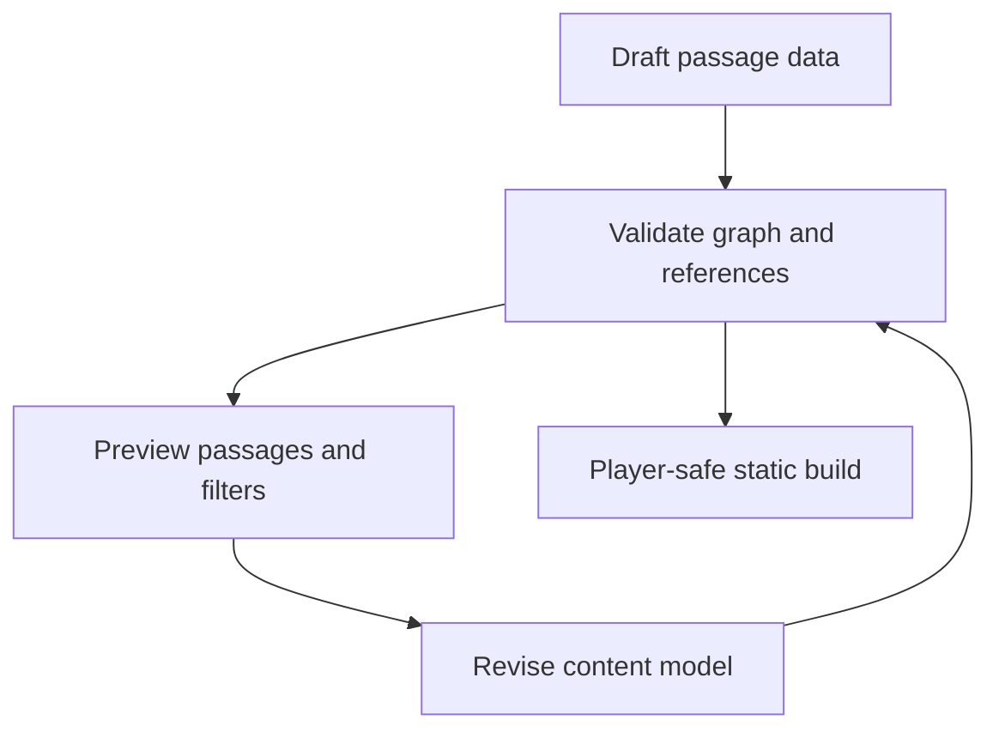

# Chapter 13: Authoring A Branching Adventure

## Research Question

How can the chapter teach content modelling, passage IDs, choice constraints, reachability,
dead-end checks, endings, puzzle gates, previews, imports, warnings, and player-safe publishing
through the practical work of writing a branching adventure?

The answer should be: authoring is not only prose. In a branching gamebook, authoring also means
building a small content system where passages, choices, checks, items, flags, encounters, endings,
and visibility rules can be inspected before a reader gets trapped in a beautiful corridor that no
one can enter.

## Core Concept

Branching adventure authoring is structured writing with validation loops.

For this chapter, the key ideas are:

- **Passage**: a named unit of authored story, usually with an ID, title, body, tags, choices, and
  optional ending or encounter metadata.
- **Choice**: a player-facing action that points to a passage directly, through a check, or through a
  combat outcome.
- **Content model**: the schema that lets authored prose participate in game state.
- **Authoring convention**: a local rule that keeps content consistent enough for tools to inspect.
- **Reachability**: whether a passage can be reached from the start node.
- **Dead end**: a non-ending passage with no choices.
- **Gate**: a choice requirement based on items, flags, hit points, or conditions.
- **Preview**: an author-facing view that shows what the player or a filtered content slice will see.
- **Import pipeline**: a staged process for turning source writing into safe app content.
- **Player-safe publishing**: keeping debug tools, private notes, Game Master-only content, and
  unfinished authoring surfaces out of the public build.

The chapter should make the modelling move visible:

```ts
interface Passage {
  id: string;
  title: string;
  body: string;
  choices: Choice[];
  ending?: "victory" | "failure" | "retreat" | "cliffhanger";
  tags?: PassageTag[];
  encounterId?: string;
}
```

That shape teaches the reader why an authoring tool can answer questions a manuscript cannot answer
alone: which passages are unreachable, which choices point nowhere, which gates require missing
items, and which endings the draft actually supports.

## RPG Or Gamebook Analogy

The Cartographer finds a beautiful corridor that no one can enter.

The writer loves the corridor. The map disagrees. There is no choice pointing to it, no key that can
open it, and no route that can return from it. The Cartographer does not judge the prose; they mark
the structural problem so the author can decide whether to cut, connect, or repurpose the passage.

This keeps the chapter grounded in craft:

- A strong passage still needs an incoming route.
- A compelling choice still needs a valid target.
- A clever lock still needs a key or a bypass.
- A dramatic ending still needs a playable path.
- A private draft must not appear in the public player build.

## Opening Passage Or Table Transcript

Open with a gamebook passage where **the Cartographer and the Playtester** discover an impossible
map.

The Cartographer sees every node at once and points to unreachable rooms. The Playtester sees only
the current page and says the choices feel good. The excerpt should dramatise the difference
between local experience and whole-graph validation. It should end with both being right:
good authoring needs local prose feel and global structural checks.

## Sources

- Gamebook form source: official Fighting Fantasy site, especially the description of gamebooks as
  interactive adventures where the reader chooses paths and uses dice, pencil, and eraser:
  <https://www.fightingfantasy.com/ff-gamebooks>.
- Interactive fiction authoring source: Twine reference, "Basic Concepts", which frames Twine as a
  tool for editing interactive narratives and explains story formats and exported stories:
  <https://twinery.org/reference/en/getting-started/basic-concepts.html>.
- Interactive fiction design source: Graham Nelson, *The Inform Designer's Manual*, especially its
  treatment of interactive fiction as designed world, structure, and player-facing text:
  <https://inform-fiction.org/manual/html/index.html>.
- Five-room adventure source: Johnn Four / Roleplaying Tips on the five-room dungeon method:
  <https://www.roleplayingtips.com/epic-adventure-building-game-plan/>.
- Campaign Ledger evidence:
  `/Users/dank/Code/personal/web/campaign-ledger/src/campaigns/imports.ts`,
  `/Users/dank/Code/personal/web/campaign-ledger/src/app.tsx`,
  `/Users/dank/Code/personal/web/campaign-ledger/src/components/pages/Campaign/Campaign.tsx`,
  `/Users/dank/Code/personal/web/campaign-ledger/docs/epics/sheet-0061.md`.
- Gamebook evidence:
  `/Users/dank/Code/personal/web/dungeons-and-data-structures/src/gamebook/model.ts`,
  `/Users/dank/Code/personal/web/dungeons-and-data-structures/src/gamebook/graph.ts`,
  `/Users/dank/Code/personal/web/dungeons-and-data-structures/src/gamebook/content/five-room-template.ts`,
  `/Users/dank/Code/personal/web/dungeons-and-data-structures/src/gamebook/content/mt-graphnor.ts`,
  `/Users/dank/Code/personal/web/dungeons-and-data-structures/src/app.tsx`.

## Shelf References

- Steve Jackson and Ian Livingstone, *The Warlock of Firetop Mountain*: use as a familiar shelf model
  for authored branching, inventory, risk, and mapping; keep the Mt. Graphnor structure original.
- Ian Livingstone, *Deathtrap Dungeon*: use for traps, gating, failure, and replay pressure without
  copying passage structure or set pieces.
- Steve Jackson, *Sorcery!* series: use for authoring longer continuity, spells, state, and player
  memory across books.
- Dungeons & Dragons 2014 *Dungeon Master's Guide*: use for adventure design, encounter purpose,
  pacing, treasure, clues, and table-facing preparation.
- Martin Fowler, *Refactoring*: use for keeping content conventions and validation adaptable as the
  authoring model changes.

## Rights And Originality Notes

Use Fighting Fantasy as form inspiration: numbered/linked passages, reader agency, dice-led risk,
inventory, failure, replay, and the feeling of mapping a dangerous text. Do not copy protected
passage structures, maps, distinctive encounters, names, trade dress, prose, puzzle answers, or
setting material.

The gamebook chapter should keep Mt. Graphnor original and SRD-safe. The Five Room Dungeon pattern
is a planning scaffold, not a licence to copy any particular published dungeon. Twine and Inform can
be cited as authoring traditions and tooling precedents without adopting their syntax or recreating
their example stories.

## Campaign Ledger Evidence

Campaign Ledger is the mature authoring-pipeline case study because it supports Game Master writing
that must be staged, converted, previewed, saved, and filtered for players.

- `/Users/dank/Code/personal/web/campaign-ledger/docs/epics/sheet-0061.md`
  - Defines Game Master prep as a visibility-aware authoring workflow.
  - Requires player preview so Game Masters can check what the table can currently see.
  - Requires staged Google Docs import that previews converted content before saving.
  - Preserves source metadata for imported material.
  - Explicitly avoids automatic two-way Google Docs sync and background polling.
  - Calls out the risk that player preview creates false confidence unless it reuses production
    visibility checks.
- `/Users/dank/Code/personal/web/campaign-ledger/src/campaigns/imports.ts`
  - Converts Markdown directly or a small safe HTML subset into normalised Markdown.
  - Detects imported titles.
  - Removes private Google Drive or Docs URLs and records warnings.
  - Removes unsupported script and embedded content from HTML imports.
  - Normalises Google Docs references to stable `google-doc:<document-id>` metadata.
  - Prepares manual Google Docs imports without storing private document URLs.
- `/Users/dank/Code/personal/web/campaign-ledger/src/components/pages/Campaign/Campaign.tsx`
  - Renders the Game Master import page for pasted Markdown or small HTML excerpts.
  - Provides a Google Docs manual export page that makes the no-sync boundary visible.
  - Renders an import preview page with detected title, provider, target type, visibility,
    warnings, converted Markdown, and final save controls.
  - Saves imports as wiki pages, session records, NPC dossiers, or retained drafts.
  - Shows recent imports with provider and visibility labels.
- `/Users/dank/Code/personal/web/campaign-ledger/src/app.tsx`
  - Parses import preview forms and applies the Google Docs manual-import preparation boundary.
  - Re-converts submitted preview Markdown on save, preserving conversion warnings.
  - Persists imports to the requested target type while preserving source title, source reference,
    visibility, and conversion notes.
  - Builds player preview using the same repository read models and visibility filters as player
    routes.
  - Calculates a visibility audit for wiki pages, sessions, NPCs, images, and character notes.
- `/Users/dank/Code/personal/web/campaign-ledger/src/app.test.tsx`
  - Verifies Game Master player preview uses production visibility filtering and excludes Game
    Master-only content.
  - Verifies staged campaign imports can save to wiki, session, NPC, and draft targets.
  - Verifies manual Google Docs exports are previewed, private URLs are removed, stable source
    metadata is recorded, and player-visible imports can be read by a player.
- `/Users/dank/Code/personal/web/campaign-ledger/src/campaigns/imports.test.ts`
  - Verifies Markdown title detection.
  - Verifies safe HTML subset conversion.
  - Verifies private Google URLs and unsupported embeds create warnings.
  - Verifies Google Docs references normalise to stable metadata.

Inference from project context: Campaign Ledger shows that "authoring" becomes software work when
writing needs workflow, review, provenance, safety, and audience-specific visibility. That makes it a
strong mature companion to the smaller gamebook authoring tools.

## Gamebook Build Payoff

The gamebook already has the core authoring surface. The chapter should explain and refine it rather
than start a new authoring system.

- `/Users/dank/Code/personal/web/dungeons-and-data-structures/src/gamebook/model.ts`
  - Defines the content model: `Adventure`, `Passage`, `Choice`, checks, combat outcomes, choice
    requirements, choice effects, item definitions, discoveries, and endings.
  - Makes choice targets explicit through direct `targetId`, check success/failure targets, and
    combat victory/defeat/continue targets.
- `/Users/dank/Code/personal/web/dungeons-and-data-structures/src/gamebook/graph.ts`
  - Builds passage maps.
  - Extracts all target passages from choices.
  - Computes reachable passages from the start.
  - Validates missing start passages, duplicate passages, duplicate items, duplicate discoveries,
    duplicate encounters, missing targets, missing combat encounters, missing item/discovery
    references, targetless choices, empty non-ending passages, unreachable passages, and unreachable
    endings.
  - Exports a Mermaid graph so authors can see the passage structure.
- `/Users/dank/Code/personal/web/dungeons-and-data-structures/src/gamebook/content/five-room-template.ts`
  - Defines the five room roles for Mt. Graphnor: entrance/guardian, puzzle or roleplaying
    challenge, trick or setback, climax, reward and twist.
  - Defines required ending kinds: victory, failure, retreat, and cliffhanger.
  - Validates room-tag and ending coverage.
- `/Users/dank/Code/personal/web/dungeons-and-data-structures/src/gamebook/content/mt-graphnor.ts`
  - Provides the current original adventure content.
  - Uses passage tags for room roles and facets.
  - Includes guardian, puzzle, trap, climax, reward, victory, failure, retreat, and cliffhanger
    passages.
  - Demonstrates checks, combat outcomes, item gates, flag gates, state effects, recovery choices,
    and multiple endings.
- `/Users/dank/Code/personal/web/dungeons-and-data-structures/src/app.tsx`
  - Provides `/gamebook/author` as the author tools route when author tooling is enabled.
  - Shows graph validation, Five Room template coverage, content audit counts, Mermaid graph source,
    testing coverage, and passage previews.
  - Supports passage-preview filtering by tags/endings.
  - Provides author-mode force navigation that can recover after passage renames by skipping current
    passage validation.
  - Keeps author/debug routes and force-passage controls out of the published player-only static
    build when author tools are disabled.
- `/Users/dank/Code/personal/web/dungeons-and-data-structures/src/gamebook/graph.test.ts`
  - Verifies Mt. Graphnor is reachable.
  - Verifies all required endings exist.
  - Verifies Five Room template coverage.
  - Verifies the copy is no longer placeholder/prototype text.
  - Verifies missing targets, targetless choices, missing encounters, missing content references,
    duplicate definitions, unreachable passages, unreachable endings, and Mermaid export.

The build move for this chapter should be modest and author-facing:

- Write clear conventions for passage IDs, choice IDs, room tags, ending tags, item IDs, discovery
  IDs, and encounter IDs.
- Add a short checklist for drafting a new adventure module from the current Mt. Graphnor template.
- Keep the author page as the preview/check surface; do not build a rich CMS before the book needs
  one.
- Keep final narrative drafting separate from the mechanics dossier work. The current chapter should
  prepare the authoring structure, not lock the final prose.

## Notes For The Draft

### Opening Move

Start with a draft passage that looks fine in isolation:

```ts
{
  id: "moon-door",
  title: "The Moon Door",
  body: "A silver door opens onto a silent stair.",
  choices: []
}
```

Then ask the authoring questions:

- Is it an ending?
- If not, where can the reader go?
- Which passage points here?
- Does it require an item?
- Can that item actually be found?
- Should this be visible in the public build yet?

The reader should feel the shift from writing a paragraph to maintaining an interactive structure.

### Sections

1. **A Passage Is A Record**
   - Introduce passage IDs, titles, body text, tags, choices, endings, and encounters.
   - Explain why IDs should be boring, stable, and meaningful.
   - Use Mt. Graphnor's `entrance`, `keyboard-room`, `trap-hall`, `climax`, and ending IDs.

2. **Choices Are Contracts**
   - A direct choice has a target.
   - A check choice has success and failure targets.
   - A combat choice has victory, defeat, and continue targets.
   - Every branch should name what happens next.

3. **Gates, Keys, And Consequences**
   - Model requirements with items, flags, hit points, and conditions.
   - Model effects with item changes, flags, damage, healing, and temporary hit points.
   - Use the brass key, puzzle-solved flag, and ration recovery choices as examples.

4. **Reachability And Dead Ends**
   - Explain graph traversal in plain terms.
   - Show how a validator can find unreachable passages and empty non-ending passages.
   - Use the Cartographer analogy for whole-map checking.

5. **Room Roles As A Planning Scaffold**
   - Introduce the Five Room template as a constraint for the first adventure.
   - Emphasise that room roles are design scaffolding, not final prose.
   - Tie guardian, puzzle, trap, climax, and reward/twist to the current template.

6. **Preview Before Publishing**
   - Show passage previews and filtered author views.
   - Explain why authors need to read the same content through more than one lens: prose, graph,
     choices, mechanics, and endings.
   - Use Campaign Ledger's player preview to show the mature version of audience-specific preview.

7. **Import Is A Staging Area**
   - Use Campaign Ledger's staged Markdown/HTML/Google Docs import as the richer example.
   - Convert, warn, preview, then save.
   - Preserve source metadata.
   - Remove private links before content becomes player-visible.

8. **Player-Safe Publishing**
   - Author tools help writers, but the player build should not ship debug routes or private
     controls.
   - Explain the current split between author-capable dev mode and player-only static output.

9. **Originality And Influence**
   - Discuss gamebook inspiration without copying.
   - Keep the lesson on structures: passage graph, resource gates, endings, replay, risk, and
     agency.
   - Avoid borrowing distinctive maps, puzzles, scenes, names, and prose from existing books.

### Diagram Idea



Campaign Ledger comparison:


### Code Example Path

Use a small broken graph first:

```ts
const adventure = {
  startPassageId: "entrance",
  passages: [
    { id: "entrance", choices: [{ id: "go", targetId: "missing-room" }] }
  ]
};
```

Then show a validation issue:

```ts
{
  code: "missing-target",
  passageId: "entrance",
  choiceId: "go",
  targetId: "missing-room"
}
```

Then show the authoring loop:

```ts
const validation = validateAdventure(adventure);
const mermaid = exportMermaid(adventure);
const templateIssues = validateFiveRoomTemplate(adventure);
```

The code should be used as a teaching lens, not as an invitation to build a giant editor.

### Sidebar Ideas

- **A Beautiful Passage Can Still Be A Bug**
  - If it cannot be reached, it is not part of the player's experience.
- **A Choice Without A Target Is A Promise You Break Immediately**
  - Let the validator be ruthless so the author can stay generous.
- **Import Is Not Publishing**
  - Converted content should pass through warnings and preview before it becomes player-visible.
- **Tags Are For Tools**
  - Tags let authors filter, count, validate, and plan without changing player prose.
- **The CMS You Do Not Build**
  - The first authoring tool can be a validator, a preview page, and conventions. Full editing UI can
    wait.

## Risks

- **Copying form too closely**: Fighting Fantasy and other gamebooks should inform structure, not
  supply maps, prose, puzzle shapes, names, or trade dress.
- **Overbuilding author tools**: a validator and preview surface are enough for this stage.
- **Authoring blind spots**: a graph can validate targets and reachability, but it cannot guarantee
  pacing, clarity, tone, or emotional payoff.
- **False preview confidence**: player preview must use the same filters as production routes, as
  Campaign Ledger's acceptance notes already warn.
- **Hidden private material**: imported drafts, Game Master-only notes, author debug controls, and
  private source links must not leak into player-facing output.
- **Brittle conventions**: passage IDs, tags, and target conventions should be documented before more
  adventures are added.
- **Narrative lock-in too early**: this chapter should support the final Mt. Graphnor drafting pass,
  not pretend that the current prototype prose is final manuscript prose.
