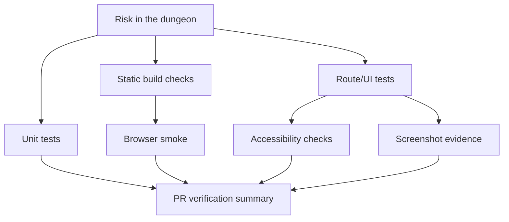
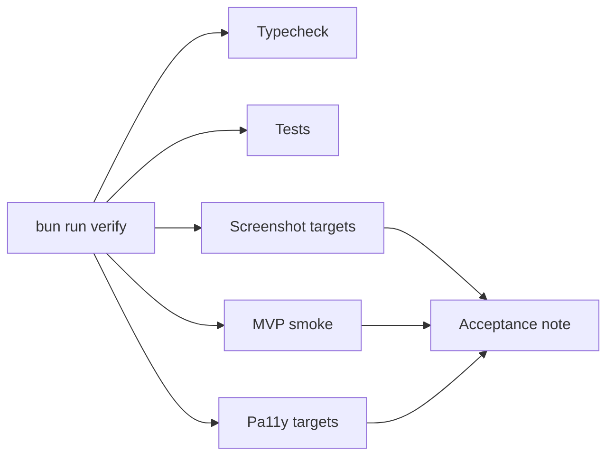

# Chapter 14: Testing The Dungeon

## Research Question

How can the chapter teach verification, smoke tests, route and component tests, accessibility checks,
screenshots, acceptance notes, and evidence-led PR review through the practical problem of proving a
branching dungeon still works?

The answer should be: testing is a scouting party. It does not make the dungeon interesting by
itself, but it walks the important routes before the reader does. A good verification habit checks
the content graph, rules, state, UI, published artefacts, browser behaviour, accessibility
expectations, screenshots, and review evidence at the level where each risk actually lives.

## Core Concept

Testing is risk-directed evidence.

For this chapter, the key ideas are:

- **Verification gate**: a repeatable command that produces pass/fail evidence for a known class of
  risk.
- **Unit test**: a focused check for domain behaviour such as graph validation, save migration, dice,
  combat, or choice effects.
- **Route or component test**: a server-rendered HTML check that protects request handling, fragments,
  author/player boundaries, and visible UI states.
- **Smoke test**: a short end-to-end route through the most important user workflow.
- **Static artefact check**: a build-output inspection that proves the shipped files contain expected
  player assets and omit development-only tools.
- **Browser smoke**: a served-page check that exercises real browser behaviour such as local storage,
  form controls, imports, downloads, and client-side interaction.
- **Accessibility check**: automated and human review against user-facing accessibility expectations.
- **Screenshot evidence**: a visual record for layout, theme, responsive state, and reviewer context.
- **Acceptance note**: a concise record of delivered scope, verification evidence, known limits, and
  follow-up boundaries.
- **PR verification summary**: compact evidence in the pull request body or review trail, listing the
  commands, pass/fail status, total checks or tests, screenshot status, and blocked items.

The chapter should keep the beginner lesson simple: each test answers a question. Do not ask one
test to prove everything.

```ts
export interface VerificationGate {
  id: string;
  name: string;
  command: string;
  evidence: string;
}
```

That shape lets the book move from vague confidence to explicit claims:

- Type checking protects contracts.
- Unit tests protect domain rules.
- Static builds protect generated output.
- Static smoke protects shipped files.
- Browser smoke protects real player interaction.
- Accessibility and screenshots protect the parts a purely structural test cannot see.

## RPG Or Gamebook Analogy

The Dungeon Master sends a test party into every door.

The first scout checks whether each door opens. The second keeps an inventory ledger. The third tries
to retreat after a failed fight. The fourth reads the map in poor light. The final scout asks whether
the public handout accidentally includes the Game Master's private notes. None of them are the hero,
but together they discover whether the adventure is ready for the hero.

This gives the chapter a friendly mental model:

- Unit tests inspect individual traps, locks, and rules.
- Route tests open doors and check what the player sees.
- Smoke tests walk a survivable path through the dungeon.
- Accessibility checks ask whether more than one kind of player can use the map.
- Screenshots let reviewers see the room without travelling there themselves.
- Acceptance notes tell the table what was actually checked.

## Opening Passage Or Table Transcript

Open with a D&D table transcript where **the Dungeon Master and the Test Party** rehearse a dungeon
before opening night.

The Dungeon Master wants to say "it works". The Test Party keeps asking, "which part, and how do you
know?" One character finds a broken secret door; another proves the public map hides the private
notes; another points out that a narrow hallway looks fine to the author but not to the player. The
transcript can end with the Dungeon Master replacing certainty with evidence.

## Sources

- Software engineering source: IEEE Computer Society, *Guide to the Software Engineering Body of
  Knowledge (SWEBOK) V4.0*, especially Software Testing as a recognised knowledge area:
  <https://www.computer.org/education/bodies-of-knowledge/software-engineering/topics> and
  <https://ieeecs-media.computer.org/media/education/swebok/swebok-v4.pdf>.
- Accessibility source: W3C, *Web Content Accessibility Guidelines (WCAG) 2.2*, a W3C
  Recommendation whose success criteria are written as testable statements:
  <https://www.w3.org/TR/WCAG22/>.
- Browser and visual testing source: Playwright documentation on running browser tests, screenshots,
  and visual comparisons:
  <https://playwright.dev/docs/running-tests>,
  <https://playwright.dev/docs/next/screenshots>, and
  <https://playwright.dev/docs/next/test-snapshots>.
- Accessibility tooling source: Pa11y, a command-line accessibility testing tool used by Campaign
  Ledger:
  <https://pa11y.org/>.
- Campaign Ledger evidence:
  `/Users/dank/Code/personal/web/campaign-ledger/scripts/verify.ts`,
  `/Users/dank/Code/personal/web/campaign-ledger/scripts/test-a11y.ts`,
  `/Users/dank/Code/personal/web/campaign-ledger/scripts/smoke-mvp.ts`,
  `/Users/dank/Code/personal/web/campaign-ledger/scripts/capture-screenshots.ts`,
  `/Users/dank/Code/personal/web/campaign-ledger/scripts/hyper-dank-compat.test.tsx`,
  `/Users/dank/Code/personal/web/campaign-ledger/.github/PULL_REQUEST_TEMPLATE.md`,
  `/Users/dank/Code/personal/web/campaign-ledger/docs/operations/game-master-prep-acceptance.md`,
  `/Users/dank/Code/personal/web/campaign-ledger/docs/operations/hyper-dank-adoption-acceptance.md`.
- Gamebook evidence:
  `/Users/dank/Code/personal/web/dungeons-and-data-structures/src/gamebook/testing.ts`,
  `/Users/dank/Code/personal/web/dungeons-and-data-structures/src/gamebook/testing.test.ts`,
  `/Users/dank/Code/personal/web/dungeons-and-data-structures/scripts/verify.ts`,
  `/Users/dank/Code/personal/web/dungeons-and-data-structures/scripts/check-static.ts`,
  `/Users/dank/Code/personal/web/dungeons-and-data-structures/scripts/test-static-gamebook.ts`,
  `/Users/dank/Code/personal/web/dungeons-and-data-structures/src/app.test.tsx`,
  `/Users/dank/Code/personal/web/dungeons-and-data-structures/src/gamebook/graph.test.ts`,
  `/Users/dank/Code/personal/web/dungeons-and-data-structures/src/gamebook/state.test.ts`,
  `/Users/dank/Code/personal/web/dungeons-and-data-structures/src/gamebook/play.test.ts`,
  `/Users/dank/Code/personal/web/dungeons-and-data-structures/src/gamebook/rules/`.

## Rights And Originality Notes

Testing examples can use the original Mt. Graphnor mechanics, the app's own Campaign Ledger routes,
and SRD-safe rule vocabulary. Do not reproduce protected gamebook passages, maps, puzzle answers, or
encounters as test fixtures.

Accessibility material should cite WCAG and Pa11y as testing references, but the chapter should not
claim automated accessibility tests prove full accessibility. Automated checks are useful evidence,
not a substitute for keyboard, screen reader, zoom, contrast, and human usability review.

Screenshots should be treated as review evidence rather than art assets. If a screenshot includes
private campaign notes, unrevealed player content, local file paths, or credentials, it should not be
committed or posted in a PR.

## Campaign Ledger Evidence

Campaign Ledger is the mature testing-and-delivery case study because its verification posture spans
domain tests, accessibility, smoke workflows, screenshots, compatibility checks, PR templates, and
operations acceptance notes.

- `/Users/dank/Code/personal/web/campaign-ledger/scripts/verify.ts`
  - Defines an ordered local acceptance gate: typecheck, tests, accessibility, MVP smoke, and sheet
    screenshots.
  - Routes routine verification screenshots to a temporary directory so `bun run verify` does not
    accidentally churn committed PR evidence.
  - Allows an explicit screenshot output override for deliberate local debugging or PR evidence.
- `/Users/dank/Code/personal/web/campaign-ledger/scripts/verify.test.ts`
  - Tests the verification command order.
  - Tests the temporary screenshot-output default.
  - Tests the explicit `VERIFY_SCREENSHOT_DIR` override.
- `/Users/dank/Code/personal/web/campaign-ledger/scripts/test-a11y.ts`
  - Runs Pa11y over public, player, Game Master, and admin routes.
  - Includes prep workspace, player preview, NPCs, campaign images, imports, Google Docs manual
    import, roster, rules, login, logout, and local play routes.
  - Seeds app state and logs in as the relevant role before testing protected pages.
- `/Users/dank/Code/personal/web/campaign-ledger/scripts/smoke-mvp.ts`
  - Starts an in-memory app and checks the full seeded workflow.
  - Imports SRD rules and private campaign rules.
  - Exercises player sign-in, sheet edits, notes, faction choice, rules browsing, local play storage,
    Game Master campaign pages, wiki, private rules, sessions, image upload, staged imports, Google
    Docs manual import, admin handoff, and logout protection.
  - Models smoke testing as a narrative path through the app's most important workflows.
- `/Users/dank/Code/personal/web/campaign-ledger/scripts/capture-screenshots.ts`
  - Defines screenshot targets by role, path, theme, tab, and optional interaction.
  - Captures light and dark states for public, player, Game Master, admin, local play, sheet, rules,
    wiki, images, import, and interaction surfaces.
  - Shows why screenshots are targeted evidence: they record the state reviewers need, not every
    possible screen.
- `/Users/dank/Code/personal/web/campaign-ledger/scripts/hyper-dank-compat.test.tsx`
  - Imports shared Hyper-Dank UI, data, transport, automation, and content helpers through public
    package paths.
  - Verifies compatibility shims stay thin.
  - Flags newly overlapping shared UI component names before local components are replaced.
  - Demonstrates compatibility tests as tests for dependency boundaries, not product flows.
- `/Users/dank/Code/personal/web/campaign-ledger/.github/PULL_REQUEST_TEMPLATE.md`
  - Requires issue/project/base/branch tracking.
  - Requires screenshot evidence or a blocker note for user-facing UI changes.
  - Requires verification commands and shared-package compatibility checks when those boundaries are
    touched.
  - Keeps local databases, generated assets, and routine verification screenshots out of commits.
- `/Users/dank/Code/personal/web/campaign-ledger/docs/operations/game-master-prep-acceptance.md`
  - Records delivered scope, automated acceptance coverage, PR screenshot evidence, GitHub tracking,
    and deferred follow-ups for the Game Master prep epic.
  - Summarises typecheck/tests, Hyper-Dank compatibility, accessibility, MVP smoke, and screenshot
    evidence against the specific product risks in that epic.
- `/Users/dank/Code/personal/web/campaign-ledger/docs/operations/hyper-dank-adoption-acceptance.md`
  - Records package adoption scope, compatibility coverage, visual evidence, and app-owned
    boundaries.
  - Explains that future Hyper-Dank package updates should run compatibility review, `bun run
    verify`, and relevant screenshot evidence when UI changes.

Inference from project context: Campaign Ledger shows that verification is a product and delivery
habit. Tests prove behaviour, accessibility targets widen the user lens, screenshots support UX
review, compatibility tests protect shared-package boundaries, and acceptance notes keep review
memory after the PR disappears into `main`.

## Gamebook Build Payoff

The gamebook already has the compact worked example for this chapter. The chapter should use it to
teach a smaller, beginner-friendly version of the Campaign Ledger testing posture.

- `/Users/dank/Code/personal/web/dungeons-and-data-structures/src/gamebook/testing.ts`
  - Defines five verification gates: Type check, Unit tests, Static build, Static artifact check,
    and Static browser smoke.
  - Defines five coverage areas: Passage graph and content, Save state and persistence, Rules/dice
    and combat, Routes and rendered UI, and Published static gamebook.
  - Maps each coverage area to evidence files and verification gates.
- `/Users/dank/Code/personal/web/dungeons-and-data-structures/src/gamebook/testing.test.ts`
  - Verifies every coverage area points to at least one evidence file and at least one valid gate.
  - Verifies the manifest covers graph, state, rules, UI, and static browser surfaces.
- `/Users/dank/Code/personal/web/dungeons-and-data-structures/scripts/verify.ts`
  - Runs typecheck, Bun tests, static build, static artefact check, and Playwright static browser
    smoke through Hyper-Dank automation helpers.
  - Produces one compact verification report with gate status and exits non-zero on failure.
- `/Users/dank/Code/personal/web/dungeons-and-data-structures/scripts/check-static.ts`
  - Checks generated static routes and assets include expected player-facing content.
  - Verifies the published HTML and client bundle omit development-only author/debug text such as
    force passage controls, author mode, and Mermaid output.
- `/Users/dank/Code/personal/web/dungeons-and-data-structures/scripts/test-static-gamebook.ts`
  - Serves the generated `dist/` output and drives a real browser with Playwright.
  - Clears local storage, starts a new game, selects class/race, takes choices, resolves combat,
    checks saved state, exports JSON, downloads JSON, resets, imports the save, and verifies the
    restored passage and encounter state.
- `/Users/dank/Code/personal/web/dungeons-and-data-structures/src/app.test.tsx`
  - Tests health, gamebook route rendering, author-capable versus player-only clients, author/debug
    boundaries, author tool tabs, validation output, Mermaid graph output, testing coverage, passage
    previews, choice posts, combat, gates, and invalid submitted state handling.
- `/Users/dank/Code/personal/web/dungeons-and-data-structures/src/gamebook/graph.test.ts`
  - Tests Mt. Graphnor reachability, required endings, Five Room template coverage, content readiness,
    missing targets, targetless choices, missing encounters, missing references, duplicate
    definitions, unreachable passages, unreachable endings, and Mermaid export.
- `/Users/dank/Code/personal/web/dungeons-and-data-structures/src/gamebook/state.test.ts`
  - Tests versioned save creation, choice requirements, effects, temporary hit points, conditions,
    local-storage round trips, migrations, imported JSON validation, current-passage validation, and
    author recovery.
- `/Users/dank/Code/personal/web/dungeons-and-data-structures/src/gamebook/play.test.ts`
  - Tests combat shortcuts for defeated encounters, readable log entries, puzzle-bypass victory,
    combat completion, trap failure, and retreat paths.
- `/Users/dank/Code/personal/web/dungeons-and-data-structures/src/gamebook/rules/`
  - Tests character modifiers, proficiency scaling, templates, race bonuses, dice, advantage,
    disadvantage, combat rounds, damage, SRD source metadata, equipment catalogue references, and
    playable rule coverage.
- `/Users/dank/Code/personal/web/dungeons-and-data-structures/src/app.tsx`
  - Surfaces the verification gates and coverage areas in the author tools page.
  - Makes testing visible as part of authoring rather than a hidden CI ritual.

The build move for this chapter should be practical:

- Keep `src/gamebook/testing.ts` as the compact verification manifest.
- Keep `bun run verify` as the headline local gate.
- Add accessibility-style expectations to the chapter before deciding whether the gamebook needs its
  own Pa11y command.
- Use screenshots for visible UI PRs, but do not require screenshots for docs-only dossier work.
- Teach the PR verification summary as headline evidence: command, pass/fail, total gates/tests, CI
  status, screenshot status, and blockers.

## Notes For The Draft

### Opening Move

Start with a broken adventure that still looks playable at first glance:

```ts
{
  id: "trap-hall",
  title: "Trap Hall",
  body: "A narrow path crosses the gears.",
  choices: [{ id: "dash", text: "Dash across", targetId: "ending-victory" }]
}
```

Then ask what the author actually needs to know:

- Can a player reach this passage?
- Does the target exist?
- Does the route accidentally skip the climax?
- Does the save state survive the choice?
- Does the published build include this passage?
- Does it work in a real browser after local storage is cleared?
- Can a reviewer see the changed layout?
- Did the PR say what evidence was run?

This makes testing feel like a set of questions rather than a moral lecture.

### Sections

1. **Every Test Answers A Question**
   - Explain risk-directed evidence.
   - Contrast "we have tests" with "this command proves these behaviours".
   - Use the gamebook `VerificationGate` interface.

2. **Unit Tests For Dungeon Rules**
   - Cover graph validation, save migration, dice, combat, inventory gates, and SRD provenance.
   - Show why domain modules are easier to test than UI tangles.

3. **Route Tests For What The Player Sees**
   - Use server-rendered HTML assertions as an approachable stepping stone.
   - Check author tools, player routes, redirects, fragments, and hidden debug controls.

4. **Smoke Tests Walk The Golden Path**
   - Define smoke testing as a high-value route, not exhaustive proof.
   - Compare the gamebook static browser smoke with Campaign Ledger's MVP smoke.
   - Show browser-local storage as the reason a real browser check matters.

5. **Static Builds Need Their Own Checks**
   - Explain why the generated `dist/` output can fail differently from the dev route.
   - Use the author/debug omission check as the example.

6. **Accessibility Is More Than A Passing Script**
   - Introduce WCAG principles and testable success criteria.
   - Use Campaign Ledger's Pa11y targets as the mature example.
   - Mark automated checks as necessary evidence, not complete proof.

7. **Screenshots Are Review Evidence**
   - Explain light/dark, responsive, role-specific, and interaction-state screenshots.
   - Use Campaign Ledger screenshot targets as the larger pattern.
   - Keep docs-only PRs screenshot-free unless rendering changed.

8. **Compatibility Tests Protect Shared Boundaries**
   - Use Campaign Ledger's Hyper-Dank compatibility tests.
   - Tie this back to chapter 10 on modules and package adoption.

9. **Acceptance Notes Remember The Adventure**
   - Show how acceptance docs summarise delivered scope, automated evidence, screenshots, tracking,
     and follow-ups.
   - Explain why big epics need this memory after merge.

10. **PR Review As Evidence Review**
    - Teach compact verification summaries.
    - Show how to review not only code, but claims: what changed, what was proved, what remains
      unproved.

### Diagram Idea



Campaign Ledger comparison:



### Code Example Path

Start with the manifest:

```ts
export const VERIFICATION_GATES = [
  {
    id: "unit-tests",
    name: "Unit tests",
    command: "bun test",
    evidence: "Bun tests exercise graph validation, state migration, choice resolution, dice, combat, and route rendering.",
  },
];
```

Then show a coverage area:

```ts
{
  id: "published-static",
  title: "Published static gamebook",
  purpose: "Protects generated static HTML, assets, player-only client bundling, and browser-local play behaviour.",
  coveredBy: ["scripts/check-static.ts", "scripts/test-static-gamebook.ts"],
  gates: ["static-build", "static-check", "static-browser"],
}
```

Then show a compact PR verification summary:

```md
## Verification
- PASS: bun run verify, 5 gates passed.
- PASS: 82 tests passed.
- Screenshots: not required for docs-only changes.
```

This connects code, process, and review without dumping logs into the manuscript.

### Sidebar Ideas

- **A Test Is A Claim With Receipts**
  - Say exactly what the check proves and what it does not.
- **Smoke Is Not Fireproofing**
  - A smoke test is a route through the product, not exhaustive coverage.
- **Screenshots Are For Humans**
  - Use them for layout, state, theme, and review context.
- **Automated Accessibility Is A Starting Line**
  - Pa11y can catch many issues, but manual checks still matter.
- **The Player Build Is A Different Dungeon**
  - Static output can ship without author tools; test the thing you publish.
- **Do Not Paste The Whole Spellbook Into The PR**
  - Verification summaries should be compact: commands, pass/fail, totals, screenshots, blockers.

## Risks

- **False confidence**: passing tests can prove important things without proving the whole
  experience is good.
- **Testing theatre**: a command list is not useful unless each gate maps to a risk.
- **Over-specific UI assertions**: route tests that pin every class or line of copy can make
  harmless edits expensive.
- **Under-tested browser state**: local storage, import/export, downloads, and reset flows need
  browser-level evidence.
- **Accessibility overclaiming**: Pa11y and static checks do not replace manual keyboard, zoom,
  screen reader, and contrast review.
- **Screenshot churn**: routine verification screenshots should stay temporary unless the PR needs
  deliberate visual evidence.
- **Private information leakage**: screenshots and acceptance notes must avoid unrevealed campaign
  secrets, credentials, local file paths, and private source URLs.
- **Unclear PR evidence**: long logs bury the useful information. Compact verification should name
  the commands, status, totals, screenshots, and blockers.
- **Stale acceptance notes**: acceptance records are useful only if they name what actually shipped
  and what was deferred.
