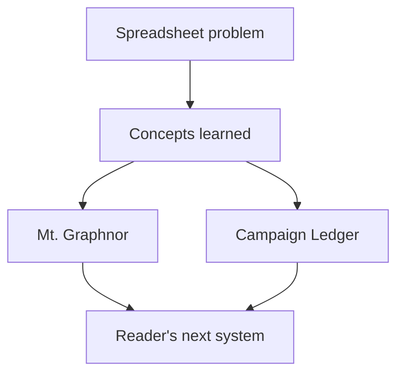

# Chapter 15: The Labyrinth Never Ends

## Research Question

How should the conclusion close the book while honestly reflecting what the reader has built and
learned, without pretending the journey is finished?

The answer should be: return to the personal story and show the change in vision. The author began
with a spreadsheet problem and ends with a way of seeing software: graphs of choices, records of
state, rules with provenance, boundaries around roles, modules with contracts, authoring pipelines,
tests, and review evidence. The labyrinth does not end because software does not end. The point is
that the reader now has a map, a few tools, and enough confidence to keep exploring.

## Core Concept

The conclusion is synthesis.

It should gather the book's recurring ideas:

- **Choices**: gamebook passages, hypermedia controls, user actions, route transitions.
- **Constraints**: types, gates, permissions, schemas, licences, resource limits.
- **State**: character sheets, saves, inventories, encounters, campaign data, browser storage,
  SQLite records.
- **Rules**: dice, combat, conditions, structured SRD data, source precedence, validation.
- **Boundaries**: player/author mode, Game Master/player visibility, modules, packages, public
  contracts, private notes.
- **Evidence**: tests, smoke paths, screenshots, accessibility checks, acceptance notes, PR
  verification.
- **Meaning**: the reason to build systems is not the system itself, but the people and play it
  supports.

The final chapter should help the reader realise that the same shape has repeated at different
scales. A passage graph, a character sheet, a save file, an admin guard, a module boundary, and a PR
verification note are all ways of making choices and consequences explicit.

## RPG Or Gamebook Analogy

The Wizard closes one spellbook and opens another.

The first spellbook is the one the reader has just finished: Dungeons & Data Structures, Mt.
Graphnor, and the working examples. The second is whatever they build next. The point is not that
they have mastered every spell, but that the runes are no longer random marks.

The conclusion should feel like returning from a dungeon with a better map than the one the party
entered with. There may be deeper rooms, but the reader can now recognise doors, keys, traps,
routes, ledgers, and safe exits.

## Opening Passage Or Table Transcript

Open with a table transcript where **the Wizard and the Apprentice** return to the original
spreadsheet.

The Apprentice sees the old spreadsheet again and notices that it was never "just" a spreadsheet. It
was already a small system: records, rules, state, formulas, constraints, and user workflows. The
Wizard closes the first spellbook and says the next one will be written by the Apprentice.

This transcript should echo the introduction without repeating it. It should show growth through
recognition: the world did not become programmable at the end; the reader learned how to see the
programmes hiding in plain sight.

## Sources

- Personal source: `/Users/dank/Code/personal/scratch.md`
  - Frames the book as a dissertation-like reflection on five years of developer learning.
  - Provides the labyrinth image and the move from spreadsheets to consultancy.
- Seed manuscript source: `book/chapters/seed/conclusion.md`
  - Supplies the original closing claim that RPG design patterns can help structure software.
  - Should be rewritten because it over-emphasises abstract base classes and factory patterns from
    the older essay shape.
- Book structure source: `book/book-structure-plan.md`
  - Names the final chapter as "The Labyrinth Never Ends".
  - Says the conclusion should return to the personal story, reflect on moving from spreadsheet
    formulas to systems thinking, and show how the gamebook and book mirror each other.
- Build log source: `book/build-log.md`
  - Records the actual gamebook and research journey: domain model, graph validation, state,
    character creation, dice, combat, inventory, author tools, rules catalogue, verification
    manifest, architecture checkpoint, and chapter dossiers.
- Dossier sources:
  - `book/research/chapter-02-choose-your-node-adventure.md`
  - `book/research/chapter-03-hypertext-hateoas-and-the-gamebook-page.md`
  - `book/research/chapter-04-character-sheets-as-data-models.md`
  - `book/research/chapter-05-classes-composition-and-the-limits-of-inheritance.md`
  - `book/research/chapter-06-dice-probability-and-risk.md`
  - `book/research/chapter-07-combat-as-an-event-loop.md`
  - `book/research/chapter-08-inventory-resources-and-encumbrance.md`
  - `book/research/chapter-09-the-dungeon-master-and-the-admin.md`
  - `book/research/chapter-10-adventure-modules-and-programming-modules.md`
  - `book/research/chapter-11-rules-as-structured-data.md`
  - `book/research/chapter-12-saving-the-game.md`
  - `book/research/chapter-13-authoring-a-branching-adventure.md`
  - `book/research/chapter-14-testing-the-dungeon.md`
- Gamebook evidence:
  `/Users/dank/Code/personal/web/dungeons-and-data-structures/src/gamebook/`,
  `/Users/dank/Code/personal/web/dungeons-and-data-structures/src/app.tsx`,
  `/Users/dank/Code/personal/web/dungeons-and-data-structures/scripts/verify.ts`.
- Campaign Ledger evidence:
  `/Users/dank/Code/personal/web/campaign-ledger/ARCHITECTURE.md`,
  `/Users/dank/Code/personal/web/campaign-ledger/docs/operations/`,
  `/Users/dank/Code/personal/web/campaign-ledger/src/`.

## Shelf References

- Andrew Hunt and David Thomas, *The Pragmatic Programmer*: use for the closing emphasis on lifelong
  learning, craft, feedback, and choosing the next problem.
- Robert C. Martin, *The Clean Coder*: use carefully for the professional identity arc from private
  toolmaking to accountable delivery.
- A favourite Fighting Fantasy book from the author's shelf: use as a personal return point, showing
  how the same object looks different after learning graphs, state, rules, and tests.
- Dungeons & Dragons 2014 *Dungeon Master's Guide*: use for the image of ending one adventure while
  leaving hooks for the next.

## Campaign Ledger Evidence

The conclusion should use Campaign Ledger as evidence of the journey from private need to real
software practice:

- A campaign spreadsheet problem became a running app with authentication, roles, campaign data,
  character sheets, rules, local play, imports, previews, screenshots, accessibility checks, smoke
  tests, and acceptance notes.
- Campaign Ledger repeatedly demonstrates the book's larger theme: playful subject matter does not
  make the software toy-like. It still needs architecture, boundaries, persistence, provenance,
  verification, usability, and delivery discipline.
- The conclusion can refer back to Campaign Ledger lightly as the mature version of several book
  ideas, especially permissions, rules data, persistence, authoring, and testing.

Do not turn the conclusion into a Campaign Ledger case-study chapter. The detailed evidence already
belongs in earlier dossiers. The conclusion should use Campaign Ledger to show growth and continuity.

## Gamebook Build Payoff

The conclusion should treat Mt. Graphnor as the book's completed worked example, even if final
literary prose remains a later pass.

By the end of the book, the gamebook should be readable as:

- a graph of passages and choices;
- a hypertext application with links, forms, routes, fragments, and static output;
- a character model with derived stats and SRD-safe templates;
- a composition exercise in classes, races, inventory, attacks, and capabilities;
- a dice and probability demonstration;
- a combat state machine;
- an inventory and resource system;
- a player-safe application with author/debug boundaries;
- a modular codebase with content, rules, state, graph, renderers, clients, scripts, and app shell;
- a small rules catalogue with attribution and provenance;
- a local-storage persistence example with export/import and migrations;
- an authored branching adventure with validation, previews, content audit, and Mermaid graph;
- a tested and reviewable static gamebook with verification evidence.

The build payoff is reflective, not additive. The conclusion should not start a new feature. It
should ask the reader to look back at the artefact they now understand.

## Notes For The Draft

### Opening Move

Return to the first image:

> The spreadsheet was not the end of the story. It was the first room.

Then show the reader what changed:

- at the start, a formula was a workaround;
- by the end, a formula is one example of a rule operating on state;
- at the start, a gamebook was a nostalgic object;
- by the end, it is a graph, a hypermedia app, a content model, a save document, and a test target;
- at the start, campaign notes were private chaos;
- by the end, they are a real software domain with roles, provenance, visibility, imports and
  delivery evidence.

### Sections

1. **The First Room Was A Spreadsheet**
   - Echo the introduction.
   - Emphasise that the entry point was practical need, not academic purity.

2. **What The Dungeon Taught Us**
   - Revisit the chapter arc as a set of concepts, not a list of files.
   - Choices, state, rules, boundaries, modules, evidence.

3. **The Gamebook As A Mirror**
   - Explain how Mt. Graphnor became a compact model of software systems.
   - Do not claim the adventure prose is final if it is not.

4. **Campaign Ledger As The Larger Map**
   - Show how the same ideas appear at production-ish scale.
   - Keep this as synthesis, not new evidence.

5. **What We Still Have Not Built**
   - Name healthy incompleteness: richer narrative, broader gamebook content, deeper accessibility
     review, more sophisticated authoring, hosted deployment, future Campaign Ledger features.
   - Frame this as honest scope, not failure.

6. **The Next Spellbook**
   - Encourage the reader to pick their own domain and inspect its data, rules, choices, state, and
     evidence.
   - End with agency rather than triumphalism.

### Diagram Idea

### Chapter Echoes

- Chapter 02: a dungeon room becomes a node.
- Chapter 03: a choice becomes hypermedia.
- Chapter 04: a character sheet becomes a data model.
- Chapter 05: a class becomes a bundle of capabilities, not just an inheritance branch.
- Chapter 06: a die roll becomes probability made visible.
- Chapter 07: combat becomes a state machine.
- Chapter 08: inventory becomes constrained collections and resources.
- Chapter 09: the Game Master becomes an admin boundary.
- Chapter 10: an adventure module becomes a software module.
- Chapter 11: a rule becomes structured, sourced data.
- Chapter 12: memory becomes a save contract.
- Chapter 13: writing becomes authoring with validation.
- Chapter 14: confidence becomes verification evidence.

### Reusable Sentences

- "The labyrinth never ends, but it does become more legible."
- "A graph is not only a diagram. It is a way of asking what can happen next."
- "A save file is not only storage. It is a promise about what a player can return to."
- "A permission check is not only security. It is a statement about who is allowed to know or change
  the story."
- "The point was never to prove that RPGs secretly are software. The point was to use one loved
  system to learn how to see another."

## Risks

- **Premature victory lap**: the conclusion should feel earned and honest, not self-congratulatory.
- **Repeating the table of contents**: use the chapter arc as synthesis, not a bullet-summary dump.
- **Overclaiming completeness**: name what remains unfinished or intentionally scoped out.
- **Losing the beginner**: close with confidence and next steps, not abstraction.
- **Campaign Ledger overload**: refer back to it as continuity, not as a new case study.
- **Gamebook overstatement**: distinguish the completed mechanics prototype from final literary
  adventure polish.
- **Weak emotional close**: return to the personal story so the ending has shape, not just summary.
