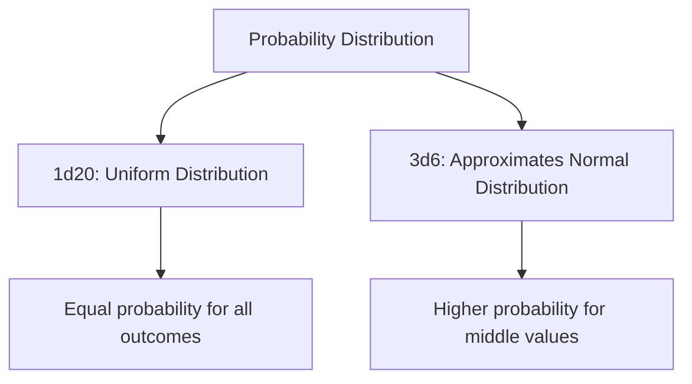

# Dice Systems: Probability Theory and Random Number Generation

## Introduction

At the heart of most role-playing games lies a fundamental mechanism for introducing uncertainty: dice. From the iconic d20 of Dungeons & Dragons to the pool of d10s in World of Darkness games, these randomization tools embody important concepts from probability theory and influence how we approach random number generation in software development.

## Probability Distributions in Dice Systems

Different dice configurations produce distinct probability distributions, each with unique characteristics that affect gameplay:

```typescript
// Utility class for analyzing dice probability distributions
class DiceDistribution {
  private readonly sides: number;
  private readonly count: number;
  private readonly modifier: number;
  private distribution: Map<number, number> = new Map();
  
  constructor(count: number, sides: number, modifier: number = 0) {
    this.sides = sides;
    this.count = count;
    this.modifier = modifier;
    this.calculateDistribution();
  }
  
  // Calculate full probability distribution
  private calculateDistribution(): void {
    // For single die
    if (this.count === 1) {
      for (let i = 1; i <= this.sides; i++) {
        this.distribution.set(i + this.modifier, 1 / this.sides);
      }
      return;
    }
    
    // For multiple dice, use dynamic programming approach
    let currentDist = new Map<number, number>();
    
    // Initialize with first die
    for (let i = 1; i <= this.sides; i++) {
      currentDist.set(i, 1 / this.sides);
    }
    
    // Add each additional die
    for (let d = 1; d < this.count; d++) {
      const newDist = new Map<number, number>();
      
      // For each outcome in current distribution
      for (const [sum, prob] of currentDist.entries()) {
        // Add each possible roll of the next die
        for (let i = 1; i <= this.sides; i++) {
          const newSum = sum + i;
          const newProb = (newDist.get(newSum) || 0) + (prob * (1 / this.sides));
          newDist.set(newSum, newProb);
        }
      }
      
      currentDist = newDist;
    }
    
    // Apply modifier to final distribution
    if (this.modifier !== 0) {
      const modifiedDist = new Map<number, number>();
      for (const [sum, prob] of currentDist.entries()) {
        modifiedDist.set(sum + this.modifier, prob);
      }
      currentDist = modifiedDist;
    }
    
    this.distribution = currentDist;
  }
  
  getProbabilityOf(value: number): number {
    return this.distribution.get(value) || 0;
  }
  
  getProbabilityOfAtLeast(value: number): number {
    let probability = 0;
    for (const [outcome, prob] of this.distribution.entries()) {
      if (outcome >= value) {
        probability += prob;
      }
    }
    return probability;
  }
  
  getExpectedValue(): number {
    let expected = 0;
    for (const [outcome, prob] of this.distribution.entries()) {
      expected += outcome * prob;
    }
    return expected;
  }
  
  getVariance(): number {
    const expectedValue = this.getExpectedValue();
    let variance = 0;
    
    for (const [outcome, prob] of this.distribution.entries()) {
      variance += Math.pow(outcome - expectedValue, 2) * prob;
    }
    
    return variance;
  }
  
  getStandardDeviation(): number {
    return Math.sqrt(this.getVariance());
  }
  
  // Visualize the distribution (returns array of probabilities for plotting)
  visualize(): {value: number, probability: number}[] {
    const result: {value: number, probability: number}[] = [];
    
    // Get min and max values
    const min = Math.min(...Array.from(this.distribution.keys()));
    const max = Math.max(...Array.from(this.distribution.keys()));
    
    // Create array of all values and probabilities
    for (let i = min; i <= max; i++) {
      result.push({
        value: i,
        probability: this.getProbabilityOf(i)
      });
    }
    
    return result;
  }
}

// Example usage
const d20 = new DiceDistribution(1, 20);
console.log(`D20 probability of rolling 20: ${d20.getProbabilityOf(20) * 100}%`);
console.log(`D20 probability of rolling at least 15: ${d20.getProbabilityOfAtLeast(15) * 100}%`);

const twoDSix = new DiceDistribution(2, 6);
console.log(`2d6 expected value: ${twoDSix.getExpectedValue()}`);
console.log(`2d6 standard deviation: ${twoDSix.getStandardDeviation()}`);
```

## Central Limit Theorem in Action

One of the most fascinating aspects of dice systems is the demonstration of the Central Limit Theorem, which states that the sum of independent random variables tends toward a normal distribution, regardless of the original distribution of the variables. This is especially evident when comparing different dice combinations:



Let's examine the characteristics of different dice combinations:

| Dice System | Distribution Type | Expected Value | Standard Deviation | Notes |
|-------------|-------------------|----------------|---------------------|-------|
| 1d20        | Uniform           | 10.5           | 5.77                | Equal probability (5%) for each outcome |
| 3d6         | Approximately Normal | 10.5        | 2.96                | Bell curve, 10-11 most common (12.5%) |
| 2d6         | Triangular        | 7              | 1.71                | Value 7 has highest probability (16.7%) |
| 4dF (Fate)  | Discrete Normal   | 0              | 1.41                | Range from -4 to +4, 0 most common |

This mathematical foundation has profound implications for game design:

1. **Risk Assessment**: Players intuitively understand that rolling a 10+ on 1d20 is a 55% chance, while rolling 11+ on 3d6 is approximately 50% but feels more reliable
   
2. **Predictability vs. Swinginess**: Systems using multiple dice produce more consistent results (less variability), while single-die systems produce more dramatic outcomes

3. **Probability Curves**: Game designers select dice systems that match the desired probability distribution for their game mechanics

## Implementing Digital Dice

When implementing dice systems in software, several considerations come into play:

```typescript
// Basic dice roller with true randomness
class DiceRoller {
  /**
   * Rolls a specified number of dice with a certain number of sides
   * @param count Number of dice to roll
   * @param sides Number of sides on each die
   * @param modifier Value to add to the final sum
   * @returns Object containing the total and individual dice results
   */
  static roll(count: number, sides: number, modifier: number = 0): {
    total: number;
    rolls: number[];
  } {
    const rolls: number[] = [];
    
    for (let i = 0; i < count; i++) {
      // Generate a random integer between 1 and sides
      const roll = Math.floor(Math.random() * sides) + 1;
      rolls.push(roll);
    }
    
    const total = rolls.reduce((sum, roll) => sum + roll, 0) + modifier;
    
    return {
      total,
      rolls
    };
  }
  
  /**
   * Rolls dice with advantage (roll twice, take higher)
   * Common in D&D 5e
   */
  static rollWithAdvantage(sides: number): {
    total: number;
    rolls: number[];
  } {
    const roll1 = Math.floor(Math.random() * sides) + 1;
    const roll2 = Math.floor(Math.random() * sides) + 1;
    
    return {
      total: Math.max(roll1, roll2),
      rolls: [roll1, roll2]
    };
  }
  
  /**
   * Rolls dice with disadvantage (roll twice, take lower)
   * Common in D&D 5e
   */
  static rollWithDisadvantage(sides: number): {
    total: number;
    rolls: number[];
  } {
    const roll1 = Math.floor(Math.random() * sides) + 1;
    const roll2 = Math.floor(Math.random() * sides) + 1;
    
    return {
      total: Math.min(roll1, roll2),
      rolls: [roll1, roll2]
    };
  }
  
  /**
   * Exploding dice: when maximum value is rolled, roll again and add
   * Common in games like Savage Worlds
   */
  static rollExploding(sides: number): {
    total: number;
    rolls: number[];
  } {
    const rolls: number[] = [];
    let total = 0;
    
    let roll;
    do {
      roll = Math.floor(Math.random() * sides) + 1;
      rolls.push(roll);
      total += roll;
    } while (roll === sides);
    
    return {
      total,
      rolls
    };
  }
}
```

### Cryptographically Secure Random Number Generation

For applications where fairness is critical (like online gaming platforms), using cryptographically secure random number generation is important:

```typescript
// Using Node.js crypto module for secure random numbers
import * as crypto from 'crypto';

class SecureDiceRoller {
  /**
   * Generates a cryptographically secure random integer between min and max (inclusive)
   */
  static getSecureRandomInt(min: number, max: number): number {
    const range = max - min + 1;
    const bytesNeeded = Math.ceil(Math.log2(range) / 8);
    const maxNum = Math.pow(256, bytesNeeded);
    const cutoff = maxNum - (maxNum % range);
    
    let randomInt;
    do {
      const randomBytes = crypto.randomBytes(bytesNeeded);
      randomInt = 0;
      for (let i = 0; i < bytesNeeded; i++) {
        randomInt += randomBytes[i] * Math.pow(256, i);
      }
    } while (randomInt >= cutoff);
    
    return min + (randomInt % range);
  }
  
  static roll(count: number, sides: number, modifier: number = 0): {
    total: number;
    rolls: number[];
  } {
    const rolls: number[] = [];
    
    for (let i = 0; i < count; i++) {
      const roll = this.getSecureRandomInt(1, sides);
      rolls.push(roll);
    }
    
    const total = rolls.reduce((sum, roll) => sum + roll, 0) + modifier;
    
    return {
      total,
      rolls
    };
  }
}
```

## Monte Carlo Simulation for Game Balancing

One powerful application of dice systems in software development is using Monte Carlo simulation to balance game mechanics:

```typescript
// Monte Carlo simulation for combat outcome analysis
class CombatSimulator {
  /**
   * Simulates combat between character and monster to estimate win probability
   * @param character The player character stats
   * @param monster The monster stats
   * @param iterations Number of simulations to run
   * @returns Win probability as a percentage
   */
  static simulateCombat(
    character: { 
      hp: number; 
      ac: number; 
      attackBonus: number; 
      damagePerHit: [number, number, number]; // [diceCount, diceSides, modifier]
    },
    monster: { 
      hp: number; 
      ac: number; 
      attackBonus: number; 
      damagePerHit: [number, number, number]; 
    },
    iterations: number = 10000
  ): number {
    let characterWins = 0;
    
    for (let i = 0; i < iterations; i++) {
      // Clone stats to avoid modifying originals
      const characterHP = character.hp;
      const monsterHP = monster.hp;
      
      let characterTurn = true; // Character goes first
      
      // Run combat until someone dies
      while (characterHP > 0 && monsterHP > 0) {
        if (characterTurn) {
          // Character attacks
          const attackRoll = DiceRoller.roll(1, 20).total + character.attackBonus;
          if (attackRoll >= monster.ac) {
            // Hit! Roll damage
            const [diceCount, diceSides, modifier] = character.damagePerHit;
            const damage = DiceRoller.roll(diceCount, diceSides, modifier).total;
            monsterHP -= damage;
          }
        } else {
          // Monster attacks
          const attackRoll = DiceRoller.roll(1, 20).total + monster.attackBonus;
          if (attackRoll >= character.ac) {
            // Hit! Roll damage
            const [diceCount, diceSides, modifier] = monster.damagePerHit;
            const damage = DiceRoller.roll(diceCount, diceSides, modifier).total;
            characterHP -= damage;
          }
        }
        
        // Switch turns
        characterTurn = !characterTurn;
      }
      
      // Check who won
      if (monsterHP <= 0) {
        characterWins++;
      }
    }
    
    return (characterWins / iterations) * 100;
  }
  
  /**
   * Analyzes the expected damage per round for various attack configurations
   */
  static analyzeExpectedDamage(
    attackBonus: number,
    targetAC: number,
    damagePerHit: [number, number, number], // [diceCount, diceSides, modifier]
    advantageType: "normal" | "advantage" | "disadvantage" = "normal"
  ): number {
    const [diceCount, diceSides, modifier] = damagePerHit;
    const averageDamagePerHit = ((diceSides + 1) / 2) * diceCount + modifier;
    
    // Calculate hit probability
    let hitProbability: number;
    const hitThreshold = targetAC - attackBonus;
    
    if (advantageType === "normal") {
      // Regular attack: need to roll at least hitThreshold on d20
      hitProbability = Math.max(0, Math.min(0.95, (21 - hitThreshold) / 20));
    } else if (advantageType === "advantage") {
      // Advantage: probability of at least one die hitting
      const missProbability = Math.pow(Math.max(0, Math.min(1, (hitThreshold - 1) / 20)), 2);
      hitProbability = Math.min(0.95, 1 - missProbability);
    } else {
      // Disadvantage: need both dice to hit
      hitProbability = Math.pow(Math.max(0, Math.min(0.95, (21 - hitThreshold) / 20)), 2);
    }
    
    // Critical hit adds another set of damage dice (but not modifiers)
    const criticalProbability = advantageType === "advantage" ? 0.0975 : 
                               (advantageType === "disadvantage" ? 0.0025 : 0.05);
    
    const regularHitProbability = hitProbability - criticalProbability;
    const averageDamageOnCrit = ((diceSides + 1) / 2) * diceCount * 2 + modifier;
    
    // Expected damage = (regular hit probability × regular damage) + (crit probability × crit damage)
    return (regularHitProbability * averageDamagePerHit) + (criticalProbability * averageDamageOnCrit);
  }
}

// Example usage
const fighter = {
  hp: 45,
  ac: 18,
  attackBonus: 7,
  damagePerHit: [2, 6, 4] // 2d6+4
};

const ogre = {
  hp: 59,
  ac: 14,
  attackBonus: 6,
  damagePerHit: [2, 8, 4] // 2d8+4
};

const winProbability = CombatSimulator.simulateCombat(fighter, ogre, 10000);
console.log(`Fighter has ${winProbability.toFixed(2)}% chance to defeat the ogre.`);

const expectedDamage = CombatSimulator.analyzeExpectedDamage(
  fighter.attackBonus, 
  ogre.ac, 
  fighter.damagePerHit, 
  "advantage"
);
console.log(`Fighter's expected damage per round with advantage: ${expectedDamage.toFixed(2)}`);
```

## Theoretical Insights

The dice systems in RPGs provide several important theoretical insights applicable to software development:

1. **Random Number Distribution**: Understanding how to generate appropriate probability distributions for specific application needs

2. **Statistical Analysis**: Techniques for analyzing and predicting outcomes in probabilistic systems

3. **Discrete Event Simulation**: Modeling complex systems with multiple random variables

4. **Balance Testing**: Using simulation to test and balance complex interactive systems

5. **User Experience Design**: Crafting systems with the right balance of predictability and variance

## Conclusion

The humble dice systems of RPGs embody sophisticated concepts from probability theory that directly translate to software development practices. By studying these systems, developers gain intuition about randomness, distribution, and statistical behavior—concepts that prove invaluable when designing algorithms that model real-world uncertainty.

Whether implementing a combat system for a digital RPG, a Monte Carlo simulation for financial analysis, or even a load-balancing algorithm for distributed systems, the lessons learned from dice-based probability systems provide a solid foundation for handling uncertainty in a structured, mathematical way.