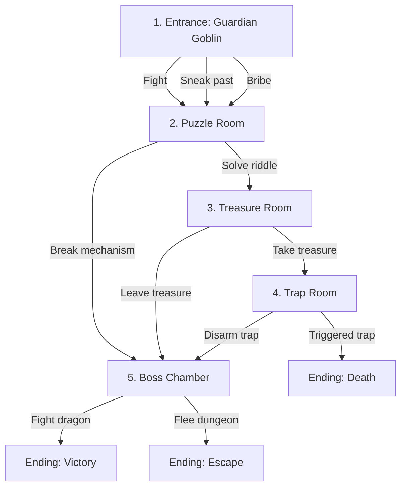

# Dungeons & Data Structures

## Introduction

Role-playing games (RPGs) and tabletop systems like Dungeons & Dragons have evolved alongside computer science over the decades, and the overlap between these domains is both fascinating and instructive. At their core, both RPGs and software development rely on structured information and rules for manipulating that information—the very definition of algorithms and data structures.

Data structures in computer science are specialized formats for organizing, storing, and accessing data efficiently. From simple arrays and linked lists to complex graphs and trees, these structures provide the foundation upon which software is built. Similarly, RPGs employ their own specialized data structures: character sheets organize player abilities, monster stat blocks standardize enemy capabilities, and adventure modules structure narrative progression.

Algorithms, meanwhile, represent the step-by-step procedures for solving problems. In software, algorithms handle everything from sorting data to pathfinding in virtual worlds. In RPGs, algorithms determine how damage is calculated, how characters advance, and how the probability of success is determined through dice mechanics.

This essay explores the parallels between RPG systems and computer science principles, demonstrating how the design patterns found in games like Dungeons & Dragons and adventure gamebooks can inform software architecture—and vice versa. We'll examine branching narrative structures, stat block abstraction, character composition models, and more, illustrating these concepts with TypeScript code examples and diagrams.

By viewing RPGs through the lens of computer science, we gain insights not only into more effective game design but also into more intuitive software architecture that models real-world systems and narratives.

## Choose Your Node Adventure

Adventure gamebooks like the Fighting Fantasy series and Choose Your Own Adventure books implement one of the most recognizable data structures in computer science: the directed graph. Each numbered section or paragraph in these books functions as a node in the graph, with the choices at the end of each section representing directed edges to other nodes.

### Graph Theory in Adventure Books

In computer science terms, a directed graph (or digraph) consists of:
- **Vertices (nodes)**: The individual locations or states in the system
- **Edges (connections)**: The relationships or transitions between nodes
- **Direction**: The permitted flow from one node to another

Adventure gamebooks typically implement a directed acyclic graph (DAG) to prevent infinite loops, though some may include cycles for specific gameplay mechanics. The reader traverses this graph through decision-making, performing what amounts to a depth-first search through the narrative space.

### Implementing an Adventure Node System

Let's implement a simple Choose Your Own Adventure system using TypeScript:

```typescript
interface AdventureNode {
  id: number;
  text: string;
  choices: Choice[];
  isEnding: boolean;
}

interface Choice {
  text: string;
  nextNodeId: number;
}

class AdventureGraph {
  private nodes: Map<number, AdventureNode> = new Map();
  private currentNodeId: number;
  
  constructor(startingNodeId: number) {
    this.currentNodeId = startingNodeId;
  }
  
  addNode(node: AdventureNode): void {
    this.nodes.set(node.id, node);
  }
  
  getCurrentNode(): AdventureNode | undefined {
    return this.nodes.get(this.currentNodeId);
  }
  
  makeChoice(choiceIndex: number): boolean {
    const currentNode = this.getCurrentNode();
    if (!currentNode || choiceIndex >= currentNode.choices.length) {
      return false;
    }
    
    this.currentNodeId = currentNode.choices[choiceIndex].nextNodeId;
    return true;
  }
  
  isAtEnding(): boolean {
    const currentNode = this.getCurrentNode();
    return currentNode ? currentNode.isEnding : false;
  }
  
  // Validate that all choices lead to valid nodes
  validateGraph(): boolean {
    for (const node of this.nodes.values()) {
      for (const choice of node.choices) {
        if (!this.nodes.has(choice.nextNodeId)) {
          console.error(`Node ${node.id} has invalid choice to ${choice.nextNodeId}`);
          return false;
        }
      }
    }
    return true;
  }
}
```

### Five Room Dungeon Example

To illustrate this concept, let's create a simple five-room dungeon adventure using our node system. First, let's visualize the structure using a Mermaid diagram:



Now, let's implement this adventure using our node system:

```typescript
// Create the adventure
const dungeon = new AdventureGraph(1);

// Add the nodes
dungeon.addNode({
  id: 1,
  text: "You stand at the entrance of the dungeon. A goblin guards the doorway, eyeing you suspiciously.",
  choices: [
    { text: "Attack the goblin", nextNodeId: 2 },
    { text: "Try to sneak past while it's distracted", nextNodeId: 2 },
    { text: "Offer gold to pass", nextNodeId: 2 }
  ],
  isEnding: false
});

dungeon.addNode({
  id: 2,
  text: "You enter a chamber with a stone pedestal in the center. There's a riddle inscribed: 'I speak without a mouth and hear without ears. I have no body, but I come alive with wind.'",
  choices: [
    { text: "Answer 'Echo'", nextNodeId: 3 },
    { text: "Smash the pedestal", nextNodeId: 5 }
  ],
  isEnding: false
});

dungeon.addNode({
  id: 3,
  text: "The pedestal slides away, revealing a hidden compartment with a glittering treasure chest.",
  choices: [
    { text: "Take the treasure", nextNodeId: 4 },
    { text: "Leave it and proceed", nextNodeId: 5 }
  ],
  isEnding: false
});

dungeon.addNode({
  id: 4,
  text: "As you lift the treasure, you hear a click. The floor beneath you begins to crumble, revealing spikes!",
  choices: [
    { text: "Try to disarm the trap", nextNodeId: 5 },
    { text: "Jump but fail to escape", nextNodeId: 6 }
  ],
  isEnding: false
});

dungeon.addNode({
  id: 5,
  text: "You enter a massive chamber with ancient columns. A dragon sleeps on a pile of gold in the center.",
  choices: [
    { text: "Fight the dragon", nextNodeId: 7 },
    { text: "Flee the dungeon", nextNodeId: 8 }
  ],
  isEnding: false
});

dungeon.addNode({
  id: 6,
  text: "The spikes impale you. Your adventure ends here.",
  choices: [],
  isEnding: true
});

dungeon.addNode({
  id: 7,
  text: "After a fierce battle, you defeat the dragon and claim its hoard. You are victorious!",
  choices: [],
  isEnding: true
});

dungeon.addNode({
  id: 8,
  text: "You escape the dungeon with your life, if not your pride. Perhaps another day you'll return better prepared.",
  choices: [],
  isEnding: true
});

// Validate the graph
if (dungeon.validateGraph()) {
  console.log("Adventure is ready to play!");
}
```

This implementation demonstrates how adventure books structure their narratives as traversable graphs. Each choice represents an edge leading to another node, and the reader's decisions determine their path through the story. The same approach is used in digital RPGs, interactive fiction, and even modern narrative-heavy video games.

From a computational perspective, this structure offers several advantages:
- **Modularity**: Each node can be designed independently
- **Reusability**: Multiple paths can lead to the same node
- **Analyzability**: The narrative structure can be validated programmatically
- **Extensibility**: New nodes and paths can be added without disrupting existing ones

## Abstract Stats: The Foundation of RPG Entities

In RPGs like Dungeons & Dragons, diverse entities—players, monsters, NPCs—share fundamental attributes and capabilities. This common structure makes the stat block a perfect candidate for an abstract base class in object-oriented design.

### The Unified Stat Block

At their core, all entities in most RPG systems possess:
- **Attributes**: Basic characteristics like strength and intelligence
- **Derived Stats**: Values calculated from attributes (like skill bonuses)
- **Combat Statistics**: Hit points, armor class, etc.
- **Abilities**: Special capabilities and actions

By creating an abstract base class, we establish a common interface that all game entities can implement while allowing for specialized subclasses.

```typescript
// Basic types for our RPG system
type Size = "Tiny" | "Small" | "Medium" | "Large" | "Huge" | "Gargantuan";
type Ability = "strength" | "dexterity" | "constitution" | "intelligence" | "wisdom" | "charisma";
type DamageType = "bludgeoning" | "piercing" | "slashing" | "fire" | "cold" | "lightning" | "acid" | "poison" | "necrotic" | "radiant" | "force" | "psychic";
type Condition = "blinded" | "charmed" | "deafened" | "frightened" | "grappled" | "incapacitated" | "paralyzed" | "petrified" | "poisoned" | "prone" | "restrained" | "stunned" | "unconscious";

// Base abstract class for all entities with stats
abstract class StatBlock {
  name: string;
  size: Size;
  armorClass: number;
  hitPoints: number;
  maxHitPoints: number;
  temporaryHitPoints: number = 0;
  speed: {
    walk?: number;
    fly?: number;
    swim?: number;
    climb?: number;
    burrow?: number;
  };
  abilities: Record<Ability, number>;
  savingThrowBonuses: Partial<Record<Ability, number>> = {};
  skillBonuses: Record<string, number> = {};
  damageResistances: DamageType[] = [];
  damageImmunities: DamageType[] = [];
  conditionImmunities: Condition[] = [];
  damageVulnerabilities: DamageType[] = [];
  languages: string[] = [];
  
  constructor(
    name: string, 
    size: Size, 
    abilities: Record<Ability, number>,
    armorClass: number,
    hitPoints: number,
    speed: { walk?: number; fly?: number; swim?: number; climb?: number; burrow?: number; }
  ) {
    this.name = name;
    this.size = size;
    this.abilities = abilities;
    this.armorClass = armorClass;
    this.hitPoints = hitPoints;
    this.maxHitPoints = hitPoints;
    this.speed = speed;
  }
  
  // Core methods available to all entities
  
  getAbilityModifier(ability: Ability): number {
    return Math.floor((this.abilities[ability] - 10) / 2);
  }
  
  rollAbilityCheck(ability: Ability): number {
    const modifier = this.getAbilityModifier(ability);
    const roll = Math.floor(Math.random() * 20) + 1; // d20 roll
    return roll + modifier;
  }
  
  rollSavingThrow(ability: Ability): { total: number; success: boolean; } {
    let modifier = this.getAbilityModifier(ability);
    
    // Add proficiency if this entity has saving throw proficiency
    if (ability in this.savingThrowBonuses) {
      modifier += this.savingThrowBonuses[ability] || 0;
    }
    
    const roll = Math.floor(Math.random() * 20) + 1; // d20 roll
    const total = roll + modifier;
    
    // Determine success (DC would be passed from calling context)
    const dc = 15; // Example DC, would typically be passed in
    const success = total >= dc;
    
    return { total, success };
  }
  
  rollSkillCheck(skill: string, ability: Ability): number {
    let modifier = this.getAbilityModifier(ability);
    
    // Add skill bonus if applicable
    if (skill in this.skillBonuses) {
      modifier += this.skillBonuses[skill];
    }
    
    const roll = Math.floor(Math.random() * 20) + 1; // d20 roll
    return roll + modifier;
  }
  
  takeDamage(amount: number, type: DamageType): number {
    // Apply damage resistances/immunities/vulnerabilities
    if (this.damageImmunities.includes(type)) {
      return 0; // No damage taken
    } else if (this.damageResistances.includes(type)) {
      amount = Math.floor(amount / 2); // Half damage
    } else if (this.damageVulnerabilities.includes(type)) {
      amount = amount * 2; // Double damage
    }
    
    // Apply damage to temporary HP first
    if (this.temporaryHitPoints > 0) {
      if (amount <= this.temporaryHitPoints) {
        this.temporaryHitPoints -= amount;
        return amount; // All damage absorbed by temporary HP
      } else {
        amount -= this.temporaryHitPoints;
        const damageTaken = this.temporaryHitPoints;
        this.temporaryHitPoints = 0;
        
        // Remaining damage affects actual HP
        this.hitPoints = Math.max(0, this.hitPoints - amount);
        return damageTaken + amount;
      }
    } else {
      // Direct damage to HP
      const prevHP = this.hitPoints;
      this.hitPoints = Math.max(0, this.hitPoints - amount);
      return prevHP - this.hitPoints; // Return actual damage dealt
    }
  }
  
  heal(amount: number): number {
    if (this.hitPoints === 0) return 0; // Can't heal if dead/unconscious
    
    const prevHP = this.hitPoints;
    this.hitPoints = Math.min(this.maxHitPoints, this.hitPoints + amount);
    return this.hitPoints - prevHP; // Return actual healing done
  }
  
  addTemporaryHitPoints(amount: number): void {
    // Temporary HP doesn't stack - take the higher value
    this.temporaryHitPoints = Math.max(this.temporaryHitPoints, amount);
  }
  
  isAlive(): boolean {
    return this.hitPoints > 0;
  }
}
```

This abstract `StatBlock` class serves as the foundation for all entities in our RPG system. It implements the core mechanics shared across different entity types, providing a consistent interface for game systems like combat and skill challenges.

### Specialized Entity Types

From this abstract base, we can derive specialized classes for different entity types:

```typescript
// Monster entity type
class Monster extends StatBlock {
  type: string; // "humanoid", "beast", "fiend", etc.
  challengeRating: number;
  actions: Action[];
  legendaryActions?: Action[];
  
  constructor(
    name: string,
    size: Size,
    type: string,
    abilities: Record<Ability, number>,
    armorClass: number,
    hitPoints: number,
    speed: { walk?: number; fly?: number; swim?: number; climb?: number; burrow?: number; },
    challengeRating: number,
    actions: Action[]
  ) {
    super(name, size, abilities, armorClass, hitPoints, speed);
    
    this.type = type;
    this.challengeRating = challengeRating;
    this.actions = actions;
  }
  
  // Monster-specific method for taking an action
  performAction(actionName: string, target: StatBlock): boolean {
    const action = this.actions.find(a => a.name === actionName);
    if (!action) return false;
    
    // Implementation would depend on action type
    console.log(`${this.name} performs ${actionName} against ${target.name}`);
    return true;
  }
}

// NPC entity type
class NonPlayerCharacter extends StatBlock {
  occupation: string;
  attitude: string; // "friendly", "neutral", "hostile", etc.
  dialogueOptions: DialogueOption[];
  inventory: Item[];
  
  constructor(
    name: string,
    abilities: Record<Ability, number>,
    armorClass: number,
    hitPoints: number,
    occupation: string,
    attitude: string,
    dialogueOptions: DialogueOption[] = [],
    inventory: Item[] = []
  ) {
    super(
      name, 
      "Medium", // Most NPCs are medium-sized humanoids
      abilities,
      armorClass,
      hitPoints,
      { walk: 30 } // Standard walking speed
    );
    
    this.occupation = occupation;
    this.attitude = attitude;
    this.dialogueOptions = dialogueOptions;
    this.inventory = inventory;
  }
  
  // NPC-specific method for dialogue interaction
  interact(dialogueKey: string): string {
    const dialogue = this.dialogueOptions.find(d => d.key === dialogueKey);
    return dialogue ? dialogue.text : "The NPC doesn't respond to that.";
  }
}
```

### Benefits of Abstract Stat Blocks

This approach offers numerous advantages:

1. **Unified Game Systems**: Combat, skill checks, and other mechanics can operate on any entity through the common interface
2. **Code Reuse**: Core functionality is implemented once in the base class
3. **Polymorphism**: Systems can accept any StatBlock without knowing its specific type
4. **Consistency**: All entities behave predictably for basic operations
5. **Extensibility**: New entity types can be added without modifying existing code

These principles align with object-oriented design best practices, particularly the Liskov Substitution Principle, which states that objects of a superclass should be replaceable with objects of a subclass without affecting the functionality of the program.

## Character Composition & Inheritance

While the abstract StatBlock provides a solid foundation, player characters in RPGs have significantly more complexity due to the combinatorial nature of races, classes, backgrounds, and equipment. This complexity is best handled through a combination of inheritance and composition.

### Character Class Hierarchy

In our system, the PlayerCharacter class extends the StatBlock but incorporates additional components:

```typescript
interface Race {
  name: string;
  size: Size;
  speed: number;
  abilityScoreIncreases: Partial<Record<Ability, number>>;
  traits: Trait[];
  languages: string[];
}

interface CharacterClass {
  name: string;
  hitDieSize: number;
  primaryAbility: Ability;
  savingThrowProficiencies: Ability[];
  armorProficiencies: string[];
  weaponProficiencies: string[];
  skillProficiencyChoices: string[];
  startingEquipment: Item[];
  features: Record<number, Feature[]>; // Keyed by level
}

interface Background {
  name: string;
  skillProficiencies: string[];
  toolProficiencies: string[];
  languages: number; // Number of languages to choose
  equipment: Item[];
  feature: Feature;
  personalityTraits: string[];
  ideals: string[];
  bonds: string[];
  flaws: string[];
}

// Player Character class
class PlayerCharacter extends StatBlock {
  race: Race;
  characterClass: CharacterClass;
  level: number;
  background: Background;
  proficiencyBonus: number;
  experience: number;
  alignment: string;
  features: Feature[] = [];
  inventory: Item[] = [];
  equippedItems: Record<string, Item> = {};
  spellbook?: Spellbook;
  
  constructor(
    name: string,
    race: Race,
    characterClass: CharacterClass,
    level: number,
    background: Background,
    baseAbilities: Record<Ability, number>,
    alignment: string
  ) {
    // Calculate base stats
    const raceAbilityBonuses = race.abilityScoreIncreases;
    const abilities: Record<Ability, number> = { ...baseAbilities };
    
    // Apply racial ability score increases
    for (const ability in raceAbilityBonuses) {
      const typedAbility = ability as Ability;
      abilities[typedAbility] += raceAbilityBonuses[typedAbility] || 0;
    }
    
    // Calculate hit points
    const conModifier = Math.floor((abilities.constitution - 10) / 2);
    const firstLevelHP = characterClass.hitDieSize + conModifier;
    const additionalLevelsHP = level > 1 
      ? (level - 1) * (Math.floor(characterClass.hitDieSize / 2) + 1 + conModifier)
      : 0;
    const totalHP = firstLevelHP + additionalLevelsHP;
    
    // Calculate armor class (simplified)
    const dexModifier = Math.floor((abilities.dexterity - 10) / 2);
    const baseAC = 10 + dexModifier;
    
    // Call the StatBlock constructor
    super(
      name,
      race.size,
      abilities,
      baseAC,
      totalHP,
      { walk: race.speed }
    );
    
    this.race = race;
    this.characterClass = characterClass;
    this.level = level;
    this.background = background;
    this.alignment = alignment;
    this.experience = 0;
    
    // Calculate proficiency bonus
    this.proficiencyBonus = Math.floor((level - 1) / 4) + 2;
    
    // Apply features, proficiencies, etc.
    this.initializeCharacter();
  }
  
  private initializeCharacter(): void {
    // Apply saving throw proficiencies
    for (const ability of this.characterClass.savingThrowProficiencies) {
      this.savingThrowBonuses[ability] = this.proficiencyBonus;
    }
    
    // Apply skill proficiencies (simplified - would normally involve choices)
    for (const skill of this.background.skillProficiencies) {
      this.skillBonuses[skill] = this.proficiencyBonus;
    }
    
    // Apply racial traits
    for (const trait of this.race.traits) {
      this.features.push(trait);
      // Apply trait effects (resistance, skills, etc.)
      this.applyTraitEffects(trait);
    }
    
    // Apply class features for current level
    for (let i = 1; i <= this.level; i++) {
      const levelFeatures = this.characterClass.features[i] || [];
      for (const feature of levelFeatures) {
        this.features.push(feature);
        // Apply feature effects
        this.applyFeatureEffects(feature);
      }
    }
    
    // Apply starting equipment (simplified)
    for (const item of this.characterClass.startingEquipment) {
      this.inventory.push(item);
    }
    
    for (const item of this.background.equipment) {
      this.inventory.push(item);
    }
    
    // Initialize spellbook for spellcasting classes
    if (this.hasSpellcasting()) {
      this.spellbook = new Spellbook(this);
    }
  }
  
  private applyTraitEffects(trait: Trait): void {
    // Implementation depends on trait type
    switch (trait.type) {
      case "resistance":
        if (trait.damageType) {
          this.damageResistances.push(trait.damageType);
        }
        break;
      case "skill":
        if (trait.skill) {
          this.skillBonuses[trait.skill] = this.proficiencyBonus;
        }
        break;
      // Additional trait types...
    }
  }
  
  private applyFeatureEffects(feature: Feature): void {
    // Implementation depends on feature type
    switch (feature.type) {
      case "armor_proficiency":
        // Add armor proficiency
        break;
      case "extra_attack":
        // Add extra attack capability
        break;
      // Additional feature types...
    }
  }
  
  hasSpellcasting(): boolean {
    // Check if class has spellcasting or if any feature grants spellcasting
    return this.characterClass.name === "Wizard" || 
           this.characterClass.name === "Cleric" ||
           this.characterClass.name === "Bard" ||
           this.features.some(f => f.grantsSpellcasting);
  }
  
  gainExperience(amount: number): boolean {
    this.experience += amount;
    
    // Check if level up is available
    const experienceThresholds = [
      0, 300, 900, 2700, 6500, 14000, 23000, 34000, 48000, 
      64000, 85000, 100000, 120000, 140000, 165000, 195000, 
      225000, 265000, 305000, 355000
    ];
    
    if (this.level < 20 && this.experience >= experienceThresholds[this.level]) {
      return true; // Level up available
    }
    
    return false;
  }
  
  levelUp(): void {
    if (this.level >= 20) return; // Already max level
    
    this.level++;
    
    // Update proficiency bonus
    this.proficiencyBonus = Math.floor((this.level - 1) / 4) + 2;
    
    // Add hit points
    const conModifier = this.getAbilityModifier("constitution");
    const hitDieAverage = Math.floor(this.characterClass.hitDieSize / 2) + 1;
    this.maxHitPoints += hitDieAverage + conModifier;
    this.hitPoints += hitDieAverage + conModifier;
    
    // Add new class features
    const newFeatures = this.characterClass.features[this.level] || [];
    for (const feature of newFeatures) {
      this.features.push(feature);
      this.applyFeatureEffects(feature);
    }
    
    // Update saving throws and skill proficiencies
    this.updateProficiencies();
    
    // Update spellbook if applicable
    if (this.spellbook) {
      this.spellbook.updateForLevel(this.level);
    }
  }
  
  private updateProficiencies(): void {
    // Update saving throw bonuses
    for (const ability of this.characterClass.savingThrowProficiencies) {
      this.savingThrowBonuses[ability] = this.proficiencyBonus;
    }
    
    // Update skill bonuses
    for (const skill in this.skillBonuses) {
      if (this.skillBonuses[skill] > 0) { // If proficient
        this.skillBonuses[skill] = this.proficiencyBonus;
      }
    }
  }
  
  equipItem(item: Item): boolean {
    if (!this.inventory.includes(item)) {
      return false; // Can't equip what you don't have
    }
    
    // Check if you can equip this item (proficiency, etc.)
    // ...
    
    // Equip the item
    const slot = item.equipSlot;
    if (slot) {
      // Unequip any item already in that slot
      if (this.equippedItems[slot]) {
        this.unequipItem(slot);
      }
      
      this.equippedItems[slot] = item;
      
      // Apply item effects (AC changes, etc.)
      // ...
      
      return true;
    }
    
    return false;
  }
  
  unequipItem(slot: string): Item | null {
    const item = this.equippedItems[slot];
    if (item) {
      delete this.equippedItems[slot];
      
      // Remove item effects
      // ...
      
      return item;
    }
    
    return null;
  }
}
```

This PlayerCharacter class demonstrates how composition and inheritance can be combined:
- **Inheritance** is used for the base StatBlock functionality
- **Composition** is used for incorporating the race, class, background, and equipment

### Component-Based Design

For a more flexible system, we could further refactor our design to use a component-based approach, where each capability is a separate component that can be attached to any entity:

```typescript
// Component interface
interface Component {
  owner: StatBlock;
  initialize(): void;
  update(deltaTime: number): void;
}

// Enhanced StatBlock with component support
class EntityWithComponents extends StatBlock {
  private components: Map<string, Component> = new Map();
  
  addComponent(id: string, component: Component): void {
    component.owner = this;
    component.initialize();
    this.components.set(id, component);
  }
  
  getComponent(id: string): Component | undefined {
    return this.components.get(id);
  }
  
  hasComponent(id: string): boolean {
    return this.components.has(id);
  }
  
  removeComponent(id: string): boolean {
    return this.components.delete(id);
  }
  
  update(deltaTime: number): void {
    for (const component of this.components.values()) {
      component.update(deltaTime);
    }
  }
}

// Example component: Spellcasting
class SpellcastingComponent implements Component {
  owner!: StatBlock;
  spellcastingAbility: Ability;
  maxSpellLevel: number;
  knownSpells: Spell[] = [];
  spellSlots: Record<number, number> = {}; // Level -> count
  
  constructor(spellcastingAbility: Ability, maxSpellLevel: number) {
    this.spellcastingAbility = spellcastingAbility;
    this.maxSpellLevel = maxSpellLevel;
  }
  
  initialize(): void {
    // Set up spell slots based on class/level
    // ...
  }
  
  update(deltaTime: number): void {
    // Handle regeneration of spell slots, etc.
    // ...
  }
  
  getSpellSaveDC(): number {
    const abilityModifier = this.owner.getAbilityModifier(this.spellcastingAbility);
    
    // Assuming owner is a player character with proficiency bonus
    let profBonus = 0;
    if ('proficiencyBonus' in this.owner) {
      profBonus = (this.owner as unknown as PlayerCharacter).proficiencyBonus;
    }
    
    return 8 + abilityModifier + profBonus;
  }
  
  getSpellAttackBonus(): number {
    const abilityModifier = this.owner.getAbilityModifier(this.spellcastingAbility);
    
    // Assuming owner is a player character with proficiency bonus
    let profBonus = 0;
    if ('proficiencyBonus' in this.owner) {
      profBonus = (this.owner as unknown as PlayerCharacter).proficiencyBonus;
    }
    
    return abilityModifier + profBonus;
  }
  
  castSpell(spell: Spell, level: number, target: StatBlock): boolean {
    // Check if we have an appropriate spell slot
    if (this.spellSlots[level] <= 0) {
      return false;
    }
    
    // Consume spell slot
    this.spellSlots[level]--;
    
    // Execute spell effect
    spell.cast(this.owner, target, level, this.getSpellSaveDC(), this.getSpellAttackBonus());
    
    return true;
  }
}

// Example component: Weapon Proficiency
class WeaponProficiencyComponent implements Component {
  owner!: StatBlock;
  proficientWeaponTypes: string[];
  
  constructor(weaponTypes: string[]) {
    this.proficientWeaponTypes = weaponTypes;
  }
  
  initialize(): void {
    // No initialization needed
  }
  
  update(deltaTime: number): void {
    // No update needed, this is a passive component
  }
  
  isProficientWith(weapon: Weapon): boolean {
    return this.proficientWeaponTypes.includes(weapon.type);
  }
  
  getAttackBonus(weapon: Weapon): number {
    // Determine which ability to use
    let abilityModifier: number;
    if (weapon.hasProperty("finesse")) {
      // Use the better of STR or DEX
      const strMod = this.owner.getAbilityModifier("strength");
      const dexMod = this.owner.getAbilityModifier("dexterity");
      abilityModifier = Math.max(strMod, dexMod);
    } else if (weapon.hasProperty("ranged")) {
      abilityModifier = this.owner.getAbilityModifier("dexterity");
    } else {
      abilityModifier = this.owner.getAbilityModifier("strength");
    }
    
    // Add proficiency if proficient
    let profBonus = 0;
    if (this.isProficientWith(weapon) && 'proficiencyBonus' in this.owner) {
      profBonus = (this.owner as unknown as PlayerCharacter).proficiencyBonus;
    }
    
    return abilityModifier + profBonus;
  }
  
  getDamageBonus(weapon: Weapon): number {
    // Similar to attack bonus, but without proficiency
    if (weapon.hasProperty("finesse")) {
      const strMod = this.owner.getAbilityModifier("strength");
      const dexMod = this.owner.getAbilityModifier("dexterity");
      return Math.max(strMod, dexMod);
    } else if (weapon.hasProperty("ranged")) {
      return this.owner.getAbilityModifier("dexterity");
    } else {
      return this.owner.getAbilityModifier("strength");
    }
  }
}
```

This component-based approach provides greater flexibility than inheritance alone:
- Components can be added or removed dynamically
- Entities can have a customized set of capabilities
- Composition avoids the "diamond problem" of multiple inheritance
- New functionality can be added without modifying existing classes

The entity-component pattern is widely used in modern game development for precisely these reasons. It creates a more modular system where capabilities can be mixed and matched to create diverse entity types without an explosion of class hierarchies.

### Factory Method Pattern for Character Creation

To streamline character creation, we can implement a factory pattern:

```typescript
class CharacterFactory {
  static createFighter(
    name: string,
    race: Race,
    level: number = 1,
    background: Background,
    abilities: Record<Ability, number>,
    fightingStyle: string
  ): PlayerCharacter {
    // Create base character
    const fighter = new PlayerCharacter(
      name,
      race,
      this.getFighterClass(fightingStyle),
      level,
      background,
      abilities,
      "Lawful Neutral" // Default alignment
    );
    
    // Add fighter-specific components
    fighter.addComponent("weaponProficiency", new WeaponProficiencyComponent([
      "simple", "martial"
    ]));
    
    // Add specific equipment based on fighting style
    switch (fightingStyle) {
      case "two-handed":
        const greatsword = ItemFactory.createWeapon("greatsword");
        fighter.inventory.push(greatsword);
        fighter.equipItem(greatsword);
        break;
      case "dueling":
        const longsword = ItemFactory.createWeapon("longsword");
        const shield = ItemFactory.createArmor("shield");
        fighter.inventory.push(longsword, shield);
        fighter.equipItem(longsword);
        fighter.equipItem(shield);
        break;
      // Additional fighting styles...
    }
    
    return fighter;
  }
  
  static createWizard(
    name: string,
    race: Race,
    level: number = 1,
    background: Background,
    abilities: Record<Ability, number>,
    specialization: string
  ): PlayerCharacter {
    // Create base character
    const wizard = new PlayerCharacter(
      name,
      race,
      this.getWizardClass(specialization),
      level,
      background,
      abilities,
      "Neutral" // Default alignment
    );
    
    // Add wizard-specific components
    wizard.addComponent("spellcasting", new SpellcastingComponent(
      "intelligence",
      Math.ceil(level / 2)
    ));
    
    // Add starting spells based on level and specialization
    const spellcastingComponent = wizard.getComponent("spellcasting") as SpellcastingComponent;
    
    // Add cantrips
    spellcastingComponent.knownSpells.push(SpellFactory.createSpell("mage_hand"));
    spellcastingComponent.knownSpells.push(SpellFactory.createSpell("fire_bolt"));
    
    // Add first level spells
    spellcastingComponent.knownSpells.push(SpellFactory.createSpell("magic_missile"));
    spellcastingComponent.knownSpells.push(SpellFactory.createSpell("shield"));
    
    // Add specialization spells
    switch (specialization) {
      case "evocation":
        spellcastingComponent.knownSpells.push(SpellFactory.createSpell("burning_hands"));
        break;
      case "divination":
        spellcastingComponent.knownSpells.push(SpellFactory.createSpell("identify"));
        break;
      // Additional specializations...
    }
    
    // Add starting equipment
    const quarterstaff = ItemFactory.createWeapon("quarterstaff");
    wizard.inventory.push(quarterstaff);
    wizard.equipItem(quarterstaff);
    
    return wizard;
  }
  
  // Helper methods to create class objects
  private static getFighterClass(fightingStyle: string): CharacterClass {
    return {
      name: "Fighter",
      hitDieSize: 10,
      primaryAbility: "strength",
      savingThrowProficiencies: ["strength", "constitution"],
      armorProficiencies: ["light", "medium", "heavy", "shields"],
      weaponProficiencies: ["simple", "martial"],
      skillProficiencyChoices: ["Acrobatics", "Animal Handling", "Athletics", "History", "Insight", "Intimidation", "Perception", "Survival"],
      startingEquipment: [],
      features: {
        1: [
          {
            name: "Fighting Style",
            description: `You adopt a particular style of fighting as your specialty. You gain the following benefit based on the style you choose: ${fightingStyle}`,
            type: "class_feature"
          },
          {
            name: "Second Wind",
            description: "You have a limited well of stamina that you can draw on to protect yourself from harm.",
            type: "class_feature"
          }
        ],
        2: [
          {
            name: "Action Surge",
            description: "You can push yourself beyond your normal limits for a moment.",
            type: "class_feature"
          }
        ],
        // Additional levels...
      }
    };
  }
  
  private static getWizardClass(specialization: string): CharacterClass {
    return {
      name: "Wizard",
      hitDieSize: 6,
      primaryAbility: "intelligence",
      savingThrowProficiencies: ["intelligence", "wisdom"],
      armorProficiencies: [],
      weaponProficiencies: ["dagger", "dart", "sling", "quarterstaff", "light crossbow"],
      skillProficiencyChoices: ["Arcana", "History", "Insight", "Investigation", "Medicine", "Religion"],
      startingEquipment: [],
      features: {
        1: [
          {
            name: "Spellcasting",
            description: "As a student of arcane magic, you have a spellbook containing spells that show the first glimmerings of your true power.",
            type: "class_feature",
            grantsSpellcasting: true
          },
          {
            name: "Arcane Recovery",
            description: "You have learned to regain some of your magical energy by studying your spellbook.",
            type: "class_feature"
          }
        ],
        2: [
          {
            name: `Arcane Tradition: ${specialization}`,
            description: `You have focused your studies on one of the eight schools of magic: ${specialization}.`,
            type: "class_feature"
          }
        ],
        // Additional levels...
      }
    };
  }
}
```

This factory approach encapsulates the complex logic of character creation, making it easier to create consistent character objects with appropriate components, abilities, and equipment.

## Conclusion

The design patterns found in RPGs like Dungeons & Dragons provide powerful metaphors for structuring software systems. Through our exploration, we've seen how:

1. **Adventure Structure**: The node-based design of Choose Your Own Adventure books and dungeon modules perfectly maps to directed graphs in computer science, offering a blueprint for narrative-driven applications.

2. **Abstract Base Classes**: The common stat block of RPG entities demonstrates how abstract classes can provide a unified interface while enabling specialized implementations, facilitating polymorphism and code reuse.

3. **Component-Based Design**: The modular nature of character abilities, spells, and equipment illustrates the power of composition over inheritance, allowing for flexible and extensible systems.

4. **Factory Patterns**: The complex creation of characters with interrelated parts demonstrates the value of factory methods for encapsulating creation logic and ensuring consistent objects.

These patterns aren't merely academic—they represent battle-tested design approaches refined over decades of tabletop gaming. By drawing inspiration from RPGs, software developers can create systems that are not only technically sound but also intuitive for users familiar with these conventions.

The next time you're designing a complex software system, consider how it might be modeled using the patterns found in your favorite RPG. The stat blocks, character sheets, and adventure modules that have entertained millions might just provide the perfect template for your next architectural challenge.

## Glossary

### Computer Science Terms

- **Abstract Class**: A class that cannot be instantiated directly and is designed to be subclassed
- **Algorithm**: A step-by-step procedure for solving a problem
- **Composition**: A design principle where complex objects are built from simpler ones
- **Data Structure**: A specialized format for organizing and storing data
- **Directed Graph**: A set of nodes connected by edges with defined directions
- **Factory Method**: A creational pattern that uses factory methods to deal with object creation
- **Inheritance**: A mechanism where a class inherits properties and methods from a parent class
- **Interface**: A contract specifying methods a class must implement
- **Polymorphism**: The ability for different objects to respond to the same method call in different ways
- **Type System**: Rules governing how data types interact within a programming language

### RPG Terms

- **Ability Score**: A numeric representation of a character's innate capabilities (e.g., Strength, Intelligence)
- **Armor Class (AC)**: A measure of how difficult a character is to hit in combat
- **Challenge Rating (CR)**: A measure of how difficult a monster is to defeat
- **Hit Points (HP)**: A numeric representation of a character's health or vitality
- **Modifier**: A bonus or penalty applied to dice rolls, typically derived from ability scores
- **NPC (Non-Player Character)**: Any character not controlled by a player
- **Proficiency**: Special training that provides bonuses to certain actions
- **Saving Throw**: A dice roll to resist or mitigate harmful effects
- **Spell Slot**: A resource consumed to cast spells
- **Stat Block**: A standardized format for presenting a character or monster's game statistics